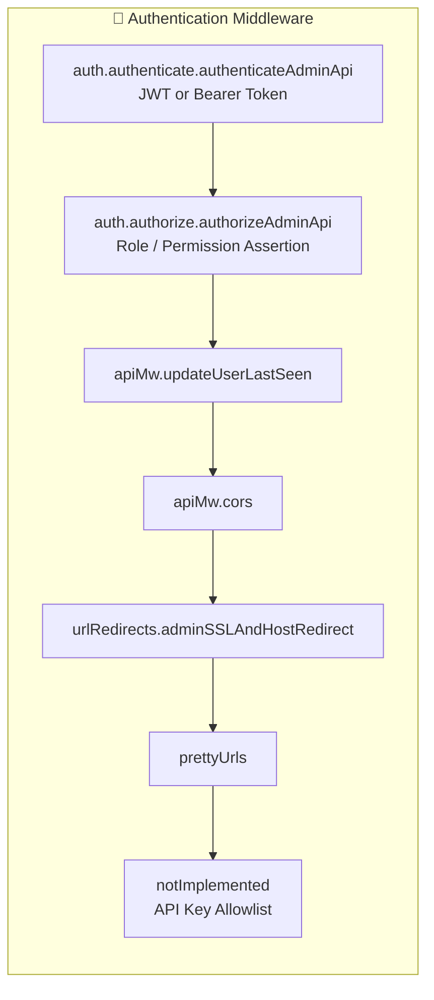

# Server Architecture

## Request Lifecycle

```mermaid
flowchart TB
    HTTP[HTTP Request] --> GhostServer[GhostServer.js<br/>Express App]
    GhostServer --> Preprocessing
    
    subgraph Preprocessing["Preprocessing"]
        Sentry[Sentry Error Tracking]
        PrettyURL[pretty-urls redirect]
        Locals[GhostLocals<br/>theme, safe version]
    end
    
    Preprocessing --> RouteMatch[Route Matching]
    
    subgraph RouteMatch["Route Matching"]
        direction TB
        Admin[/ghost/api/admin/*] --> AdminAPI[Admin API Router]
        Content[/ghost/api/content/*] --> ContentAPI[Content API Router]
        Members[/members/api/*] --> MembersAPI[Members API Router]
        Other[/ *] --> Theme[Frontend Theme Renderer]
    end
    
    AdminAPI --> Pipeline[API Pipeline]
    
    subgraph Pipeline["API Pipeline per Endpoint"]
        direction TB
        MW[Middleware Chain<br/>authAdminApi / authorizeAdminApi]
        Val[Validation<br/>options & input schema]
        Perm[Permissions Check]
        Query[Query<br/>Model Layer]
        Output[Output Serialization]
        Response[Response]
    end
    
    Pipeline --> Error{Error?}
    Error -->|Yes| ErrHandler[Error Handling<br/>404 / 403 / 501]
    Error -->|No| Client[Client Response]
    
    ErrHandler --> Client
```

## Middleware Chain



## Monorepo Structure

```
00-Ghost-5.116.2/
├── ghost/                          ← Core packages
│   ├── core/                       ← Main CMS server
│   │   ├── core/
│   │   │   ├── server/             ← Express server, API controllers, models, services
│   │   │   │   ├── api/endpoints/  ← All API controllers (built-in + 30+ custom social)
│   │   │   │   ├── models/         ← Bookshelf ORM models
│   │   │   │   ├── services/       ← Business logic layer
│   │   │   │   ├── web/            ← Express routing setup
│   │   │   │   ├── data/           ← DB schema + migrations
│   │   │   │   ├── adapters/       ← Storage, scheduling, etc.
│   │   │   │   └── lib/            ← Utilities
│   │   │   ├── frontend/           ← Theme engine, helpers
│   │   │   └── shared/             ← Config, events, settings cache
│   │   └── test/                   ← E2E, integration, unit tests
│   ├── admin/                      ← Ember.js admin SPA
│   ├── api-framework/              ← Reusable API pipeline framework
│   ├── members-api/                ← Members/subscriptions domain
│   ├── email-service/              ← Email delivery
│   └── ... (30+ packages)
├── apps/                           ← React frontend apps (Embla, Portal, Comments, etc.)
└── .docker/                        ← Docker build configuration
```

## Custom Route Isolation

```mermaid
flowchart LR
    subgraph Builtin["Built-in Routes (Ghost Standard)"]
        BR[admin/routes.js]
    end
    
    subgraph Custom["Custom Routes (Think-AI)"]
        CR[admin/custom-routes.js<br/>All /social/* additions]
    end
    
    subgraph Registry["Endpoint Registry"]
        EI[endpoints/index.js<br/>(custom begin … custom end)]
    end
    
    subgraph Framework["API Framework"]
        AF[api-framework pipeline]
    end
    
    BR --> Registry
    CR --> Registry
    EI --> AF
```

## Key Architectural Decisions

### 1. Custom routes are isolated from built-in routes
- Built-in routes: `admin/routes.js` (Ghost standard)
- Custom routes: `admin/custom-routes.js` (all `/social/*` additions)
- This makes it easy to diff against upstream Ghost during version upgrades

### 2. API Framework pipeline
All endpoints (built-in and custom) use the `@tryghost/api-framework` pipeline:

```javascript
// Pattern: endpoint registration in endpoints/index.js
get socialFollows() {
    return apiFramework.pipeline(require('./social-follows'), localUtils);
}
```

### 3. Admin vs Public split
- **Admin routes** — full authentication (session or API key), permission checks
- **Content API (public) routes** — lighter authentication (member token or anonymous)
- Comments and components have both admin and public endpoints

### 4. Custom API key allowlist
The `notImplemented` middleware controls which resources API keys can access:

```javascript
const allowlisted = {
    // Standard Ghost resources...
    social: ['GET', 'POST', 'DELETE', 'PUT']  // All methods allowed
};
```
