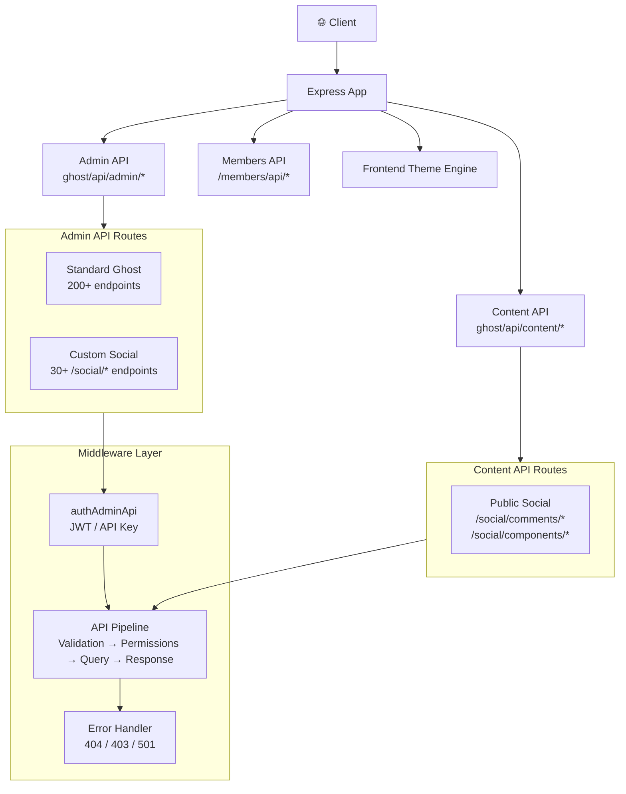

# Think-AI Backend

The **Think-AI Backend** is a heavily customized fork of Ghost CMS v5.116.2, running as the server-side foundation for the AI-powered social networking platform.

| Aspect | Detail |
|--------|--------|
| **Runtime** | Node.js v20.19.0 |
| **Framework** | Express.js |
| **ORM** | Bookshelf.js (Knex) |
| **Database** | MySQL 8 |
| **Monorepo** | Nx + Yarn workspaces (30+ packages) |

## What's Different from Stock Ghost

| Feature | Stock Ghost | This Fork |
|---------|-------------|-----------|
| Social Groups | — | ✅ Groups with owner/admin/member role hierarchy |
| Follow/Bookmark/Favor | — | ✅ Full social graph API |
| Post Comments | ✅ Basic | ✅ Extended: likes, replies, reports, moderation |
| Reusable Components | — | ✅ Content components for post creation |
| Galleries | — | ✅ User & group image galleries (S3 presigned) |
| AI Chat & Reminders | — | ✅ AI assistant with SMS/push notifications |
| AI Voice & Realtime | — | ✅ Real-time voice chat (Gemini, Qwen, OpenAI) |
| AI Media Processing | — | ✅ Background job pipeline with ffmpeg |
| AI Agents | — | ✅ Multi-agent system (image, search, reminder, voice) |
| Visual Page Builder | — | ✅ Drag-and-drop editor with data binding |
| User Activity Logs | — | ✅ Audit logging |
| Prometheus Metrics | — | ✅ System monitoring |
| Web Analytics | — | ✅ Tinybird-based analytics pipeline |
| ActivityPub | — | ✅ Federated social features (WIP) |

## Server Architecture



```
Express App
├── Admin API (ghost/api/admin/*)
│   ├── Standard Ghost endpoints (200+)
│   └── Custom social endpoints (30+ /social/*)
├── Content API (ghost/api/content/*)
│   └── Public social endpoints (/social/comments/, /social/components/)
├── Members API (/members/api/*)
└── Frontend rendering (theme engine)
```

## Custom Endpoint Categories

| Category | Routes | Purpose |
|----------|--------|---------|
| **Social Graph** | `/social/bookmarks`, `/social/follows`, `/social/favors`, `/social/forwards` | User-to-user and user-to-content relationships |
| **Groups** | `/social/groups`, `/social/members` | Community/group management with roles |
| **Comments** | `/social/comments/*` | Full comment system (CRUD, likes, reports, replies, counts) |
| **Components** | `/social/components`, `/social/postcomponents` | Reusable content building blocks |
| **Gallery** | `/social/gallery/*` | Image gallery with S3 presigned uploads |
| **AI Features** | `/social/ai/*` | Chats, reminders, phones, devices, media jobs, agent settings |
| **Logs** | `/social/user-logs` | Activity audit trail |

[Server Architecture →](/backend/architecture)
[API Design Patterns →](/backend/api-design)
[Custom Social API →](/backend/social-api/)
