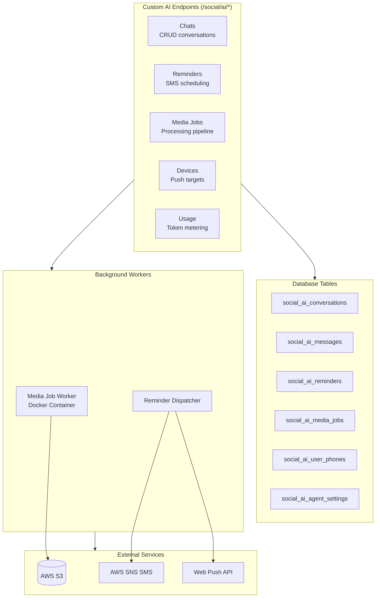
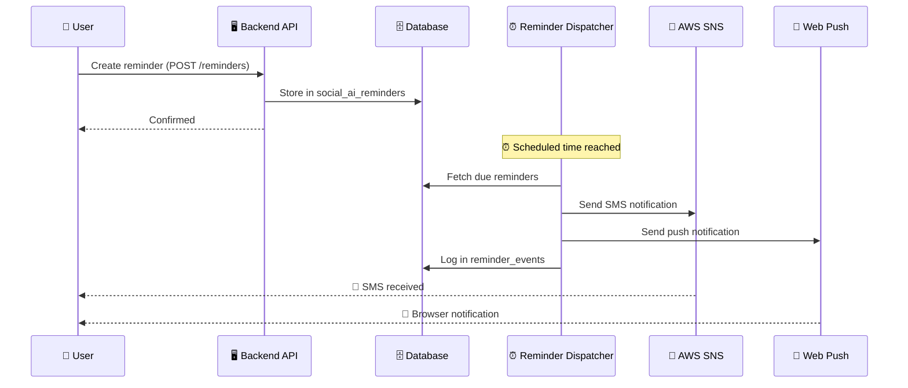
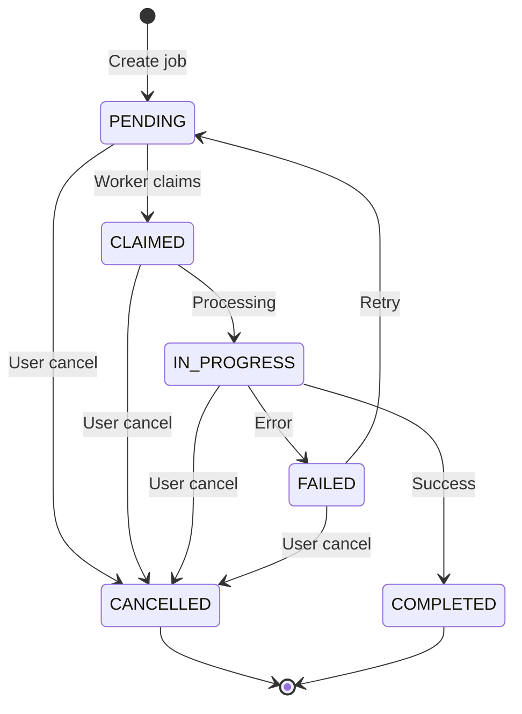
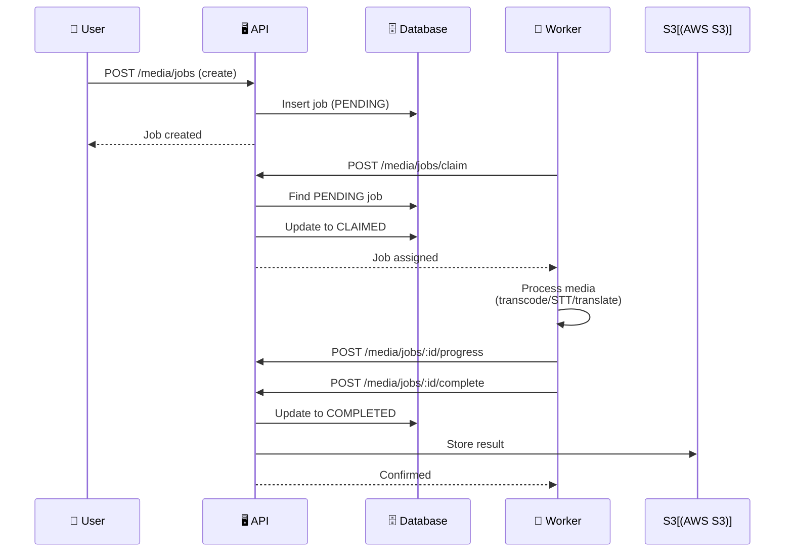

# AI Features — Backend

The Think-AI Backend includes a comprehensive AI integration spanning chat, reminders, media processing, agent configuration, and real-time voice capabilities.

## Backend AI Architecture

## AI Chat

Real-time conversational AI with persistence:

| Component | Endpoint | Description |
|-----------|----------|-------------|
| **Conversations** | `/social/ai/chats` (CRUD) | Chat session management |
| **Messages** | `social_ai_messages` table | Chat message history |
| **Devices** | `/social/ai/devices` (CRUD) | Push notification target registration |
| **SMS Logs** | `/social/ai/sms-logs` | SMS delivery audit |

The frontend connects via a real-time streaming API — either direct HTTP streaming for text models or a WebSocket proxy (Qwen RT Proxy) for real-time voice and multimodal interactions.

### Multi-Provider Architecture

The backend stores conversations and usage data while the frontend handles provider routing. Supported AI providers include **OpenAI** (GPT-4o), **Google Gemini** (Gemini 2.5), **DeepSeek** (V3/R1), **Alibaba Qwen** (Max/Turbo via DashScope), and **Zhipu GLM** (GLM-4).

## AI Reminders

SMS-based reminder system with push notification support:

| Component | Endpoint | Description |
|-----------|----------|-------------|
| **Reminders** | `/social/ai/reminders` (CRUD) | Create, read, update reminders |
| **Reminder Events** | `/social/ai/reminder-events` | Trigger history log |
| **Dispatch** | `/social/ai/reminders/dispatch` | Scheduled dispatch endpoint |
| **User Phones** | `/social/ai/user-phones` | Phone number verification/management |
| **SMS Logs** | `/social/ai/sms-logs` | Delivery tracking |

### Reminder Flow

## AI Agent Settings

Per-user or per-group agent configuration:

- `/social/ai/agent-settings` — CRUD for AI agent behavior

Each agent type (image generation, search, reminder, voice, media) has configurable settings that control behavior, model selection, and permissions.

## AI Media Jobs

Background media processing with worker-based architecture:

### Job State Machine

### Worker Coordination

### Job Operations

| Operation | Endpoint |
|-----------|----------|
| Create | `POST /social/ai/media/jobs` |
| Claim | `POST /social/ai/media/jobs/claim` |
| Progress | `POST /social/ai/media/jobs/:id/progress` |
| Complete | `POST /social/ai/media/jobs/:id/complete` |
| Fail | `POST /social/ai/media/jobs/:id/fail` |
| Cancel | `POST /social/ai/media/jobs/:id/cancel` |
| Retry | `POST /social/ai/media/jobs/:id/retry` |

### Media Job Pipeline

Jobs support multiple media types through a flexible processing pipeline:

| Media Type | Processing Capabilities |
|------------|------------------------|
| **Video** | Transcoding, thumbnail extraction, subtitle generation, format conversion |
| **Audio** | STT (speech-to-text), translation, subtitle writing |
| **Image** | Generation post-processing, resize, format conversion, optimization |
| **Combined** | Multi-step pipelines (e.g., extract audio from video → STT → translate → burn subtitles) |

The pipeline uses **FFmpeg** for media operations and **AWS S3** for asset storage. The media job runner (`ghost-media-runner` Docker image) processes jobs as a background worker.

## AI Usage Tracking

Usage metering for AI API calls:

| Component | Endpoint | Description |
|-----------|----------|-------------|
| **Usage Records** | `/social/ai/usages` | Browse and read token consumption per conversation/user |

Usage tracking enables:
- Per-user API cost monitoring
- Usage quotas and rate limiting
- Analytics on AI feature adoption

## Database Schema

All AI features have dedicated tables in the Ghost database:

| Table | Purpose | Key Columns |
|-------|---------|-------------|
| `social_ai_conversations` | Chat sessions | id, user_id, title, created_at |
| `social_ai_messages` | Chat history | id, conversation_id, role, content |
| `social_ai_devices` | Push notification targets | id, user_id, push_token, platform |
| `social_ai_sms_logs` | SMS delivery records | id, phone, status, message |
| `social_ai_usages` | API metering | id, user_id, tokens, model, cost |
| `social_ai_reminders` | User reminders | id, user_id, text, scheduled_at |
| `social_ai_reminder_events` | Reminder trigger log | id, reminder_id, triggered_at |
| `social_ai_user_phones` | Verified phone numbers | id, user_id, phone, verified |
| `social_ai_agent_settings` | AI agent configuration | id, user_id, agent_type, settings |
| `social_ai_media_jobs` | Background media jobs | id, type, status, result_path |
