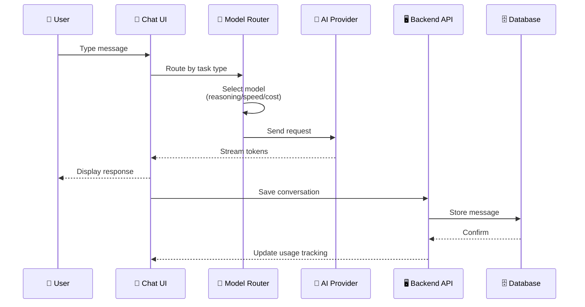
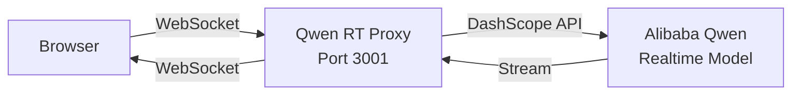
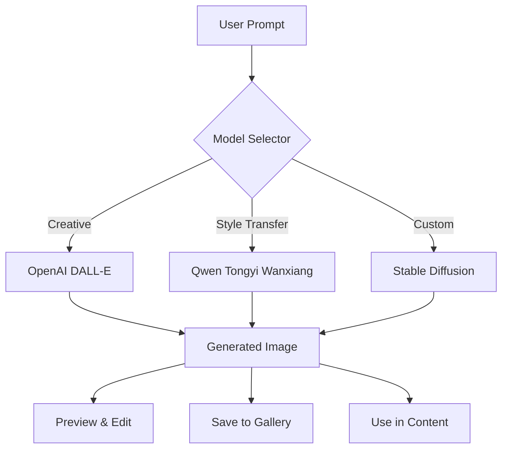
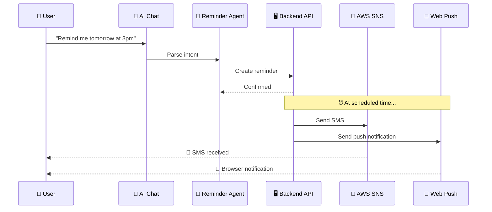
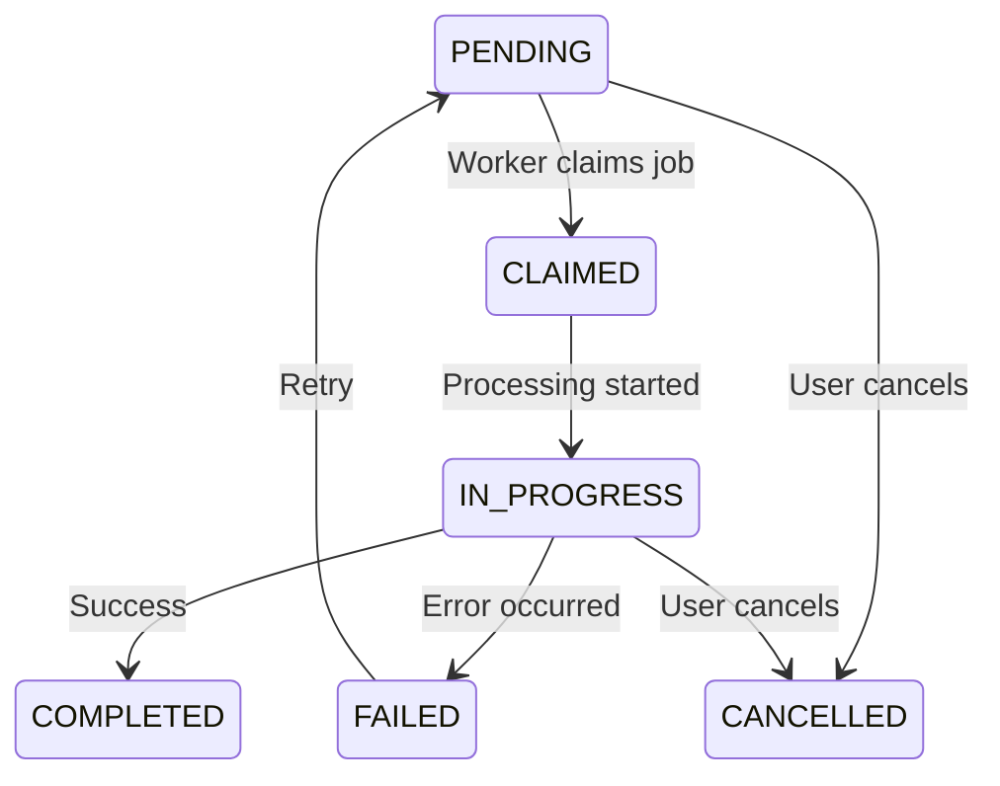
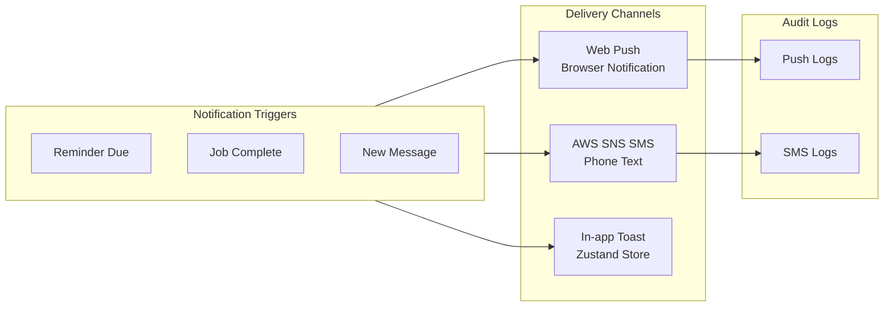

# AI Assistant — Frontend

The Think-AI Frontend includes a comprehensive **multi-agent AI Assistant** system with real-time chat, voice interaction, image generation, content search, reminders, and media processing.

## Architecture Overview

```mermaid
graph TB
    subgraph UI["User Interface"]
        Chat[AI Chat Interface<br/>/ai]
        Panel[Site Assistant Panel<br/>Floating Widget]
        Agent[Agent Panel<br/>Sidebar Tools]
    end
    
    subgraph Agents["AI Agents"]
        IMG[🖼️ Image Generation<br/>DALL-E / Qwen / SD]
        SRC[🔍 Search Agent<br/>Semantic / Full-text]
        REM[🔔 Reminder Agent<br/>SMS + Push]
        VOICE[🎙️ Voice Agent<br/>Gemini / OpenAI / Qwen]
        MEDIA[🎬 Media Agent<br/>Video / Audio / Image]
    end
    
    subgraph Streaming["Real-time Streaming"]
        HTTP[HTTP Streaming<br/>Text Chat]
        WS[WebSocket<br/>Qwen RT Proxy]
        VOICE_WS[Voice WebSocket<br/>Gemini Realtime]
    end
    
    subgraph Backend["Backend API"]
        CHAT_API[/social/ai/chats]
        REM_API[/social/ai/reminders]
        MEDIA_API[/social/ai/media/jobs]
        USAGE[/social/ai/usages]
    end
    
    subgraph Providers["AI Providers"]
        OA[OpenAI GPT-4o]
        GM[Google Gemini 2.5]
        DS[DeepSeek V3/R1]
        QW[Alibaba Qwen]
        ZP[Zhipu GLM-4]
    end
    
    subgraph Notifications["Notifications"]
        PUSH[Web Push API]
        SMS[AWS SNS SMS]
        IN_APP[In-app UI]
    end
    
    UI --> Agents
    UI --> Streaming
    Agents --> Streaming
    Streaming --> Providers
    Agents --> Backend
    Backend --> Notifications
```

## AI Chat System

### Multi-Provider Chat Flow



### Real-time WebSocket Proxy

The **Qwen RT Proxy** (`apps/qwen-rt-proxy`) provides a WebSocket bridge for real-time AI streaming:



## AI Agents

The system includes a **multi-agent framework** with specialized agents:

### Image Generation Agent



### Search Agent

AI-powered semantic search across platform content:

| Search Scope | Endpoint |
|-------------|----------|
| Posts | `/api/ai/search-posts` |
| Authors | `/api/ai/search-authors` |
| Tags | `/api/ai/search-tags` |
| Gallery | `/api/ai/search-gallery` |
| Group Posts | `/api/ai/search-group-posts` |
| Media Jobs | `/api/ai/search-media-jobs` |
| Internal Content | `/api/ai/search-internal-content` |

### Reminder Agent Flow



### Voice Agent

Real-time voice interaction with multiple providers:

| Provider | Mode | Features |
|----------|------|----------|
| **Gemini Realtime** | Bidirectional stream | Voice-to-voice, interruption support |
| **OpenAI Voice** | Realtime API | Natural conversation, multiple voices |
| **Qwen Voice** | WebSocket | Speech recognition + TTS |

## AI Job System

Long-running AI tasks are managed through a **job-based architecture**:



| API Route | Function |
|-----------|----------|
| `/api/ai/jobs` | List, create AI jobs |
| `/api/ai/jobs/[jobId]` | Job status, artifacts |
| `/api/ai/jobs/[jobId]/artifacts/[artifactId]` | Download job artifacts |
| `/api/ai/media/jobs/[jobId]` | Media job management |
| `/api/ai/media/translate` | Media translation |

## Notification System



## Site Assistant Panel

A floating **AI Assistant panel** (`SiteAssistantPanel`) provides always-available AI support:

```
┌─────────────────────────────┐
│  AI Assistant               │
│  ┌───────────────────────┐  │
│  │ Chat Messages         │  │
│  │ • Streaming responses │  │
│  │ • Agent results       │  │
│  └───────────────────────┘  │
│  ┌───────────────────────┐  │
│  │ Tool Sidebar           │  │
│  │ • Image Generation    │  │
│  │ • Search              │  │
│  │ • Reminders           │  │
│  │ • Voice               │  │
│  └───────────────────────┘  │
│  ┌───────────────────────┐  │
│  │ Input (text/voice)    │  │
│  └───────────────────────┘  │
└─────────────────────────────┘
```

## AI Provider Configuration

AI providers are configured through environment variables:

```bash
# OpenAI
OPENAI_API_KEY=sk-...

# Google Gemini
GEMINI_API_KEY=AIza...

# DeepSeek
DEEPSEEK_API_KEY=sk-...

# Alibaba Qwen (DashScope)
QWEN_API_KEY=sk-...
DASHSCOPE_API_KEY=sk-...

# Zhipu GLM
GLM_API_KEY=...
```

Model configurations are defined in:
- `config/aiChatModels.ts` — Chat model registry
- `config/aiImageModels.ts` — Image generation models
- `config/aiVoiceModels.ts` — Voice/STT models
- `config/aiMediaModels.ts` — Media processing models
- `config/aiMediaJobConfig.ts` — Media job configuration
- `config/qwenVoiceOptions.ts` — Qwen voice options
