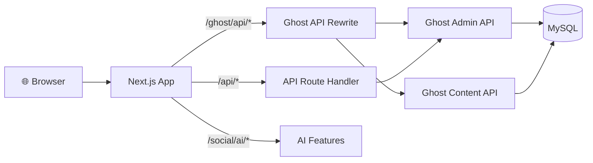

# Think-AI Frontend

The **Think-AI Frontend** is a Next.js 14 application (`@ghost-next/frontend`) delivering an AI-powered social experience with a visual page builder, multi-agent AI system, and rich SNS features.

## Frontend Overview

```mermaid
graph TB
    subgraph Browser["Browser"]
        UI[User Interface<br/>React SPA + SSR]
    end
    
    subgraph NextJS["Next.js 14 App"]
        Pages[Pages (app/*)<br/>SSR/SSG Rendering]
        API[API Routes (/api/*)<br/>Server-side Logic]
        Rewrites[Rewrites (/ghost/api/*)<br/>Backend Proxy]
    end
    
    subgraph Services["Services & State"]
        SWR[SWR Cache<br/>Server Data]
        Zustand[Zustand<br/>Client State]
        Provider[React Context<br/>Auth / Theme]
    end
    
    subgraph Packages["Monorepo Packages"]
        Eastate[Eastate<br/>SNS Components]
        StackPage[StackPage<br/>Page Builder]
        Comments[Comments-UI<br/>Widget]
        I18n[I18n<br/>Translations]
    end
    
    subgraph Infra["Infrastructure"]
        Qwen[Qwen RT Proxy<br/>WebSocket]
        Worker[Media Worker<br/>Background Jobs]
    end
    
    Browser -->|HTTP/SSR| Pages
    Browser -->|WebSocket| Qwen
    Pages --> API
    Pages --> Packages
    API --> Rewrites
    Rewrites -->|Ghost API| Backend[(Think-AI Backend)]
    Pages --> Services
    Packages --> Services
    Pages --> Worker
```

```
01-jibunsee-react/
├── apps/
│   ├── host/                 ← Main Next.js 14 application (SSR/SSG)
│   └── qwen-rt-proxy/        ← WebSocket proxy for AI real-time streaming
├── packages/
│   ├── business/
│   │   ├── eastate/          ← SNS-specific React components & hooks
│   │   └── portal/           ← Member portal UI
│   ├── stackpage/            ← Drag-and-drop visual page builder
│   ├── comments-ui/          ← Embedded comments widget
│   └── i18n/                 ← Internationalization
└── tools/
    └── notify/               ← Notification tooling
```

## Frontend Tech Stack

| Category | Technologies |
|----------|-------------|
| **Framework** | Next.js 14 (App Router, standalone output) |
| **UI Library** | React 18, TypeScript |
| **Styling** | Emotion (CSS-in-JS), Tailwind CSS |
| **Components** | MUI v6 (Material UI), @heroicons/react |
| **State** | Zustand, SWR |
| **Editor** | Tiptap (comments), Koenig Lexical (articles), react-slick (carousels) |
| **Page Builder** | StackPage (gridstack-based drag-and-drop with data/event binding) |
| **Media** | Video.js, react-dropzone |
| **Forms** | react-hook-form, @rjsf/core (JSON Schema forms) |
| **AI** | AI SDK (@ai-sdk/openai, @ai-sdk/google, @ai-sdk/deepseek, @ai-sdk/react) |
| **AI Voice** | Gemini Realtime, OpenAI Voice, Qwen Voice/STT |
| **Backend** | Axios, Zod, dayjs |
| **Cloud** | @aws-sdk/client-s3, @aws-sdk/client-sns |
| **Push** | web-push |
| **Build** | Vite (packages), Webpack/SWC (Next.js) |

## Communication with Backend



## Key Architecture Decisions

| Decision | Rationale |
|----------|-----------|
| **Next.js standalone output** | Self-contained Node.js server for Docker deployment |
| **Ghost API proxy via rewrites** | `/ghost/api/*` → Ghost backend — avoids CORS issues |
| **Yarn workspaces monorepo** | Shared packages (eastate, stackpage, i18n) |
| **StackPage library** | Independent Vite-built React library for drag-and-drop page building |
| **SWR + Zustand** | SWR for server-state caching, Zustand for client-side state |

[Component Architecture →](/frontend/architecture)
[Page Routing →](/frontend/routing)
[Page Builder →](/frontend/page-builder)
[AI Assistant →](/frontend/ai-assistant)
[State Management →](/frontend/state-management)
