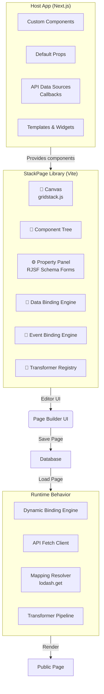
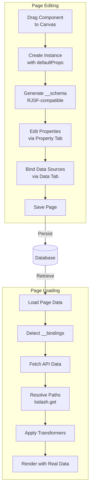
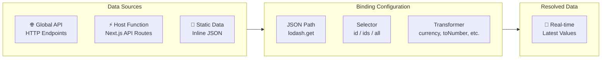
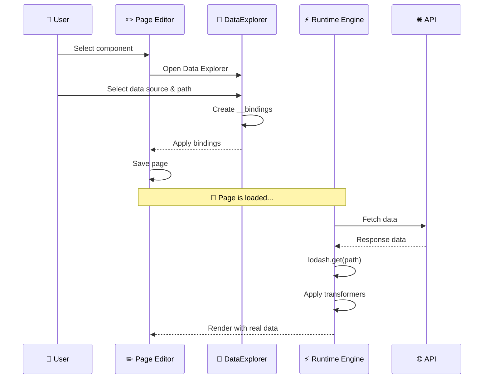

# Visual Page Builder (StackPage)

Think-AI Frontend includes a **drag-and-drop visual page builder** called **StackPage** — a standalone React library (Vite-built) that enables users to compose dynamic pages without writing code.

## Architecture

StackPage follows a **Host/Lib** architecture:



### Key Concept

- **The Host Project (Next.js):** Provides custom components, default props, API data sources (via callbacks), and templates.
- **The StackPage Lib:** Provides the editor UI, including the Canvas (based on `grid-stack.js`), Component Tree, Property Panel, and Data/Event binding engines.

## Core Workflow



### 1. Drag & Drop Composition

Users drag components from the **Component Tab** to the Canvas. This creates a component instance with `defaultProps`.

### 2. Schema Generation

The system immediately generates an RJSF (React JSON Schema Form) compatible schema based on `defaultProps` using `PropertyTypeUtils`. This schema is stored in `props.__schema`.

### 3. Property Editing

Users modify component props via the **Property Tab**, which renders a form based on `props.__schema`. Property types are inferred:
- **Array of objects** → Array type schema
- **Array of primitives** → Select type schema
- **Media types** → Image/Video/Audio specific handlers

### 4. Data Binding Engine

Components can be bound to dynamic data sources:



| Binding Type | Description |
|-------------|-------------|
| **Global API** | HTTP/HTTPS endpoints (direct fetch) |
| **Host Function** | Next.js API routes / server functions |
| **Static Data** | Hardcoded JSON data |

The binding system supports:
- **JSON Path resolution** (via lodash.get) — e.g., `response.users[0].name`
- **Transformer Pipeline** — data modification before injection (e.g., `toNumber`, `currency`, `formatDate`)
- **Selector types:** `id` (single record), `ids` (multiple records), `all` (all records)
- **Recursive array element binding** — one level deep for nested array structures
- **Ignored mappings** (`__ignoredMappings`) — fields explicitly excluded from binding

### 5. Save & Reload

- **Page Save:** Component instance props including `__schema`, `__bindings`, and `__ignoredMappings` are persisted.
- **Page Load:** A **Dynamic Binding Engine** reads saved binding info, triggers API calls, applies JSON Path resolution, runs transformers, and injects final values into component props.

## Runtime Behavior

When a built page is rendered:

```
Page Load
    │
    ▼
Detect components with active API bindings
    │
    ▼
Trigger API calls (via Host callback or direct fetch)
    │
    ▼
Apply saved JSON Path (lodash.get)
    │
    ▼
Run saved Transformer functions
    │
    ▼
Inject final values into component props
    │
    ▼
Render page with real data
```

## Data Binding Example



## Component Types

The Host app provides various composable widgets:

| Category | Components |
|----------|-----------|
| **Content** | PostView, ArticleView, RichTextEditor |
| **Media** | ImageCard, VideoCard, MediaCard, MediaMobileCard |
| **Social** | AvatarStack, PersonCard, RecommendationCard |
| **Layout** | FeaturedPostCard, StoryCard, EmailSubscriptionForm |
| **Navigation** | ImageCircle, PostView |

## Templates

Reusable page layouts are defined in the templates system:

- **`templates/common/`** — Shared layouts (header, footer, sidebar)
- **`templates/home/`** — Home feed layouts with different content arrangements
- **`templates/stories/`** — Stories-style layouts

## Page Management

| Feature | Route | Description |
|---------|-------|-------------|
| **Page Editor** | `/pages/edit/[pageid]` | Full drag-and-drop editor interface |
| **Page List** | `/pages/list` | Browse all built pages |
| **Public View** | `/pages-public/view/[pageid]` | Rendered public page output |
| **API** | `/api/pages/*`, `/api/pages-public/*` | Page CRUD and public serving |

## Use Cases

1. **Landing Pages** — Create marketing or campaign pages without developer involvement
2. **Dashboards** — Compose data-driven dashboards with API-bound widgets
3. **Content Hubs** — Curate post/article collections with custom layouts
4. **Member Portals** — Personalized pages with member-specific data bindings
5. **Dynamic Galleries** — Gallery pages with S3-backed media binding
