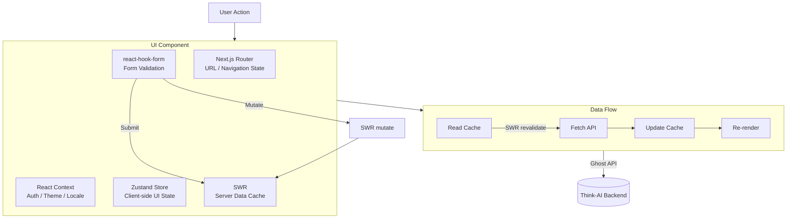

# State Management

The frontend uses a layered state management approach:

| Layer | Technology | Purpose |
|-------|-----------|---------|
| **Server State** | SWR | Caching & revalidation of Ghost API data |
| **Client State** | Zustand | UI state, modals, user preferences |
| **URL State** | Next.js Router | Page navigation, dynamic routes |
| **Form State** | react-hook-form | Form input validation & submission |
| **Context** | React Context | Theme, auth, locale providers |

## SWR (Server State)

Used for data fetching from the Ghost backend:

```typescript
// Pattern: swr hooks for API data
import useSWR from 'swr'

function usePosts(filter) {
    return useSWR(`/ghost/api/admin/posts/?filter=${filter}`, fetcher)
}
```

- Automatic revalidation on focus
- Deduplication of concurrent requests
- Optimistic UI updates
- Cache invalidation on mutations

## Zustand (Client State)

Used for lightweight client-side state:

```typescript
// Pattern: Zustand store for UI state
import { create } from 'zustand'

const useEditorStore = create((set) => ({
    isDirty: false,
    selectedBlock: null,
    setDirty: (dirty) => set({ isDirty: dirty }),
    selectBlock: (block) => set({ selectedBlock: block }),
}))
```

No boilerplate, no providers — lighter than Redux, sufficient for this application's needs.

## React Context

Used for global providers:

- **Authentication context** — user session, permissions
- **Theme context** — dark/light mode, MUI theme
- **Layout context** — responsive layout state
- **Locale context** — current language (via i18n)

## Form State

react-hook-form handles complex form states in:

- Editor screens (article creation)
- Profile settings
- Dashboard forms
- Gallery upload forms
- Any validated input forms

## State Flow



```
User Action
    │
    ▼
Component ←→ Zustand Store (client-side UI state)
    │
    ├──→ SWR (server data) ←→ Ghost API
    │
    ├──→ react-hook-form (form state) → submit → SWR mutate
    │
    ├──→ React Context (global providers)
    │
    └──→ Next.js Router (URL state, navigation)
```
