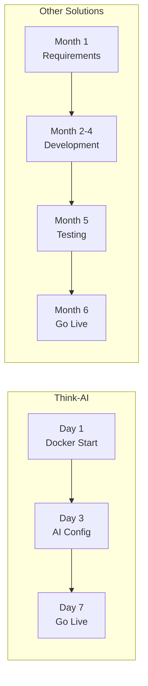
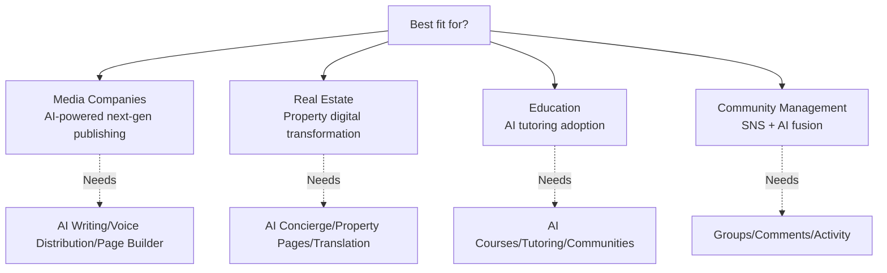

# Competitive Comparison

## Platform Comparison

| Feature | **Think-AI** | Ghost CMS | WordPress + AI | Strapi + AI |
|---------|------------|-----------|---------------|-------------|
| **AI Assistant** | ✅ Built-in (5 providers) | ❌ | 🔶 Plugin-dependent | 🔶 Custom dev |
| **AI Voice** | ✅ Built-in | ❌ | ❌ | ❌ |
| **AI Image Gen** | ✅ Built-in | ❌ | ❌ | ❌ |
| **AI Media Processing** | ✅ Built-in | ❌ | 🔶 Plugins | ❌ |
| **Smart Notifications** | ✅ Built-in | ❌ | 🔶 Plugins | ❌ |
| **SNS Features** | ✅ Full integration | ❌ | 🔶 Plugins | ❌ |
| **Page Builder** | ✅ Data binding | ❌ | 🔶 SEO issues | 🔶 Basic |
| **Multi-tenant** | ✅ Group management | ❌ | ❌ | ❌ |
| **Self-Hosted** | ✅ Docker one-click | ✅ | 🔶 Complex | ✅ Docker |
| **Data Sovereignty** | ✅ Complete control | ✅ | 🔶 3rd party | ✅ |
| **API Extensibility** | ✅ 200+ std + 30+ custom | ✅ 200+ std | ❌ REST limits | ✅ Flexible |
| **Multi-language** | ✅ JA / EN / ZH | ✅ Community | 🔶 Plugin | ✅ Plugin |

## Cost Comparison (Monthly Est., 100K users, Self-Hosted)

| Item | Think-AI | WordPress + AI Plugins | Custom Dev |
|------|---------|------------------------|------------|
| License | License fee | Free (plugins extra) | High dev cost |
| Server | $300~ | $300~ | $500~ |
| AI Usage | $100~ (optimized) | $300~ | $500~ |
| Maintenance | Included | Plugin management extra | Extra |
| **Total** | **$400~/mo** | **$600~/mo** | **$10K+ (initial)** |

## Time-to-Market

## Ideal for

---

[Back to Marketing →](index)
