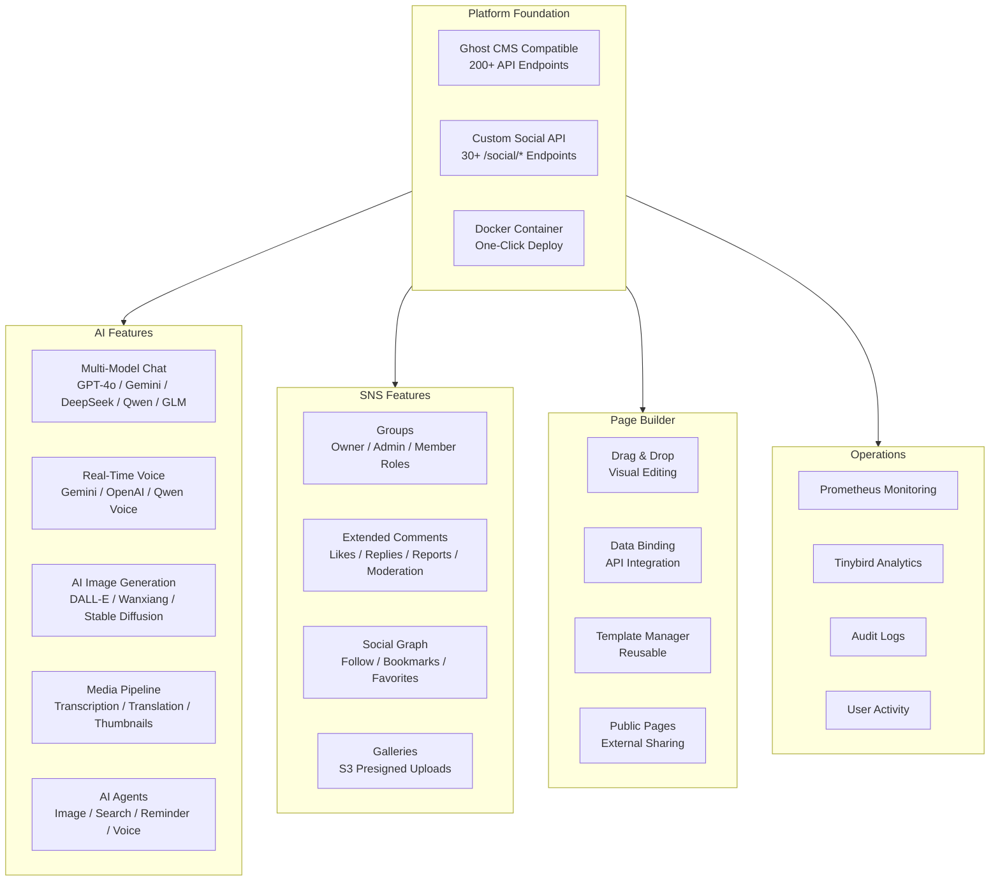

# Think-AI Feature Catalog

## Feature Categories

## Feature Details

### AI Assistant

| Feature | Providers | Status |
|---------|----------|--------|
| Text Chat (Streaming) | OpenAI, Gemini, DeepSeek, Qwen, Zhipu GLM | ✅ Done |
| Conversation History | All providers | ✅ Done |
| Context-Aware Search | RAG Pipeline | ✅ Done |
| Model Auto-Routing | Optimal model per task | ✅ Done |

### Real-Time Voice

| Feature | Providers | Status |
|---------|----------|--------|
| Voice Chat (Low Latency) | Gemini Realtime, OpenAI Voice, Qwen Voice | ✅ Done |
| Speech-to-Text | Qwen STT | ✅ Done |
| Text-to-Speech | Qwen TTS | ✅ Done |
| Interruption Support | All providers | ✅ Done |

### Social Features

| Feature | Description | Status |
|---------|------------|--------|
| Groups | Create, join, role management | ✅ Done |
| Comments | CRUD, likes, replies, reports, moderation | ✅ Done |
| Follow | Follow/unfollow, follower list | ✅ Done |
| Bookmarks | Article/post bookmark management | ✅ Done |
| Favorites | Content likes | ✅ Done |
| Galleries | User/group galleries, S3 upload | ✅ Done |
| Activity Logs | User audit trail | ✅ Done |

### Page Builder (StackPage)

| Feature | Description | Status |
|---------|------------|--------|
| Drag & Drop | gridstack-based intuitive layout | ✅ Done |
| Data Binding | Dynamic API data integration | ✅ Done |
| Event Binding | Click, hover event handling | ✅ Done |
| Property Editor | JSON Schema-driven editing | ✅ Done |
| Transformer Pipeline | Date, currency, number formatting | ✅ Done |
| Public Pages | External user page publishing | ✅ Done |

### AI Media Processing

| Feature | Description | Status |
|---------|------------|--------|
| Video Processing | Transcoding, thumbnail extraction | ✅ Done |
| Audio Processing | Transcription, translation, subtitles | ✅ Done |
| Image Processing | Resize, optimize, virtual staging | ✅ Done |
| Background Jobs | Async processing pipeline | ✅ Done |

---

[Back to Marketing →](index)
