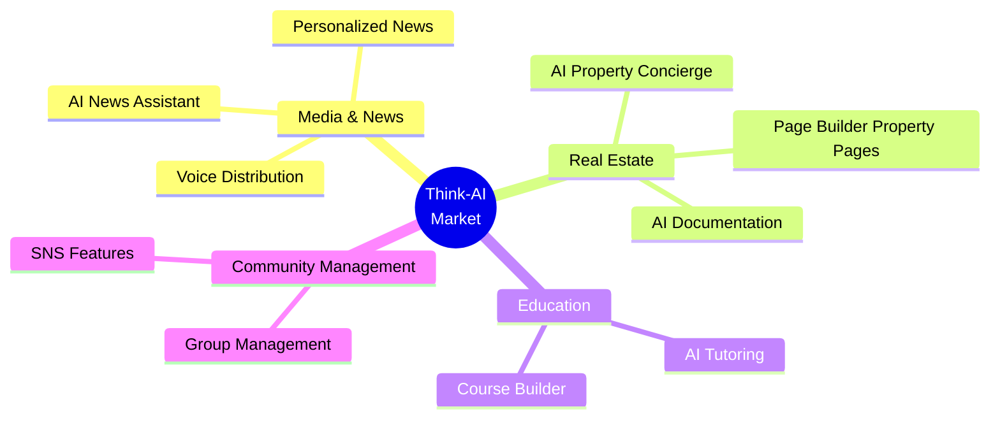
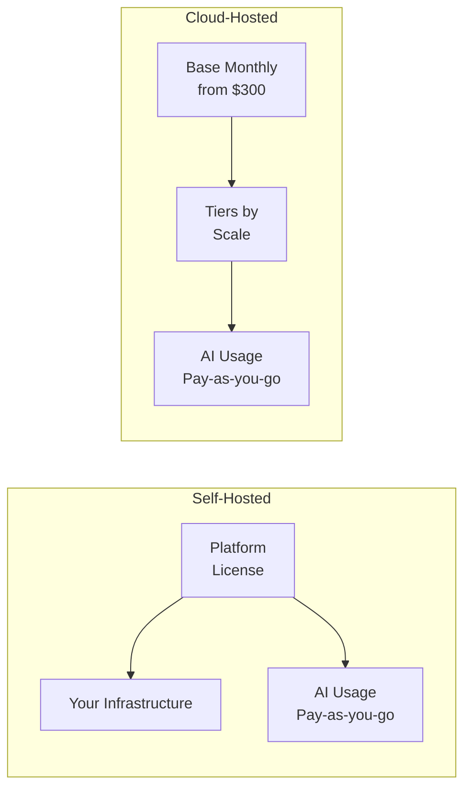
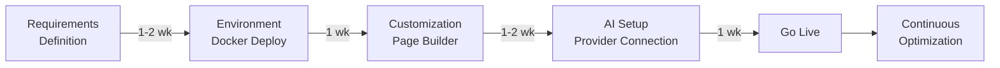
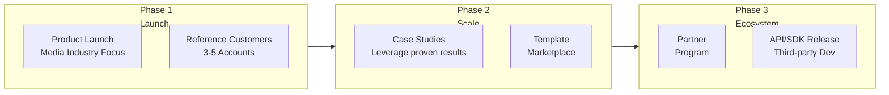

# Think-AI Marketing

**AI-Powered Next-Generation Social Platform**

Use this section for promotion, sales, and proposal materials.

---

## Target Markets

## Product Highlights

| Feature | Value Proposition | Differentiator |
|---------|-----------------|----------------|
| **Multi-Model AI Assistant** | 5 AI providers optimized per task | No vendor lock-in, cost optimization |
| **Real-Time Voice** | Natural voice conversations with interruption | Multiple voice providers |
| **Visual Page Builder** | No-code dynamic page creation | Data binding, transformer pipeline |
| **Full SNS Suite** | Groups, comments, galleries, follows | CMS + SNS integration |
| **AI Media Processing** | Automatic video/audio/image processing | Background job pipeline, ffmpeg |

## Pricing Model

## Implementation Steps

---

## Advisor's Note — Strategic Insights

### 🎯 Positioning Strategy

Think-AI's greatest strength is its **"CMS + SNS + AI trinity integration."** The market is crowded with CMS-specialized (WordPress, Ghost), SNS-specialized (Discourse, Circle), and AI-chat-specialized solutions — but few offer all three on a single platform.

**Recommended positioning:**
> Position Think-AI not as an "AI-equipped CMS," but as an "AI platform with CMS capabilities." AI is the foundation; CMS/SNS are features built on top. This messaging creates clear differentiation from competitors who bolt AI on as an afterthought.

### 📊 Segment Priority

With limited resources, approach segments in this order:

| Priority | Segment | Rationale |
|----------|---------|-----------|
| 🥇 Highest | Media & News | AI writing assistant value is clearest. DX budgets available. |
| 🥈 Second | Real Estate | AI concierge + Page Builder combo is unique value. Results measurable. |
| 🥉 Future | Education / Community | Large market but more specialized competitors (LMS). |

### 💰 Pricing Strategy Advice

- **Set starter plans at a low price point (not free).** Free plans lower quality expectations and increase churn (zero switching cost). A starter price around $50/month is recommended.
- **Emphasize AI cost transparency.** "AI usage billed at cost" messaging builds trust with enterprise customers.
- **Introduce annual discounts** (15-20% off) to improve retention rates.

### 🚀 Growth Strategy

**Key Insight:** In Phase 1, the priority is not "more features" but "one overwhelming success story." Deep adoption in one media company with measurable KPIs (60% faster article creation, 2x engagement) becomes the foundation for scaling sales.

---

## Related Documents

- [Features →](features)
- [Competitive Comparison →](comparison)
- [Use Cases →](use-cases)
- [Pricing →](pricing)
