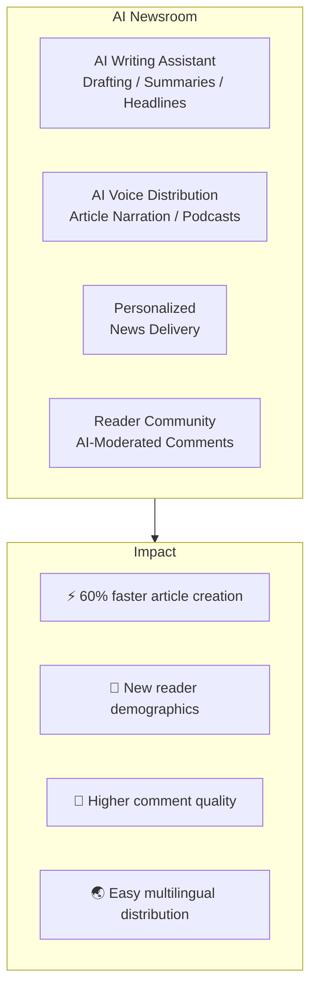
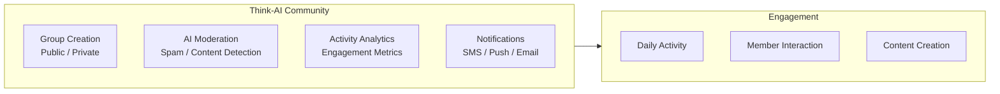

# Use Cases

## Media & News Industry

### Challenges
Declining print subscriptions, falling ad revenue, youth disengagement from news.

### Solution

**Key Features:**
- AI writing assistant (drafts, headlines, fact-checking)
- Personalized news delivery
- AI voice narration (listen during commute/housework)
- AI comment moderation
- Page Builder for no-code breaking news pages

---

## Real Estate Industry

### Challenges
Inefficient property management, personalized customer service gaps, insufficient overseas investor outreach.

### Solution

| Feature | Application |
|---------|------------|
| **AI Property Concierge** | 24/7 auto-response, multilingual |
| **Hybrid Search** | Natural language + structured filters |
| **Page Builder Templates** | Property pages from templates |
| **AI Translation** | Automatic JA/ZH/EN translation |
| **AI Documentation** | Automated property report generation |
| **Smart Notifications** | Viewing reminders, price drop alerts |

---

## Education

### Challenges
Online education quality, personalized instruction automation, community building.

| Feature | Application |
|---------|------------|
| **AI Tutoring** | 24/7 student support, personalized learning |
| **Course Page Builder** | No-code course page creation |
| **Community Features** | Class groups, discussion management |
| **Media Processing** | Lecture transcription, translation |

---

## Community Management

---

[Back to Marketing →](index)
