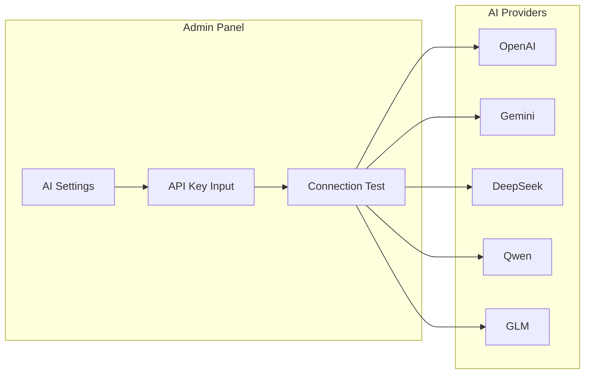

# Admin Guide

## Accessing Admin Panel

```bash
# Admin URL
https://your-domain.com/ghost/

# Login with initial admin account
```

## User Management

### Roles & Permissions

| Role | Permissions | Description |
|------|-------------|-------------|
| **Owner** | Full access | System-wide management |
| **Administrator** | Admin ops | User mgmt, content mgmt |
| **Editor** | Content edit | Create, edit, publish articles |
| **Author** | Article creation | Create articles (needs approval) |
| **Member** | View, comment | General users |

### Group Management (Custom SNS)

Groups have the following roles:

```
Group
├── Owner (creator, deletion rights)
├── Admin (member mgmt, settings)
└── Member (posts, comments)
```

## AI Configuration

### AI Provider Connection



### Model Routing

Configure which AI model to use per task:

| Task | Recommended Model | Fallback |
|------|------------------|----------|
| General Chat | GPT-4o / Gemini | DeepSeek |
| Chinese Optimized | Qwen / GLM | GPT-4o |
| Cost-Sensitive | DeepSeek V3 | Qwen |
| Image Generation | DALL-E | Tongyi Wanxiang |
| Voice Chat | Gemini Realtime | Qwen Voice |

## Monitoring & Maintenance

### Regular Maintenance

| Item | Frequency | Notes |
|------|-----------|-------|
| Log Rotation | Daily | Docker logs |
| DB Backup | Daily | mysqldump |
| Media Cleanup | Weekly | Unused assets |
| Security Updates | Monthly | Docker image updates |

### Prometheus Monitoring

Endpoint: `/metrics` provides:
- HTTP request count and latency
- DB connection count
- AI API call count and latency
- Media job processing count

---

[Back to Operations →](index)
