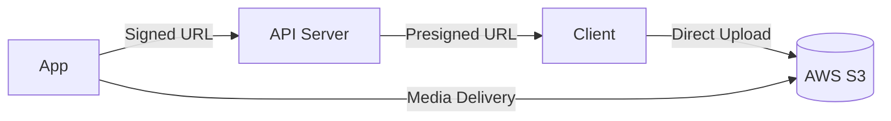

# Deployment Guide

## Prerequisites

| Requirement | Version/Spec |
|-------------|-------------|
| Docker | 24.0+ |
| Docker Compose | 2.20+ |
| MySQL | 8.0 (built-in container) |
| Node.js | 20.19.0 (prod uses container) |
| Recommended Server | 4 vCPU / 8GB RAM+ |

## Deployment Steps

### 1. Clone Repositories

```bash
# Backend
git clone <repo-url> 00-Ghost-5.116.2

# Frontend
git clone <repo-url> 01-jibunsee-react
```

### 2. Configure Environment Variables

```bash
cd 00-Ghost-5.116.2
cp .env.example .env
# Edit .env with your settings
```

**Key Environment Variables:**

| Variable | Description | Required |
|----------|-------------|----------|
| `database__connection__host` | MySQL host | ✅ |
| `database__connection__user` | MySQL user | ✅ |
| `database__connection__password` | MySQL password | ✅ |
| `database__connection__database` | Database name | ✅ |
| `url` | Site URL | ✅ |
| `OPENAI_API_KEY` | OpenAI API key | 🔶 For AI |
| `GEMINI_API_KEY` | Google Gemini API key | 🔶 For AI |
| `DEEPSEEK_API_KEY` | DeepSeek API key | 🔶 For AI |
| `QWEN_API_KEY` | Alibaba Qwen API key | 🔶 For AI |
| `ZHIPU_API_KEY` | Zhipu GLM API key | 🔶 For AI |
| `AWS_ACCESS_KEY_ID` | AWS S3/SNS access key | 🔶 For S3/SNS |
| `AWS_SECRET_ACCESS_KEY` | AWS secret key | 🔶 For S3/SNS |
| `AWS_REGION` | AWS region | 🔶 For S3/SNS |

### 3. Start with Docker Compose

```bash
# Backend
cd 00-Ghost-5.116.2
docker compose up -d

# Frontend
cd 01-jibunsee-react
docker compose up -d
```

### 4. Verify

```bash
# Backend API
curl http://localhost:2368/ghost/api/admin/

# Frontend
curl http://localhost:3000
```

## AWS Setup

### S3 (Media Storage)



1. Create S3 bucket
2. Create IAM user with S3 access policy
3. Configure CORS settings
4. Set AWS credentials in environment variables

### SNS (SMS Notifications)

1. Configure SMS sender ID in AWS SNS
2. Attach SNS Publish policy to IAM
3. Set AWS credentials in environment variables

---

[Back to Operations →](index)
