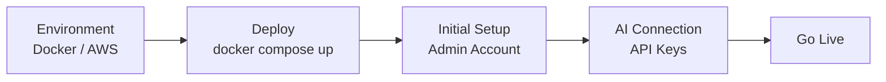
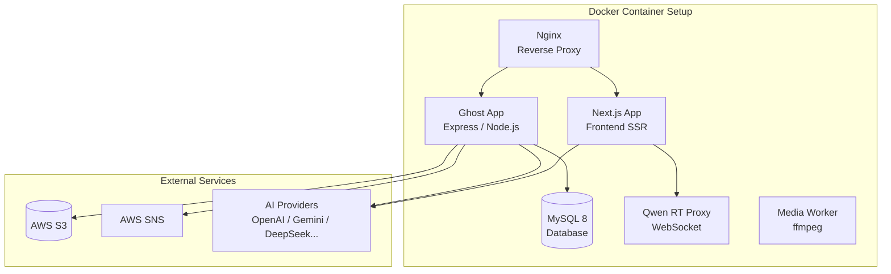

# Operations Manual

Guides for setting up, managing, and operating the Think-AI platform.

---

## Quick Start

| Step | Duration | Details |
|------|---------|---------|
| Environment Setup | 1-2 hrs | [Deployment Guide →](deployment) |
| Deploy | 10 min | Start with Docker Compose |
| Initial Setup | 30 min | Admin account, site settings |
| AI Connection | 15 min | AI provider API key setup |

---

## Sections

| Section | Audience | Content |
|---------|----------|---------|
| [Deployment Guide](deployment) | Infrastructure | Docker config, AWS setup, environment variables |
| [Admin Guide](admin-guide) | Site Admins | User management, content management, AI settings |
| [User Guide](user-guide) | End Users | Basic operations, AI features usage |
| [Troubleshooting](troubleshooting) | Everyone | Common issues and solutions |

## System Architecture

