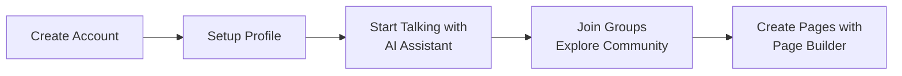

# User Guide

## Getting Started

Think-AI is an AI-powered next-generation social platform.  
Use chat, voice, image generation, and SNS features all in one platform.

## Quick Start

## Using AI Assistant

### Chat

1. Click the AI Assistant icon on screen
2. Type your question in the text box
3. Press Enter (streaming response)
4. Switch models as needed

**Capabilities:**
- General Q&A and consultation
- Article summarization and creation
- Translation (JA/EN/ZH)
- Site content search

### Voice Chat

1. Click the voice icon in AI Assistant
2. Allow microphone access
3. Speak — AI responds with voice
4. Interruption supported (just speak)

### Image Generation

1. Ask "create an image" to AI Assistant
2. Enter prompt (e.g., "sunset beach")
3. Review and download generated image

## SNS Features

### Groups

| Action | Method |
|--------|--------|
| Create group | Groups page → "Create" button |
| Join group | Group page → "Join" button |
| Post in group | Group post form |
| Manage members | Group admin only |

### Comments

- Post via comment form below articles
- Like or reply to other users' comments
- Report inappropriate comments

### Gallery

- Upload images to galleries
- Secure S3 presigned URL upload
- Album management per group

## Page Builder

1. Select "Page Builder" from menu
2. Create new page
3. Drag & drop elements from component palette
4. Configure element properties
5. Bind dynamic content with data binding
6. Click publish

## Setting Reminders

1. Tell AI Assistant: "Remind me about the meeting at 10am tomorrow"
2. Reminder is automatically set
3. Receive SMS or push notification

---

[Back to Operations →](index)
