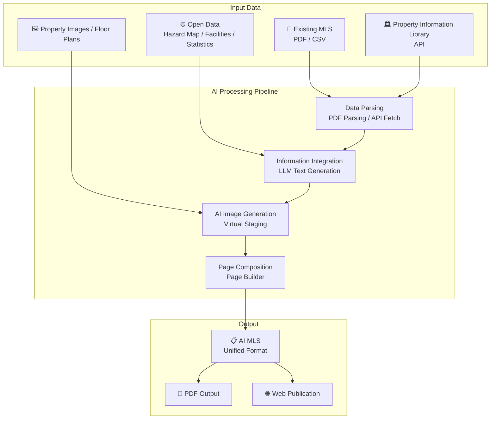
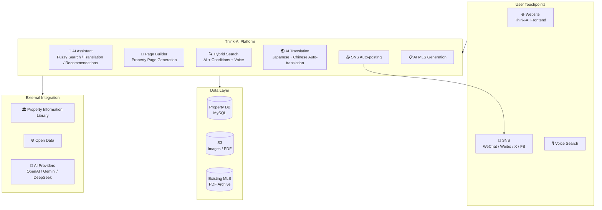
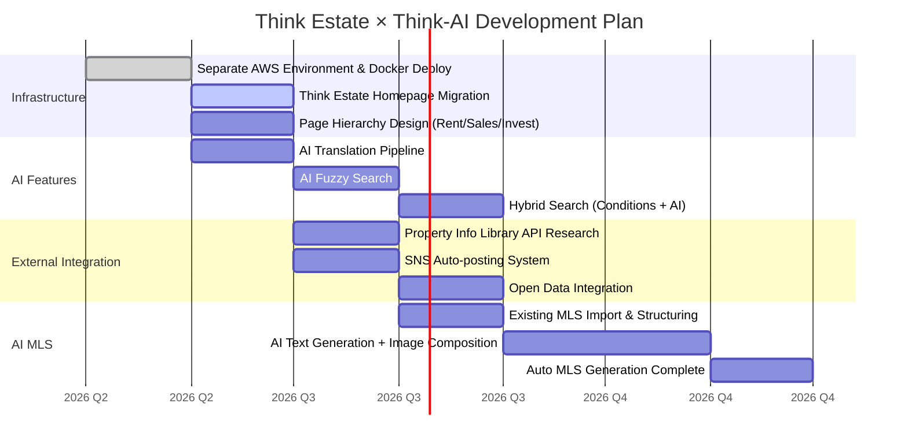

# Think Estate — Think-AI Real Estate System Requirements Specification

**Date:** 2026-04-29
**Submitted by:** Koji Kamiya (Think System Co., Ltd.)
**Project:** Think Estate × Think-AI

---

## Requirements List (Priority Order)

### ① Separate Environment Preparation & Homepage Migration

**Requirement:** Prepare a separate environment distinct from 60-think.com, and fully migrate the Think Estate homepage.
※ Leave the "For Overseas/Chinese Customers" page under construction during migration.

**Q&A:**
| # | Question | Answer |
|---|------|------|
| 01 | Is it sufficient to just launch another Docker container? | A separate AWS contract is needed, otherwise specs are insufficient |
| 02 | Can design be applied consistently to the entire page with any container configuration? | Yes |

**Action Plan:**
- Prepare a new AWS account / separate environment
- Deploy Think-AI Docker containers to the new environment
- Recreate existing site static pages with Page Builder + unified design

---

### ② Chinese Translation of All Articles

**Requirement:** Provide Chinese versions of all articles.

**Q&A:**
| # | Question | Answer |
|---|------|------|
| 03 | For migration (static information), can we skip AI translation? | Use AI |
| 04 | How will translation be handled when new property info is added? | Auto-translate then auto-distribute. URLs are shared across language versions |

**Action Plan:**
- Existing content → AI batch translation (OpenAI GPT-4o / DeepSeek, etc.)
- New additions → Automatic translation pipeline runs on registration, generating Chinese version
- Language-specific URL management via i18n routing (/ja/, /zh/, etc.)

---

### ③ Auto-posting to Multiple SNS Platforms

**Requirement:** Automatically post selected articles (property info, etc.) to multiple SNS platforms.

**Q&A:**
| # | Question | Answer |
|---|------|------|
| 05 | Which specific platforms (Chinese)? | Simultaneous SNS posting via OpenClaw (supports both Chinese and Japanese platforms) |
| 06 | Does Think Estate need to prepare accounts? | Yes |

**Action Plan:**
- Prepare accounts for each SNS platform (WeChat, Weibo, Xiaohongshu, Twitter/X, Facebook, etc.)
- Build auto-posting system using OpenClaw / wacli / xurl, etc.
- Create automated pipeline: property registration → AI summary generation → multi-language translation → SNS broadcast

---

### ④ Hierarchical Property Listing Pages

**Requirement:** Split "Property Listings" into Rentals / Sales. Further split Sales into Regular Sales / Investment Properties.
※ Keep featured properties and property info on the homepage.

**Q&A:**
| # | Question | Answer |
|---|------|------|
| 07 | How is page hierarchy achieved on Think-AI? | Feasible. Implementation depends on requirements |

**Action Plan:**
```
Property Listings
├── Rentals
│   ├── Search by Conditions (Rent / Deposit / Key Money, etc.)
│   └── Property List
├── Sales
│   ├── Regular Sales
│   │   ├── Search by Conditions (Price / Area / Age, etc.)
│   │   └── Property List
│   └── Investment Properties
│       ├── Search by Conditions (Actual Yield / Expected Yield, etc.)
│       └── Property List
└── Featured Properties (Displayed on Homepage)
```

- Create template pages for each category using Page Builder
- Implement hierarchical structure with custom routing
- Add property_type / category fields to the data model

---

### ⑤ Hybrid AI Fuzzy Search + Conditional Search

**Requirement:** Implement hybrid AI fuzzy search and conditional search. Conditional search items configurable separately for rentals/sales/investment.

**Q&A:**
| # | Question | Answer |
|---|------|------|
| 08 | Can conditional search support multiple input types (value ranges, selections)? | Items selected can be converted to text and combined with (voice input) for search. If unsatisfied with AI search results, users can search using conditions only |

**Action Plan:**
```
User Input
    │
    ├── Natural Language Search (AI)
    │   "Find rentals near station, pet-friendly, 3LDK"
    │       → Embedding similarity search + LLM recommendations
    │
    ├── Conditional Search (Filters)
    │   Rentals: Rent Range / Deposit / Key Money / Layout / Walk Time / Age
    │   Sales: Price Range / Area / Age / Walk Time
    │   Investment: Actual Yield / Expected Yield / Price / Area
    │
    └── Hybrid (AI + Conditions)
        Filter by conditions → AI supplements with fuzzy search
        or
        AI search → Filter results with conditions

```

---

### ⑥ Integration with Property Information Library (REINS-equivalent)

**Requirement:** Display search results from the property information library alongside company-owned properties in a unified listing.

**Q&A:**
| # | Question | Answer |
|---|------|------|
| 09 | Can search results be extracted from the property information library? API authentication status? | Not yet started |

**Action Plan:**
- Investigate property information library / REINS API specifications
- Confirm API authentication and usage contracts
- Develop custom data integration module
- Display integrated search results of company + external properties

---

### ⑦ Display When Selecting Other Companies' Properties from Listings

**Requirement:** Display format when selecting other companies' properties from listings to be determined.
※ If MLS information is auto-generated and displayed before confirming handling capability, it may cause misunderstanding that the property is available for contract.

**Q&A:**
| # | Question | Answer |
|---|------|------|
| 10 | Can listing pages be created? | Yes |

**Action Plan:**
- Clearly display disclaimers (e.g., "This property is not handled by our company")
- Differentiate display styles between company properties and third-party properties
- Limit inquiry routing to company-handled properties (forwarding arrangement)
- Auto-generated MLS information limited to company-owned properties only

---

### ⑧ AI Auto-Generation of Property Information Sheets (MLS)

**Requirement:** Automatically generate AI property information sheets utilizing the property information library, existing MLS data, and open data (neighborhood facilities, hazard maps, etc.).

**Q&A:**
| # | Question | Answer |
|---|------|------|
| 11 | Can existing MLS information be imported? | Readable |
| 12 | Can non-text information be obtained from the property information library? | Not yet started |
| 13 | Can MLS be created by integrating existing MLS, open data, and property information library data? | Not yet started. Image composition is possible |

**Action Plan:**


**Phased Approach:**

| Phase | Content | Timeline |
|-------|------|------|
| Phase 1 | Import existing MLS + structure text data | 2026 Q3 |
| Phase 2 | Property information library integration + open data integration | 2026 Q4 |
| Phase 3 | AI automatic text generation + image composition | 2026 Q4 |
| Phase 4 | Fully automated AI MLS generation pipeline complete | 2027 Q1 |

---

## System Architecture Diagram (Real Estate Edition)



---

## Development Roadmap



---

## Required Resources

| Category | Item | Notes |
|---------|------|------|
| **Infrastructure** | New AWS Account | Separate contract needed due to current spec limitations |
| **SNS Accounts** | WeChat Official Account | For China |
| | Weibo Official Account | For China |
| | Xiaohongshu (RED) Account | For China |
| | Twitter/X Account | For Japan |
| | Facebook Page | For Japan |
| **External APIs** | Property Info Library API Contract | Requires investigation |
| | Hazard Map API | Open data |
| | Neighborhood Facilities API | Google Maps / Other |
| **Translation** | AI Translation Models | OpenAI / DeepSeek etc. (existing) |

---

*This requirements specification is based on meeting discussions dated April 29, 2026.*
*Think-AI Real Estate · Think Estate · Think System Co., Ltd.*
