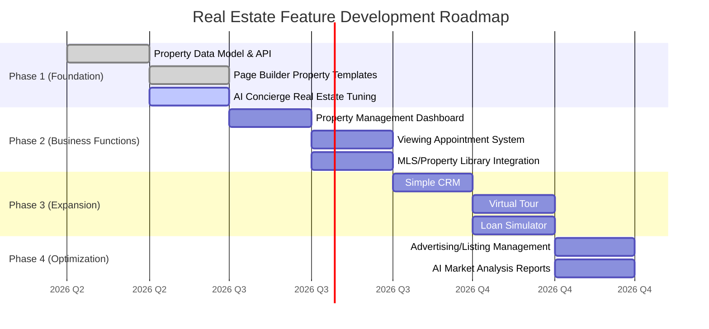
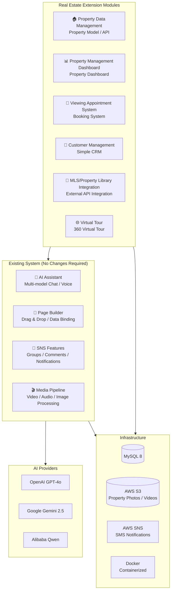

# Think-AI Real Estate Vision

**AI-Powered Digital Transformation for the Real Estate Industry**

---

## 1. Executive Summary

Think-AI is a platform that enables **AI-driven comprehensive digital transformation** for real estate operations. Built on existing SNS/CMS foundations, AI assistants, and a visual page builder, it evolves into a total industry solution by adding modules that cover real-estate-specific business workflows.

**Already available:** AI chat, voice interaction, image generation, reminder notifications, media processing, Page Builder
**Extensible to:** Property pages, customer management, viewing appointments, AI concierge, virtual tours

---

## 2. Why Think-AI for Real Estate

### Real Estate Industry Challenges

| Challenge | Current Problem |
|------|------------|
| **Inefficient customer response** | High labor costs for inquiry handling, unable to respond outside business hours |
| **Complex property information management** | Switching between multiple systems, manual update errors |
| **Insufficient digital presence** | Many real estate companies lack attractive websites |
| **Difficulty in customer follow-up** | Post-viewing and contract follow-ups rely on individual effort |
| **Time-consuming content creation** | Property pages, flyers, and SNS posts require significant time |
| **Lack of data analysis** | Inability to analyze customer behavior and market trends |

### Think-AI's Transformational Impact

| Solution | Impact |
|--------------|-----------|
| **AI Concierge 24/7** | Instant response to customer inquiries, appointment booking, property recommendations |
| **Visual Page Builder** | Real estate companies create attractive property pages themselves, no CMS required |
| **Smart Reminders** | Pre-viewing reminders, automatic deadline notifications |
| **AI Image Generation/Processing** | Automatic photo correction, virtual staging, floor plan generation |
| **Media Processing Pipeline** | Automatic property video generation, virtual tour creation |
| **AI Search & Recommendations** | Optimal property suggestions based on customer requirements |
| **Group Management** | Sales team, customer groups, property category management |

---

## 3. Capabilities Already Available in the Current System

### ✅ AI Assistant (Multi-Model)

Supports multiple AI models including ChatGPT / Gemini / DeepSeek / Qwen, switchable by use case.

**Real Estate Applications:**
- 24/7 responses to customer inquiries about properties
- Multi-language auto-response (Japanese, English, Chinese, etc.)
- Loan calculations and cost estimates
- Providing neighborhood facility information (supermarkets, schools, hospitals, etc.)

### ✅ Real-time Voice Interaction

Voice-based property search, dictation of viewing notes, voice-based customer service.

**Real Estate Applications:**
- "Find me a 3LDK, within a 5-minute walk, pet-friendly" — voice search
- Automatic transcription of voice notes during property viewings
- Real-time translation calls with international customers

### ✅ Smart Reminders & Notifications

Reminder system supporting both SMS and push notifications.

**Real Estate Applications:**
- Automatic reminder the day before a viewing (SMS + push)
- Contract submission deadline notifications
- Automatic loan pre-approval result notifications
- Push notifications for price-reduced properties

### ✅ Page Builder (StackPage)

Visual drag-and-drop page builder. Supports API data binding.

**Real Estate Applications:**
- Property detail page templates (photo gallery, floor plan, neighborhood map)
- No-code campaign page creation
- Automatically updating recommended property lists via data binding

### ✅ AI Media Processing Pipeline

Background job system for automatic video, audio, and image processing.

**Real Estate Applications:**
- Automatic viewing video generation (image slideshow + BGM + captions)
- Automatic property photo correction (brightness, color correction, object removal)
- Virtual staging (AI composites furniture into empty rooms)

### ✅ SNS Social Features

Group management, comments, likes, follows, and other SNS foundations.

**Real Estate Applications:**
- Customer inquiry threads per property
- Internal sales team groups
- Community formation among prospective buyers
- Bookmarking favorite properties

---

## 4. Extensible Capabilities

### 🔧 AI Agent Function Expansion

Customizing the existing agent system (image generation, search, reminders, voice, media) for real estate.

**Real Estate AI Agents:**

| Agent | Function | Existing Assets |
|------------|------|-----------|
| **Property Guide Agent** | Property recommendations, viewing guidance | Existing AI Chat + Search Agent |
| **Valuation Agent** | Market analysis, valuation report generation | Existing AI Search + Media Jobs |
| **Document Agent** | Contract template generation, important matters draft | Existing AI Chat + Content Generation |
| **Follow-up Agent** | Automatic post-viewing/post-contract follow-up | Existing Reminder + Notification System |

### 🔧 Page Builder Templates

| Template | Description | Technical Implementation |
|------------|------|--------------|
| Property Detail Page | Photos, floor plan, price, neighborhood info, inquiry form | Existing Page Builder + Data Binding |
| Property Listing Page | Searchable property list with filters | Existing Components + API Data Binding |
| Company Profile Page | Company info, staff introduction, track record | Existing Page Builder |
| Contact Page | Form + AI auto-response | Existing AI Chat Embedding |

### 🔧 Data Integration

Leveraging existing API route system for external system integration.

| Integration Target | Method | Existing Mechanism |
|--------|------|-------------|
| MLS / Property Information Library | Custom API endpoints + data binding | 30+ custom endpoint foundation |
| Google Maps | Embedding + data integration | Existing Frontend |
| Billing/Payment | API routes + Webhook | Existing API Route Handlers |
| CRM | API integration | Existing API Communication Foundation |

---

## 5. New Development Modules Required

### 🏗️ New Module List

| Module | Priority | Development Size | Description |
|-----------|--------|---------|------|
| **Property Data Model** | ★★★ High | Medium | Database models and API for property information management |
| **Property Management Dashboard** | ★★★ High | Large | Unified management interface for company properties (registration, editing, publishing) |
| **MLS/Property Library API** | ★★★ High | Medium | Automatic integration with external property databases |
| **Viewing Appointment System** | ★★☆ Medium | Medium | Online viewing booking, scheduling, notifications |
| **Customer Management (Simple CRM)** | ★★☆ Medium | Large | Customer information, inquiry history, interested properties management |
| **Virtual Tour Builder** | ★★☆ Medium | Medium | Virtual viewing page creation with 360° photos |
| **Loan Simulator** | ★☆☆ Low | Small | Monthly payment calculation based on loan amount and interest rate |
| **Advertising/Listing Management** | ★☆☆ Low | Medium | Portal site integration, ad placement management |

### 🏗️ Priority Roadmap



---

## 6. Use Case Scenarios

### Scenario 1: A Buyer's Experience

```
User (on mobile)
    │
    ├── 1. "Find me a 3LDK, Setagaya, within a 10-minute walk"
    │       → AI Concierge recommends 5 matching properties
    │
    ├── 2. Create a page for interesting properties using Page Builder
    │       → Photo gallery, 360° view, floor plan, neighborhood info
    │       → Data binding automatically shows latest information
    │
    ├── 3. "I'd like to book a viewing"
    │       → Select desired date/time from calendar
    │       → Notify real estate company, send confirmation to user
    │
    ├── 4. Automatic reminder the day before viewing
    │       → SMS + Push notification "Your viewing is tomorrow at 2pm"
    │
    ├── 5. AI follow-up after viewing
    │       → "How was today's viewing? Any other properties you're interested in?"
    │
    └── 6. Start purchase process
            → "Would you like to run a loan simulation?"
            → "I'll send you the required documents list"
```

### Scenario 2: Real Estate Company Operations

```
Sales Representative
    │
    ├── Morning: Check today's viewing schedule on AI Dashboard
    │       → Automatic reminders improve customer response rate by 40%
    │
    ├── Mid-morning: Create new property page with Page Builder
    │       → Auto-layout just by uploading photos
    │       → Price and status auto-update through data binding
    │
    ├── Afternoon: Review AI-generated viewing reports
    │       → Voice notes from viewings auto-transcribed
    │       → "This customer wants 3LDK, values proximity to station"
    │
    └── End of day: AI summarizes tomorrow's tasks
            → "Tomorrow: 3 viewings, 1 contract, 2 follow-ups needed"
```

---

## 7. System Architecture (Real Estate Edition)



---

## 8. Competitive Comparison

| Feature | Think-AI | Real Estate Specific CMS | General CMS | Portal Sites |
|------|----------|-------------|---------|--------------|
| **AI Concierge** | ✅ Built-in | — | — | — |
| **Visual Page Builder** | ✅ Built-in | — | ✅ (Limited) | — |
| **Voice Interaction** | ✅ Built-in | — | — | — |
| **AI Image Generation/Processing** | ✅ Built-in | — | — | — |
| **SMS/Push Notifications** | ✅ Built-in | — | — (Plugin) | — |
| **SNS Community** | ✅ Built-in | — | ✅ (Plugin) | ✅ (Limited) |
| **Property Data Management** | 🔧 In Development | ✅ | — | — |
| **MLS/Property Library Integration** | 🔧 In Development | ✅ (Limited) | — | ✅ |
| **Self-Hosted** | ✅ Full Support | — (SaaS) | ✅ | — (SaaS) |
| **Data Sovereignty** | ✅ Fully Guaranteed | — | ✅ | — |

---

## 9. Future Vision

### 🎯 2027: Establishing an AI Platform for the Real Estate Industry

**Medium-term Vision:**
- Offer as an "AI Real Estate DX Package" for small and medium real estate companies
- Monthly subscription model (self-hosted / cloud-hosted options available)
- Launch of Page Builder template marketplace
- Advanced real estate AI agents (market prediction, automated valuation, transaction matching)

**Long-term Vision:**
- End-to-end digitalization of real estate transactions
- AI-driven automated valuation, matching, and contract support
- Immersive property experiences using metaverse/AR
- Becoming the core platform of the real estate tech ecosystem

### 💡 Core Differentiator

The biggest differentiator of Think-AI's real estate solution is that it is **"AI-native by design."**

Traditional real estate systems take the approach of "adding AI to an existing management system," while Think-AI takes the approach of "adding real estate functionality to an AI-core system." This means:

- AI features are integrated as first-class citizens across all functions
- AI seamlessly supports everything from customer response to internal operations
- New features can be rapidly added through the Page Builder
- Maximum AI capability utilization while maintaining data sovereignty

---

**Think-AI × Real Estate — AI-Powered Digital Transformation**

---

*This document describes Think-AI's vision for real estate. Features and roadmap are subject to change without notice.*
