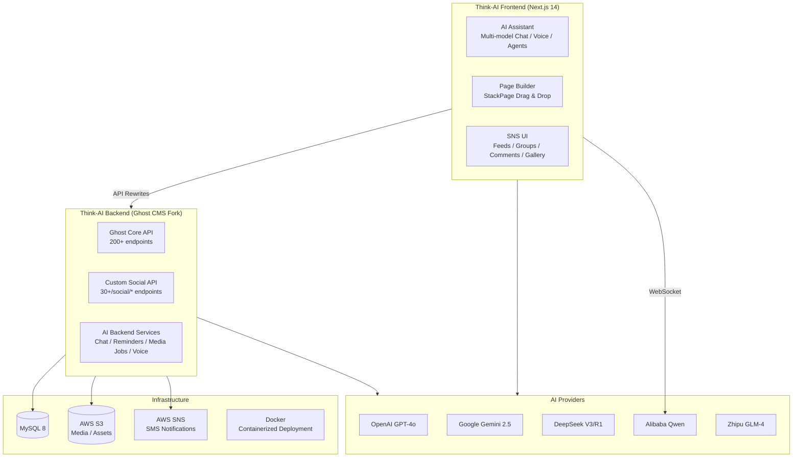

# Think-AI Platform Documentation

**Think-AI** is an AI-powered social networking platform built on a customized Ghost CMS backend and a Next.js/React frontend. This documentation covers system architecture, API reference, deployment, and feature details.

## System Architecture Overview



## [Think-AI Backend](/backend/)

A heavily customized fork of Ghost CMS v5.116.2 — the server-side foundation.

```
00-Ghost-5.116.2/          ← Backend (Express/Node.js + MySQL)
```

- **30+ custom `/social/*` API endpoints** — social graph, groups, comments, galleries
- **Custom Express middleware chain** — authentication, authorization, API key control
- **40+ database migrations** — social & AI features layered on Ghost's schema
- **AI integration** — chat, reminders, media processing, voice, agents
- **Prometheus metrics, Tinybird analytics, ActivityPub support**

[Backend docs →](/backend/)

## [Think-AI Frontend](/frontend/)

A Next.js 14 application delivering AI-powered social experiences.

```
01-jibunsee-react/         ← Frontend (Next.js/React + TypeScript)
```

- **Next.js 14 App Router** — multi-page SPA with SSR/SSG
- **SNS-specific UI** — group feeds, social comments, galleries, AI chat
- **Visual Page Builder (StackPage)** — drag-and-drop page composition with data binding
- **AI-powered features** — streaming chat, voice interaction, image generation, content creation
- **AI Assistant** — multi-agent system with real-time voice, reminders, search, and media processing
- **Docker deployment** — standalone Next.js server + media worker + Qwen RT proxy

[Frontend docs →](/frontend/)

---

> **Repository locations (on WSL2):**
> `/home/aidabo/work/legacy/00-Ghost-5.116.2` — Backend
> `/home/aidabo/work/legacy/01-jibunsee-react` — Frontend
