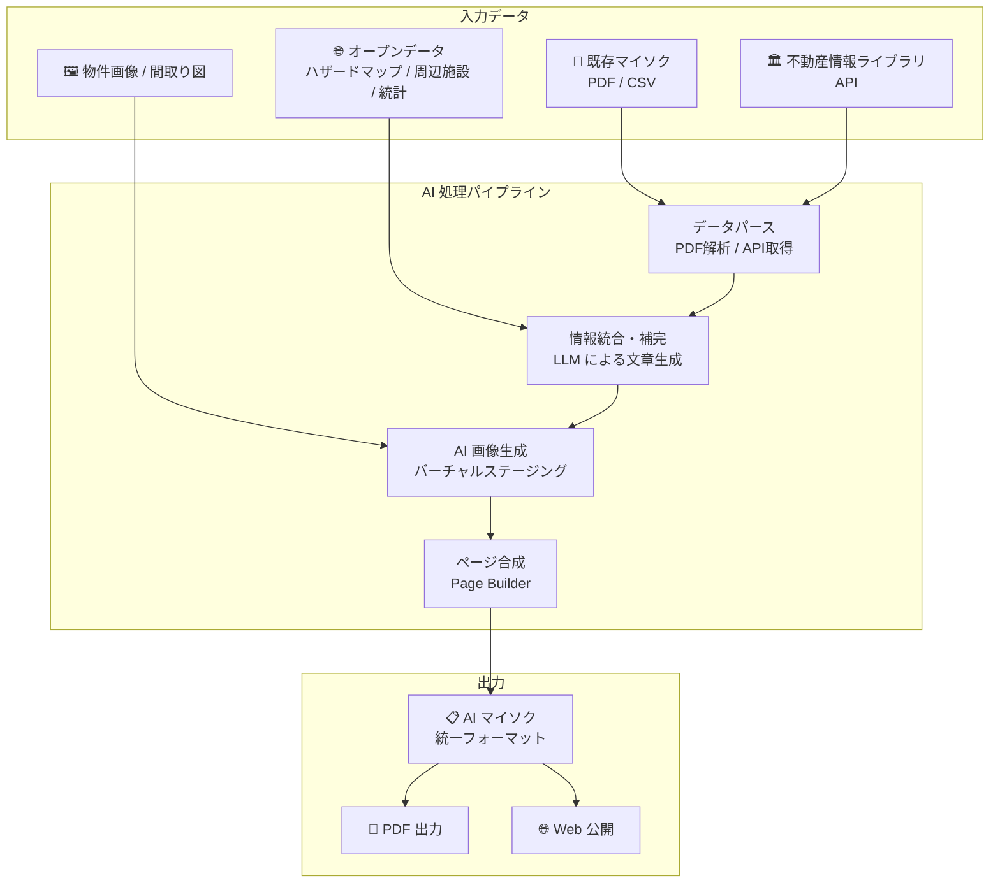
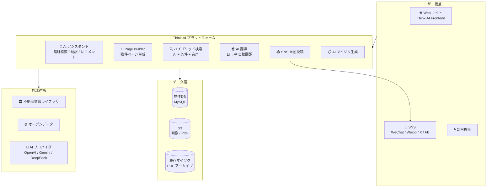
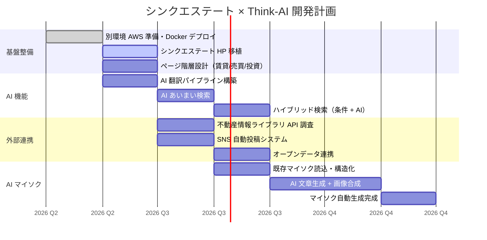

# シンクエステート — Think-AI 不動産システム要件定義書

**作成日:** 2026-04-29
**提出元:** 神矢 浩治 (シンクシステム株式会社)
**プロジェクト:** シンクエステート × Think-AI

---

## 優先順位順 要件一覧

### ① 別環境の準備とホームページ移植

**要件:** 60-think.com とは別の環境を準備し、シンクエステートのホームページを完全移植する。
※「海外・中国の方へ」のページは工事中のまま移植する。

**Q&A:**
| # | 質問 | 回答 |
|---|------|------|
| 01 | 別の Docker コンテナを立ち上げるだけ？ | AWS の別契約にしないとスペック不足 |
| 02 | 任意のコンテナを配置したページ全体へのデザインの適用は？ | 可能 |

**対応方針:**
- 新規 AWS アカウント / 別環境を用意
- Think-AI の Docker コンテナを新環境にデプロイ
- 既存サイトの静的ページを Page Builder で再現＋デザイン統一

---

### ② 全記事の中国語化

**要件:** 全記事に中国語版を用意する。

**Q&A:**
| # | 質問 | 回答 |
|---|------|------|
| 03 | 移植時（スタティックな情報）は AI 翻訳でなくても良い？ | AI でやる |
| 04 | 新規物件情報の追加時の翻訳はどうする？ | 自動翻訳後に自動配布。URL は複数言語ページで共通 |

**対応方針:**
- 既存コンテンツ → AI 一括翻訳（OpenAI GPT-4o / DeepSeek 等）
- 新規追加時 → 登録時に自動翻訳パイプラインが動作し中国語版を生成
- i18n ルーティングで言語別 URL 管理（/ja/ /zh/ など）

---

### ③ 複数 SNS への自動投稿

**要件:** 一部記事（物件情報等）を複数 SNS に自動投稿する。

**Q&A:**
| # | 質問 | 回答 |
|---|------|------|
| 05 | 具体的にどこに投稿する（中国系）？ | オープンクラウド経由で SNS 一斉投稿（中国系・日本系 OK） |
| 06 | シンクエステートでアカウントの準備が必要？ | 必要 |

**対応方針:**
- 各 SNS（WeChat, Weibo, Xiaohongshu, Twitter/X, Facebook等）のアカウントを準備
- OpenClaw / wacli / xurl 等を活用した自動投稿システムを構築
- 物件情報登録 → AI 要約生成 → 多言語翻訳 → SNS 一斉投稿 の自動パイプライン

---

### ④ 物件一覧ページの階層分け

**要件:** 「物件一覧」を賃貸 / 売買に分割。売買は通常売買物件 / 投資物件に分割。
※特選・物件情報はホームページに残す。

**Q&A:**
| # | 質問 | 回答 |
|---|------|------|
| 07 | ページの階層構造は Think-AI 上ではどうやって実現する？ | 実現可能。実装方法は要望内容次第 |

**対応方針:**
```
物件一覧
├── 賃貸物件
│   ├── 条件検索（家賃 / 敷金 / 礼金 等）
│   └── 物件一覧
├── 売買物件
│   ├── 通常売買物件
│   │   ├── 条件検索（価格 / 面積 / 築年数 等）
│   │   └── 物件一覧
│   └── 投資物件
│       ├── 条件検索（実質利回り / 想定利回り 等）
│       └── 物件一覧
└── 特選物件（ホームページ表示）
```

- Page Builder で各カテゴリのテンプレートページを作成
- カスタムルーティングで階層構造を実現
- データモデルに property_type / category フィールドを追加

---

### ⑤ AI あいまい検索 + 条件検索のハイブリッド

**要件:** AI あいまい検索と条件検索をハイブリッドで実装。条件検索項目は賃貸/売買/投資で個別設定可能。

**Q&A:**
| # | 質問 | 回答 |
|---|------|------|
| 08 | 条件検索の項目は、値の範囲や候補からの選択など複数タイプが用意できるか？ | 項目から選択したものを文章化して（音声入力）と合成して検索することもできる。AIの検索結果に満足できない場合、項目のみでも検索できる |

**対応方針:**
```
ユーザー入力
    │
    ├── 自然言語検索（AI）
    │   「駅近でペット可、3LDKの賃貸を探して」
    │       → Embedding 類似度検索 + LLM レコメンド
    │
    ├── 条件検索（フィルター）
    │   賃貸： 家賃範囲 / 敷金 / 礼金 / 間取り / 駅徒歩 / 築年数
    │   売買： 価格範囲 / 面積 / 築年数 / 駅徒歩
    │   投資： 実質利回り / 想定利回り / 価格 / 面積
    │
    └── ハイブリッド（AI + 条件）
        条件で絞り込み → AI が曖昧検索で補完
        または
        AI 検索 → 条件フィルターで結果を絞り込み

```

---

### ⑥ 不動産情報ライブラリ（レインズ相当）との連携

**要件:** 自社物件に加えて、不動産情報ライブラリの検索結果も一覧表示する。

**Q&A:**
| # | 質問 | 回答 |
|---|------|------|
| 09 | 不動産情報ライブラリから検索結果を抽出できるか？API 認証状況は？ | まだ未着手 |

**対応方針:**
- 不動産情報ライブラリ / レインズ API の仕様調査
- API 認証・利用契約の確認
- カスタムデータ連携モジュールの開発
- 自社物件 + 外部物件の統合検索結果表示

---

### ⑦ 一覧からの他社物件選択時の表示

**要件:** 一覧から他社物件を選択した際の表示内容・フォーマットは要検討。
※取り扱い可否確認前にマイソク情報を自動生成して見せると、契約可能と誤解される可能性があるため。

**Q&A:**
| # | 質問 | 回答 |
|---|------|------|
| 10 | 一覧ページをそもそも作ることができるか？ | 作成可能 |

**対応方針:**
- 表示上の注意事項（「当社取扱い物件ではありません」等）を明示
- 他社物件と自社物件で表示スタイルを区別
- お問い合わせ導線は自社経由に限定（転送対応）
- マイソク自動生成は自社物件のみに限定

---

### ⑧ AI マイソク自動生成

**要件:** 不動産情報ライブラリ、既存マイソク情報、オープンデータ（周辺施設・ハザードマップ等）を活用して AI マイソクを自動生成する。

**Q&A:**
| # | 質問 | 回答 |
|---|------|------|
| 11 | 既存マイソク情報の取り込みができるか？ | 読み込み可能 |
| 12 | 不動産情報ライブラリから文字情報以外も取得できるか？ | まだ未着手 |
| 13 | 既存マイソク、オープンデータ、不動産情報ライブラリの情報を統合してマイソクが作成できるか？ | まだ未着手。画像合成はできる |

**対応方針:**


**フェーズ分け:**

| Phase | 内容 | 時期 |
|-------|------|------|
| Phase 1 | 既存マイソクの読み込み + テキスト情報の構造化 | 2026 Q3 |
| Phase 2 | 不動産情報ライブラリ連携 + オープンデータ統合 | 2026 Q4 |
| Phase 3 | AI による自動文章生成 + 画像合成 | 2026 Q4 |
| Phase 4 | フルオート AI マイソク生成パイプライン完成 | 2027 Q1 |

---

## システム構成図（不動産版）



---

## 開発ロードマップ



---

## 必要リソース

| カテゴリ | 項目 | 備考 |
|---------|------|------|
| **インフラ** | AWS 新規アカウント | 現状のスペック不足のため別契約が必要 |
| **SNS アカウント** | WeChat 公式アカウント | 中国向け |
| | Weibo 公式アカウント | 中国向け |
| | Xiaohongshu (RED) アカウント | 中国向け |
| | Twitter/X アカウント | 日本向け |
| | Facebook ページ | 日本向け |
| **外部 API** | 不動産情報ライブラリ API 契約 | 要調査 |
| | ハザードマップ API | オープンデータ |
| | 周辺施設 API | Google Maps / その他 |
| **翻訳** | AI 翻訳モデル | OpenAI / DeepSeek 等（既存） |

---

*本要件定義書は 2026年4月29日 時点の打ち合わせ内容に基づきます。*
*Think-AI Real Estate · シンクエステート · シンクシステム株式会社*
