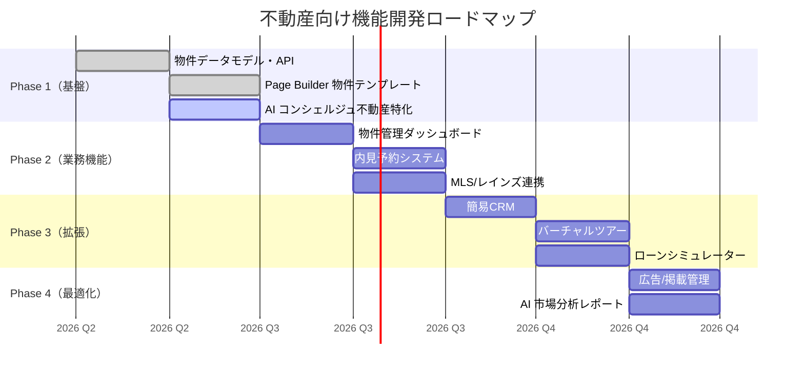
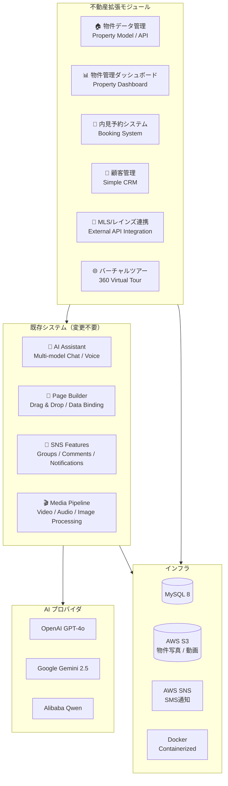

# Think-AI Real Estate Vision

**AI-Powered Digital Transformation for the Real Estate Industry**

---

## 1. Executive Summary

Think-AI は、不動産業務の **AI による全面的なデジタルトランスフォーメーション** を実現するプラットフォームです。既存の SNS/CMS 基盤、AI アシスタント、ビジュアルページビルダーを核に、不動産特有の業務フローをカバーするモジュールを追加することで、業界向けトータルソリューションへと進化します。

**既に出来ていること:** AI チャット、音声対話、画像生成、リマインダー通知、メディア処理、Page Builder
**拡張して出来ること:** 物件ページ、顧客管理、内見予約、AI コンシェルジュ、バーチャルツアー

---

## 2. なぜ不動産に Think-AI なのか

### 不動産業界の課題

| 課題 | 現状の問題点 |
|------|------------|
| **顧客対応の非効率** | 問い合わせ対応に多くの工数、営業時間外の対応が不可能 |
| **物件情報管理の煩雑さ** | 複数のシステムを行き来、手動更新によるミス |
| **デジタルプレゼンス不足** | 多くの不動産会社が魅力的な Web サイトを持てていない |
| **顧客フォローアップの困難** | 内見後や契約手続き中のフォローが属人的 |
| **コンテンツ作成の手間** | 物件紹介ページ、チラシ、SNS投稿に多大な時間 |
| **データ分析不足** | 顧客行動や市場トレンドの分析ができていない |

### Think-AI がもたらす変革

| ソリューション | インパクト |
|--------------|-----------|
| **AI コンシェルジュ 24/7** | 顧客からの問い合わせに即時対応、内見予約、物件提案 |
| **ビジュアル Page Builder** | 不動産会社自身で魅力的な物件ページを作成、CMS不要 |
| **スマートリマインダー** | 内見前のリマインド、契約期限の自動通知 |
| **AI 画像生成/加工** | 物件写真の自動補正、バーチャルステージング、間取り図生成 |
| **メディア処理パイプライン** | 物件動画の自動生成、バーチャルツアー作成 |
| **AI 検索・レコメンド** | 顧客の希望条件に基づく最適な物件提案 |
| **グループ管理** | 営業チーム、顧客グループ、物件カテゴリの管理 |

---

## 3. 現状システムで既に出来ていること

### ✅ AI アシスタント (マルチモデル)

ChatGPT / Gemini / DeepSeek / Qwen など、複数の AI モデルを用途に応じて切り替え可能。

**不動産での活用例:**
- 物件に関する顧客からの質問に 24 時間 365 日対応
- 複数言語での自動応答（日本語・英語・中国語など）
- ローン計算、諸費用の見積もり提案
- 周辺施設情報の提供（スーパー、学校、病院など）

### ✅ リアルタイム音声対話

音声での物件検索、内見メモの口述入力、音声による顧客対応が可能。

**不動産での活用例:**
- 「3LDK、駅徒歩5分以内、ペット可の物件を探して」と音声で検索
- 内見中の音声メモを自動テキスト化
- 外国人顧客へのリアルタイム翻訳通話

### ✅ スマートリマインダー & 通知

SMS とプッシュ通知の両方に対応したリマインダーシステム。

**不動産での活用例:**
- 内見前日の自動リマインド（SMS + プッシュ）
- 契約書提出期限の通知
- ローン事前審査結果の自動通知
- 値下げ物件のプッシュ通知

### ✅ Page Builder (StackPage)

ドラッグ＆ドロップでページを作成できるビジュアルビルダー。API とのデータバインディングにも対応。

**不動産での活用例:**
- 物件詳細ページのテンプレート作成（写真ギャラリー、間取り図、周辺地図）
- キャンペーンページのノーコード作成
- データバインディングで自動更新されるおすすめ物件一覧

### ✅ AI メディア処理パイプライン

動画・音声・画像の自動処理を行うバックグラウンドジョブシステム。

**不動産での活用例:**
- 内見動画の自動生成（画像スライドショー + BGM + テロップ）
- 物件写真の自動補正（明るさ調整、色補正、不要物除去）
- バーチャルステージング（空室に家具・インテリアを AI 合成）

### ✅ SNS ソーシャル機能

グループ管理、コメント、いいね、フォローなどの SNS 基盤。

**不動産での活用例:**
- 物件ごとの顧客問い合わせスレッド
- 営業チームの社内グループ
- 購入検討者同士のコミュニティ形成
- お気に入り物件のブックマーク

---

## 4. 現状システムで拡張して出来ること

### 🔧 AI エージェント機能拡張

現状のエージェントシステム（画像生成、検索、リマインダー、音声、メディア）を不動産向けにカスタマイズ。

**不動産 AI エージェント:**

| エージェント | 機能 | 既存の資産 |
|------------|------|-----------|
| **物件案内エージェント** | 条件に合う物件の提案、内見案内 | 既存の AI チャット + 検索エージェント |
| **査定エージェント** | 周辺相場の分析、価格査定レポート生成 | 既存の AI 検索 + メディアジョブ |
| **書類エージェント** | 契約書ひな形の生成、重要事項説明の下書き | 既存の AI チャット + コンテンツ生成 |
| **フォローアップエージェント** | 内見後・契約後の自動フォロー | 既存のリマインダー + 通知システム |

### 🔧 Page Builder テンプレート

| テンプレート | 説明 | 技術的実現方法 |
|------------|------|--------------|
| 物件詳細ページ | 写真、間取り、価格、周辺情報、問い合わせフォーム | 既存の Page Builder + データバインディング |
| 物件一覧ページ | 検索機能付き物件リスト、フィルター | 既存のコンポーネント + API データバインディング |
| 会社概要ページ | 会社情報、スタッフ紹介、実績 | 既存の Page Builder |
| お問い合わせページ | フォーム + AI 自動応答 | 既存の AI チャット埋め込み |

### 🔧 データ連携

既存の API ルートシステムを活用して外部システムと連携。

| 連携先 | 方法 | 既存の仕組み |
|--------|------|-------------|
| MLS / レインズ | カスタム API エンドポイント + データバインディング | 30+ カスタムエンドポイント基盤 |
| Google Maps | 埋め込み + データ連携 | 既存のフロントエンド |
| 課金/決済 | API ルート + Webhook | 既存の API ルートハンドラー |
| CRM | API 連携 | 既存の API 通信基盤 |

---

## 5. 追加で必要な開発モジュール

### 🏗️ 新規モジュール一覧

| モジュール | 優先度 | 開発規模 | 説明 |
|-----------|--------|---------|------|
| **物件データモデル** | ★★★ 高 | 中 | 物件情報を管理するデータベースモデル・API |
| **物件管理ダッシュボード** | ★★★ 高 | 大 | 自社物件の一元管理画面（登録・編集・公開管理） |
| **MLS/レインズ連携API** | ★★★ 高 | 中 | 外部物件データベースとの自動連携 |
| **内見予約システム** | ★★☆ 中 | 中 | オンライン内見予約、日程調整、通知 |
| **顧客管理（簡易CRM）** | ★★☆ 中 | 大 | 顧客情報、問い合わせ履歴、興味物件の管理 |
| **バーチャルツアービルダー** | ★★☆ 中 | 中 | 360度写真を使ったバーチャル内見ページ作成 |
| **ローンシミュレーター** | ★☆☆ 低 | 小 | 借入額・金利からの月々返済額計算 |
| **広告/掲載管理** | ★☆☆ 低 | 中 | ポータルサイト連携、広告出稿管理 |

### 🏗️ 優先ロードマップ



---

## 6. ユースケースシナリオ

### シナリオ 1: ある購入検討者の体験

```
ユーザー（スマホで操作）
    │
    ├── 1. 「3LDK、世田谷区、駅徒歩10分以内で探して」
    │       → AI コンシェルジュが条件に合う物件を5件提案
    │
    ├── 2. 気になる物件のページを Page Builder で作成
    │       → 写真ギャラリー、360度ビュー、間取り図、周辺情報
    │       → データバインディングで最新情報が自動表示
    │
    ├── 3. 「内見を予約したい」
    │       → カレンダーから希望日時を選択
    │       → 不動産会社に通知、ユーザーに確認メール
    │
    ├── 4. 内見前日に自動リマインド
    │       → SMS + プッシュ通知「明日14時に内見です」
    │
    ├── 5. 内見後、AI が自動フォローアップ
    │       → 「本日の内見はいかがでしたか？他に気になる物件はありますか？」
    │
    └── 6. 購入手続き開始
            → 「ローンシミュレーションをしますか？」
            → 「必要書類一覧をお送りします」
```

### シナリオ 2: 不動産会社の運用

```
営業担当
    │
    ├── 朝: AI ダッシュボードで本日の内見予定を確認
    │       → 自動リマインダーにより顧客返信率 40%向上
    │
    ├── 午前: Page Builder で新規物件ページを作成
    │       → 写真をアップロードするだけで自動レイアウト
    │       → データバインディングで価格・ステータス自動更新
    │
    ├── 午後: AI が生成した内見レポートを確認
    │       → 内見中の音声メモが自動テキスト化
    │       → 「このお客様は 3LDK を希望、駅近重視」
    │
    └── 終業: AI が明日のタスクをサマリー
            → 「明日は3件の内見、1件の契約、2件のフォローアップが必要です」
```

---

## 7. システムアーキテクチャ（不動産版）



---

## 8. 競合比較

| 機能 | Think-AI | 不動産特化CMS | 汎用CMS | ポータルサイト |
|------|----------|-------------|---------|--------------|
| **AI コンシェルジュ** | ✅ 標準搭載 | — | — | — |
| **ビジュアル Page Builder** | ✅ 標準搭載 | — | ✅ (限定的) | — |
| **音声対話** | ✅ 標準搭載 | — | — | — |
| **AI 画像生成/加工** | ✅ 標準搭載 | — | — | — |
| **SMS/プッシュ通知** | ✅ 標準搭載 | — | — (プラグイン) | — |
| **SNS コミュニティ** | ✅ 標準搭載 | — | ✅ (プラグイン) | ✅ (限定的) |
| **物件データ管理** | 🔧 開発中 | ✅ | — | — |
| **MLS/レインズ連携** | 🔧 開発中 | ✅ (限定的) | — | ✅ |
| **セルフホスト** | ✅ 完全対応 | — (SaaS) | ✅ | — (SaaS) |
| **データ主権** | ✅ 完全確保 | — | ✅ | — |

---

## 9. 将来ビジョン

### 🎯 2027年: 不動産業界向け AI プラットフォームの確立

**中期ビジョン:**
- 中小不動産会社向けの「AI 不動産 DX パッケージ」として提供
- 月額サブスクリプションモデル（セルフホスト / クラウドホスト選択可能）
- Page Builder テンプレートマーケットプレイスの開設
- 不動産 AI エージェントの高度化（市場予測、自動査定、取引マッチング）

**長期ビジョン:**
- 不動産取引のエンドツーエンドデジタル化
- AI による自動物件査定・マッチング・契約支援
- メタバース/AR を活用した没入型物件体験
- 不動産テックエコシステムの中核プラットフォームへ

### 💡 差別化の核

Think-AI の不動産ソリューションの最大の差別化要因は **「AI ネイティブであること」** です。

従来の不動産システムは「管理システムに後から AI を追加」するアプローチですが、Think-AI は「AI を核としたシステムに不動産機能を追加」します。これにより：

- AI 機能が第一級市民として全ての機能に統合
- 顧客対応から社内業務まで AI がシームレスに支援
- 新機能の追加が Page Builder で迅速に可能
- データ主権を維持しながら AI の力を最大活用

---

**Think-AI × Real Estate — AI-Powered Digital Transformation**

---

*本資料は Think-AI の不動産向けビジョンを説明するものです。記載の機能・ロードマップは予告なく変更される可能性があります。*
