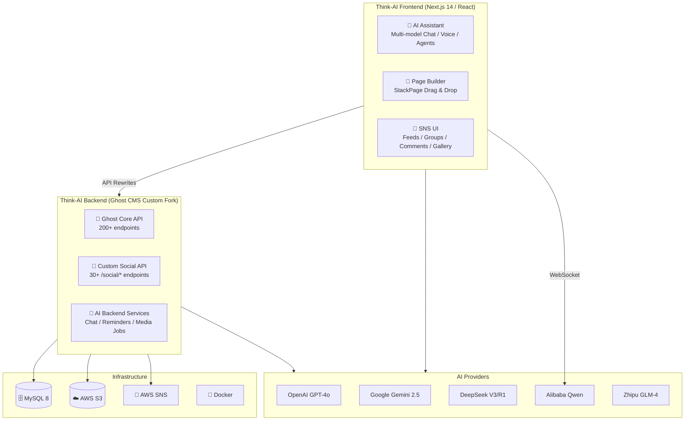
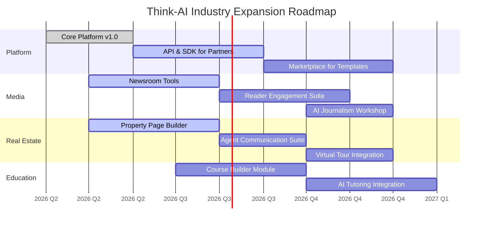

# Think-AI Platform Overview

**The AI-Powered Social Platform for Modern Communities**

---

## 1. What is Think-AI?

Think-AI is an **AI-integrated social networking platform** that combines the flexibility of a CMS (Ghost) with cutting-edge AI capabilities — multi-model chat, real-time voice, image generation, smart reminders, and a visual page builder — all in one unified system.

Built for **communities, organizations, and creators** who want AI augmentation without sacrificing control, privacy, or customizability.

## 2. System Architecture



## 3. Core Capabilities

### 🧠 Multi-Model AI Assistant
- Chat with **OpenAI GPT-4o**, **Google Gemini 2.5**, **DeepSeek**, **Alibaba Qwen**, and **Zhipu GLM**
- Seamless model switching based on task (reasoning, creativity, speed, cost)
- Streaming responses, conversation history, context-aware answers
- Site-aware AI search — answers grounded in your platform's own content

### 🎙️ Real-Time Voice Interaction
- Natural voice conversation with the AI assistant
- Multiple voice providers: **Gemini Realtime**, **OpenAI Voice**, **Qwen Voice**
- Speech-to-text and text-to-speech
- Interruption support — speak over the AI naturally

### 🖼️ AI Image Generation
- Generate images directly within the platform
- Multiple providers: DALL-E, Tongyi Wanxiang, Stable Diffusion
- Prompt-based creation with style customization
- Batch generation and result management

### 🔔 Smart Reminders & Notifications
- Natural-language reminder creation
- **SMS delivery** (via AWS SNS) and **browser push notifications**
- Phone number verification and management
- Full reminder history and audit trail

### 🎬 AI Media Processing
- Background processing pipeline for **video, audio, and images**
- Automatic transcription, translation, and subtitle generation
- Thumbnail extraction and media optimization
- Worker-based architecture for scalability

### 📐 Visual Page Builder (StackPage)
- **Drag-and-drop** page composition — no coding required
- **Live data binding** — connect UI components to real API data
- **JSON Schema-driven** property editing
- **Transformer pipeline** — format data on the fly (currency, dates, numbers)
- **Public page hosting** — share built pages with the world

### 👥 Complete SNS Features
- Social groups with role management (owner, admin, member)
- Extended comments: likes, replies, reports, moderation
- User-to-user follow, bookmark, favor, forward
- Image galleries with S3 presigned uploads
- Reusable content components for rapid post creation
- Activity logs and audit trails

## 4. Why Choose Think-AI?

### 🚀 AI-Native by Design, Not AI-Added
Unlike platforms that bolt on AI as an afterthought, Think-AI has AI woven into every layer — from the backend API services to the frontend UI components. The AI Assistant, agents, media processing, and data binding engine are all first-class citizens, not plugins or integrations.

### 🔌 Multi-Provider Freedom
No vendor lock-in. Use any major AI provider — OpenAI, Google Gemini, DeepSeek, Alibaba Qwen, Zhipu GLM — and switch between them without changing your workflow. Our intelligent model router selects the best model for each task based on capability, speed, and cost.

### 🎨 No-Code Visual Building
Non-technical users create rich, data-driven pages with drag-and-drop simplicity. The StackPage builder connects directly to live APIs, enabling real-time dashboards, landing pages, and dynamic content hubs — all without writing a single line of code.

### 🔒 Complete Data Sovereignty
Self-hosted on your own infrastructure. Your data stays yours. Your AI provider choices are yours. No third-party platforms have access to your content, your users, or your AI interactions.

### 📈 Production-Ready from Day One
Docker-based deployment, built-in Prometheus monitoring, Tinybird analytics, and comprehensive audit logging. Deploy to any cloud (AWS, GCP, Azure) or on-premises with a single command.

### 🧩 Endlessly Extensible
Built on the open-source Ghost CMS foundation, Think-AI gives you full access to modify, extend, and customize every layer. Add new API endpoints, create custom components for the page builder, integrate new AI providers, or build industry-specific modules.

### 💰 Cost-Effective at Scale
- **30+ custom API endpoints** replace expensive third-party services
- **Multi-provider AI routing** optimizes cost per task
- **Background media processing** eliminates cloud media service costs
- **Self-hosted infrastructure** avoids per-user SaaS fees

## 5. Technical Foundation

| Layer | Technology |
|-------|-----------|
| **Backend Server** | Node.js (Express) — customized Ghost CMS v5.116.2 |
| **Database** | MySQL 8 — full social and AI schema |
| **Frontend** | Next.js 14 (App Router, SSR/SSG) |
| **UI** | React 18, Material UI v6, Emotion, Tailwind CSS |
| **State** | Zustand + SWR |
| **Page Builder** | StackPage (gridstack.js + Vite) |
| **AI SDK** | Vercel AI SDK (multi-provider) |
| **Media Processing** | FFmpeg with S3 storage |
| **Notifications** | AWS SNS + Web Push API |
| **Monitoring** | Prometheus metrics + Tinybird analytics |

## 6. Industry Expansion Vision

Think-AI's modular architecture and visual page builder make it uniquely suited to expand into **vertical industry solutions**. The same core platform — AI assistant, social features, page builder — can be adapted and extended for specific business domains.

### 📰 メディア・新聞業界（日本市場向け）

**業界の課題**

日本の新聞・メディア業界は、紙媒体の購読者減少、広告収入の低下、若年層のニュース離れという三重苦に直面しています。しかし同時に、AI への関心・需要は世界的に高く、新しい読者体験の創出が急務です。

**Think-AI ソリューション**

| 機能 | 適用例 |
|------|--------|
| **🤖 AI 記者アシスタント** | 記者が AI で記事下書き作成、見出し生成、ファクトチェック。取材メモの自動テキスト化 |
| **📰 パーソナライズドニュース** | 読者の関心履歴に基づく AI レコメンド。紙面のデジタル再現（日経・朝日のようなレイアウト） |
| **💬 AI 管理コメント** | AI が誹謗中傷やスパムを自動モデレーション。健全な読者コミュニティ形成 |
| **👥 読者コミュニティ** | 記事ごとのグループ討論、記者との Q&A、投書・読者投稿システム |
| **📐 Page Builder** | 編集部が特集ページや選挙速報、連載企画をノーコードで作成。開発者不要 |
| **🎙️ 音声配信** | AI 音声による記事読み上げ。通勤・家事中にニュースを「聴く」体験。多言語対応 |
| **🎬 動画・メディア処理** | 記者会見動画の自動文字起こし・翻訳、ポッドキャスト自動作成 |

**日本市場向けの強み**
- 日本の印刷文化を尊重しつつ、デジタルへの段階的移行をサポート
- 地方新聞社向けに低コストで導入可能（セルフホストで月額費抑制）
- AI 翻訳により、地方ニュースの多言語発信が可能（インバウンド・訪日客向け）
- 44都道府県の地方紙との連携による「全国ニュースネットワーク」構築も視野

**ビジョン:** *"すべての新聞社が AI 搭載メディアプラットフォームへ — パーソナライズドニュース、対話型コミュニティ、インテリジェントなジャーナリズムツールで読者とつながる。"*

### 🏢 不動産業界

**業界の課題**

不動産業界では、物件情報の管理・公開、顧客対応、内見調整、マイソク作成といった業務が手作業に依存し、属人化・非効率が深刻です。また中国をはじめとする海外投資家向けの情報発信も不足しています。

**Think-AI ソリューション**

| 機能 | 適用例 |
|------|--------|
| **🤖 AI 物件コンシェルジュ** | 24時間 365 日、物件質問に自動応答。条件に合う物件を提案。多言語対応 |
| **📐 Page Builder** | 物件詳細ページ、賃貸/売買/投資のカテゴリ別ページをノーコードで作成 |
| **🔍 AI あいまい検索** | 「駅近・ペット可・3LDK」のような自然言語検索。条件フィルターとハイブリッド |
| **📋 AI マイソク自動生成** | 既存マイソク + 不動産情報ライブラリ + ハザードマップ等のオープンデータを統合し自動生成 |
| **🔔 スマート通知** | 内見リマインド、値下げ通知、契約期限アラート（SMS + プッシュ） |
| **🌏 AI 翻訳** | 全物件情報を日本語・中国語で自動提供。海外投資家向け |
| **📱 SNS 自動投稿** | WeChat, Weibo, X, Facebook へ物件情報を一斉配信 |
| **🎬 メディア処理** | 物件動画の自動生成、バーチャルステージング、間取り図生成 |

**既存システムからの拡張計画:**
- **現状で可能**: AI チャット・翻訳・Page Builder・リマインダー・メディア処理・SNS基盤
- **拡張で可能**: 不動産 AI エージェント、物件テンプレート、データ連携
- **新規開発**: 物件データモデル、管理ダッシュボード、内見予約、簡易CRM、外部情報連携

**ビジョン:** *"不動産業務の完全デジタル化 — AI 物件マッチングから没入型バーチャルツアー、顧客対応の自動化、データドリブンな市場分析まで。"*

### 🏗️ Extending to New Verticals

The same **Page Builder + AI Assistant** combination enables rapid expansion into any vertical:

```
Vertical Industry
    │
    ├── Page Builder creates domain-specific pages
    │   ├── Property listing pages (Real Estate)
    │   ├── Article detail pages (Media)
    │   ├── Product catalog pages (E-commerce)
    │   └── Course content pages (Education)
    │
    ├── AI Assistant provides intelligent automation
    │   ├── FAQ chatbots (Customer Service)
    │   ├── Content generation (Publishing)
    │   ├── Data analysis (Finance)
    │   └── Learning companion (Education)
    │
    └── SNS backbone enables community & engagement
        ├── Discussion forums (Education)
        ├── Client communities (Real Estate)
        ├── Reader engagement (Media)
        └── Member networks (Membership)
```

### 🚀 Strategic Roadmap



### 🎯 Our Declaration

**Think-AI is not just a social platform — it is a foundation for AI-powered digital transformation across industries.**

With the visual **Page Builder** as our extensibility layer and the **AI Assistant** as our intelligence layer, any business domain can be rapidly prototyped, deployed, and iterated upon. Missing features are not roadblocks — they are Page Builder templates waiting to be created.

We invite partners from **media, real estate, education, and beyond** to build the future of AI-augmented digital experiences on the Think-AI platform.

---

*Think-AI — Intelligent Platform for the AI Era*

*Think-AI · AI-Driven Digital Transformation · From Social to Every Industry*
