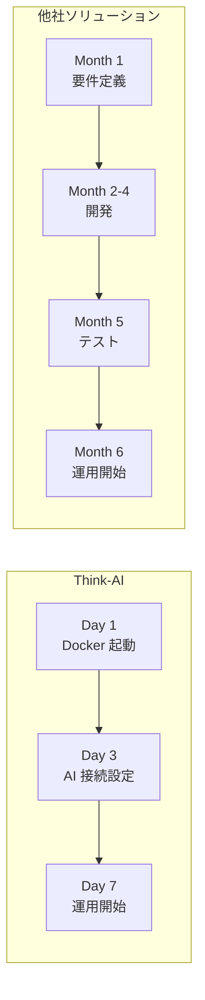
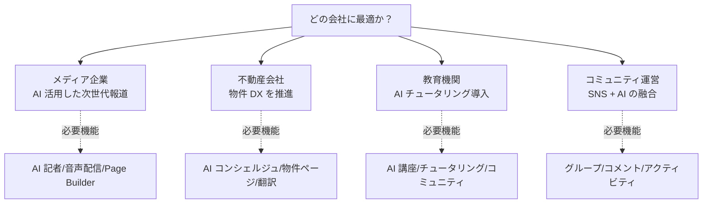

# 競合比較

## プラットフォーム比較

| 機能 | **Think-AI** | Ghost CMS | WordPress + AI | Strapi + AI |
|------|------------|-----------|---------------|-------------|
| **AI アシスタント** | ✅ 標準搭載（5 プロバイダ） | ❌ | 🔶 プラグイン依存 | 🔶 カスタム開発 |
| **AI 音声対話** | ✅ 標準搭載 | ❌ | ❌ | ❌ |
| **AI 画像生成** | ✅ 標準搭載 | ❌ | ❌ | ❌ |
| **AI メディア処理** | ✅ 標準搭載 | ❌ | 🔶 プラグイン | ❌ |
| **スマート通知（SMS+Push）** | ✅ 標準搭載 | ❌ | 🔶 プラグイン | ❌ |
| **SNS 機能** | ✅ 完全統合 | ❌ | 🔶 プラグイン | ❌ |
| **Page Builder** | ✅ データバインディング対応 | ❌ | 🔶 SEO 問題あり | 🔶 基本のみ |
| **マルチテナント** | ✅ グループ管理 | ❌ | ❌ | ❌ |
| **セルフホスト** | ✅ Docker 一発 | ✅ | 🔶 複雑 | ✅ Docker |
| **データ主権** | ✅ 完全確保 | ✅ | 🔶 サードパーティ依存 | ✅ |
| **API 拡張性** | ✅ 200+ 標準 + 30+ カスタム | ✅ 200+ 標準 | ❌ REST 制約 | ✅ 柔軟 |
| **マルチ言語** | ✅ 日本語 / 英語 / 中国語 | ✅ コミュニティ | 🔶 プラグイン | ✅ プラグイン |

## AI プロバイダ比較

| 指標 | Think-AI | 競合 |
|------|---------|------|
| 利用可能な AI モデル | 5 プロバイダ、10+ モデル | 通常 1-2 プロバイダ |
| モデル自動ルーティング | ✅ タスクに応じて最適選択 | ❌ 固定モデル |
| コスト最適化 | ✅ タスク別ルーティングで低コスト | ❌ 高額モデル固定 |
| フェイルオーバー | ✅ プロバイダ障害時に自動切替 | ❌ 単一障害点 |

## コスト比較（月額推定、10万ユーザー規模、セルフホスト）

| 項目 | Think-AI | WordPress + AI プラグイン | カスタム開発 |
|------|---------|------------------------|------------|
| ライセンス | ライセンス料 | 無料（プラグイン別途） | 開発コスト大 |
| サーバー費用 | ¥30,000〜 | ¥30,000〜 | ¥50,000〜 |
| AI 利用料 | ¥10,000〜（最適化済） | ¥30,000〜 | ¥50,000〜 |
| 保守運用 | 標準で対応 | 別途プラグイン管理 | 別途運用費 |
| **合計** | **¥40,000〜/月** | **¥60,000〜/月** | **¥1,000,000〜（初期）** |

## 導入期間比較

## こんな会社におすすめ

---

[マーケティングトップへ →](index)
