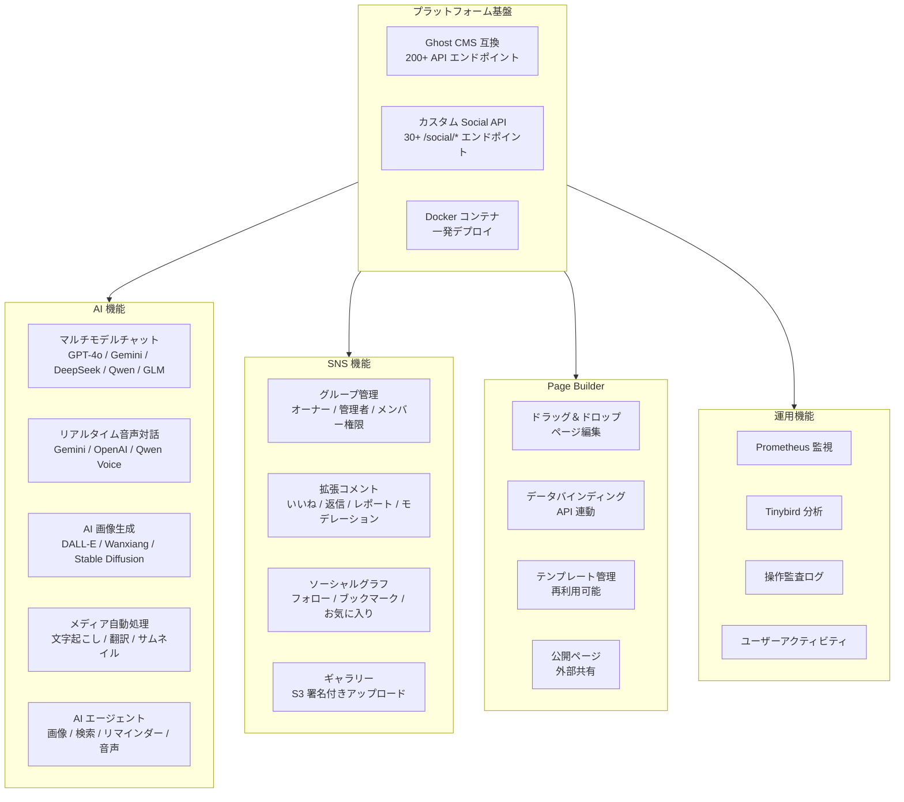

# Think-AI 機能一覧

## 機能カテゴリ

## 機能詳細

### AI アシスタント

| 機能 | 対応プロバイダ | ステータス |
|------|--------------|-----------|
| テキストチャット（ストリーミング） | OpenAI, Gemini, DeepSeek, Qwen, Zhipu GLM | ✅ 完了 |
| 会話履歴管理 | 全プロバイダ | ✅ 完了 |
| コンテキスト認識（サイト内検索） | RAG パイプライン | ✅ 完了 |
| モデル自動ルーティング | タスクに応じて最適モデルを選択 | ✅ 完了 |

### リアルタイム音声

| 機能 | 対応プロバイダ | ステータス |
|------|--------------|-----------|
| 音声対話（低遅延） | Gemini Realtime, OpenAI Voice, Qwen Voice | ✅ 完了 |
| 音声認識（STT） | Qwen STT | ✅ 完了 |
| テキスト読み上げ（TTS） | Qwen TTS | ✅ 完了 |
| 割り込み対応 | 全プロバイダ | ✅ 完了 |

### ソーシャル機能

| 機能 | 説明 | ステータス |
|------|------|-----------|
| グループ | 作成、参加、権限管理（オーナー/管理者/メンバー） | ✅ 完了 |
| コメント | CRUD、いいね、返信、レポート、モデレーション統制 | ✅ 完了 |
| フォロー | ユーザーフォロー/アンフォロー、フォロワー一覧 | ✅ 完了 |
| ブックマーク | 記事・投稿のブックマーク管理 | ✅ 完了 |
| お気に入り | コンテンツへの「いいね」 | ✅ 完了 |
| ギャラリー | ユーザー・グループ別ギャラリー、S3 アップロード | ✅ 完了 |
| アクティビティログ | ユーザー操作の監査証跡 | ✅ 完了 |

### Page Builder（StackPage）

| 機能 | 説明 | ステータス |
|------|------|-----------|
| ドラッグ＆ドロップ | gridstack ベースの直感的な配置操作 | ✅ 完了 |
| データバインディング | コンポーネントと API データの動的連携 | ✅ 完了 |
| イベントバインディング | クリック、ホバー等のイベントハンドリング | ✅ 完了 |
| プロパティエディタ | JSON Schema 駆動のプロパティ編集 | ✅ 完了 |
| トランスフォーマーパイプライン | 日付、通貨、数値フォーマット変換 | ✅ 完了 |
| 公開ページ | 外部ユーザー向けページ公開 | ✅ 完了 |

### AI メディア処理

| 機能 | 説明 | ステータス |
|------|------|-----------|
| 動画処理 | トランスコード、サムネイル抽出 | ✅ 完了 |
| 音声処理 | 文字起こし、翻訳、字幕生成 | ✅ 完了 |
| 画像処理 | リサイズ、最適化、バーチャルステージング | ✅ 完了 |
| バックグラウンドジョブ | 非同期処理パイプライン | ✅ 完了 |

---

[マーケティングトップへ →](index)
