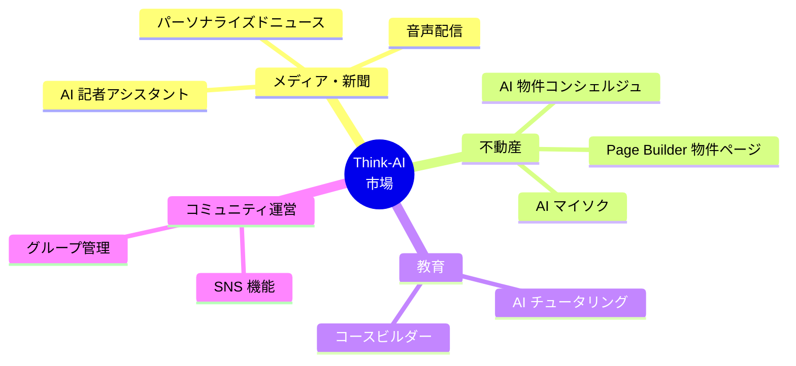
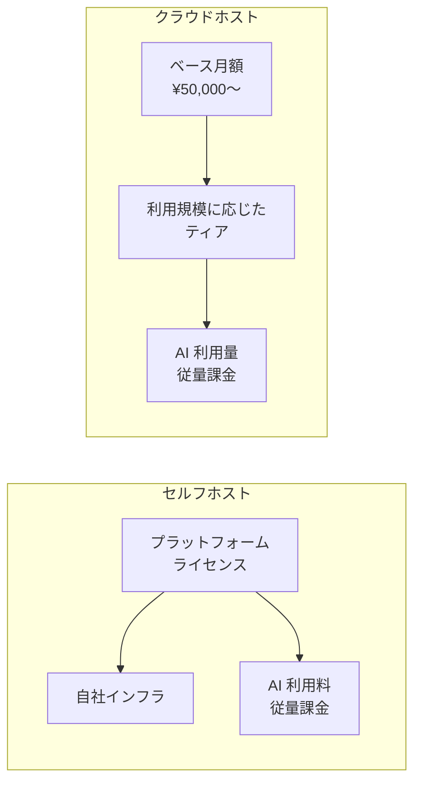
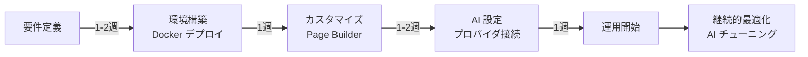
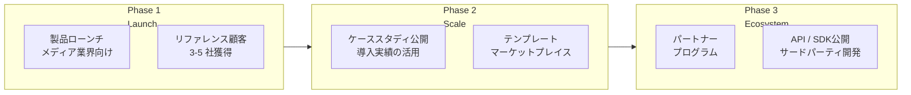

# Think-AI マーケティング資料

**AI 駆動の次世代ソーシャルプラットフォーム**

Think-AI のプロモーション、セールス、導入提案にご活用ください。

---

## ターゲット市場

## 製品ハイライト

| 機能 | 価値提案 | 差別化要因 |
|------|---------|-----------|
| **マルチモデル AI アシスタント** | 5 つの AI プロバイダを用途に応じて最適選択 | ベンダーロックインなし、コスト最適化 |
| **リアルタイム音声対話** | 自然な会話型 AI、割り込み対応 | 複数音声プロバイダ対応 |
| **ビジュアル Page Builder** | ノーコードで動的ページ作成 | データバインディング、トランスフォーマー |
| **SNS 完全装備** | グループ、コメント、ギャラリー、フォロー | CMS + SNS の統合 |
| **AI メディア処理** | 動画・音声・画像の自動処理 | バックグラウンドジョブ、ffmpeg |

## 価格モデル

## 導入のステップ

---

## アドバイザーノート — 戦略的考察

### 🎯 ポジショニング戦略

Think-AI の最大の強みは **「CMS + SNS + AI の三位一体統合」** です。市場には CMS 特化型（WordPress, Ghost）、SNS 特化型（Discourse, Circle）、AI チャット特化型のソリューションが乱立していますが、これらを単一プラットフォームで提供する製品は稀です。

**推奨ポジショニング:**
> 「AI を内蔵した次世代 CMS」ではなく、「CMS 機能を持つ AI プラットフォーム」として市場に打ち出すべきです。AI が基盤であり、CMS/SNS はその上に乗る「機能」であるというメッセージングが、競合との差別化を明確にします。

### 📊 ターゲット優先順位

リソースが限られている場合、以下の順序でセグメントにアプローチすることを推奨します：

| 優先度 | セグメント | 理由 |
|-------|-----------|------|
| 🥇 最優先 | メディア・新聞業界 | AI 記者アシスタントの価値が最も明確。DX 予算が確保されている |
| 🥈 次優先 | 不動産 | AI コンシェルジュ + Page Builder の組み合わせが独自価値。導入効果が測定しやすい |
| 🥉 将来 | 教育 / コミュニティ | 市場規模は大きいが、競合（LMS 特化型）が多い |

### 💰 価格戦略アドバイス

- **スタータープランは「無料」ではなく「低価格」** にすることを推奨します。無料プランは品質期待値を下げ、撤退コストがゼロのためチャーン率が上がります。月額 ¥5,000〜 程度のスターター価格が適切です。
- **AI 利用料の透明性** を重視してください。「AI 利用料は実費です」という明確なメッセージは、Enterprise 顧客の安心感につながります。
- **年間契約ディスカウント**（15-20% off）を導入し、継続率を高めることを推奨します。

### 🚀 成長戦略

**Key Insight:** Phase 1 で重要なのは「機能の多さ」ではなく「1 つのユースケースでの圧倒的な成功事例」です。メディア業界の 1 社で深く導入いただき、具体的な KPI（記事作成時間 60% 削減、エンゲージメント 2 倍など）を数値で示せるようにすることが、その後の拡販の土台となります。

---

## 関連資料

- [機能一覧 →](features)
- [競合比較 →](comparison)
- [ユースケース →](use-cases)
- [価格モデル →](pricing)
