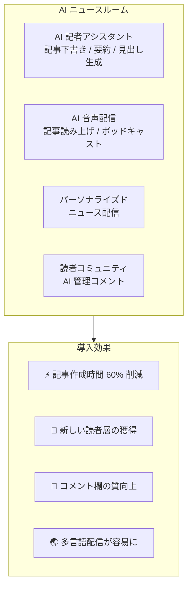
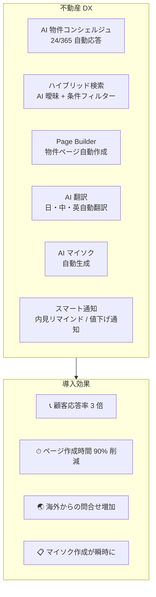
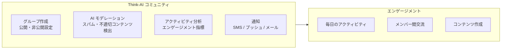

# ユースケース

## メディア・新聞業界

### 課題
新聞購読者の減少、広告収入の低下、若年層のニュース離れ。

### ソリューション

**主要機能:**
- AI 記者アシスタント（下書き作成、見出し、ファクトチェック）
- パーソナライズドニュース配信
- AI 音声読み上げ（通勤・家事中でもニュースを「聴く」）
- AI コメントモデレーション
- Page Builder で速報ページをノーコード作成

---

## 不動産業界

### 課題
物件管理の非効率、顧客対応の属人化、海外投資家への情報発信不足。

### ソリューション

**主要機能:**
- AI 物件コンシェルジュ（24 時間対応、多言語）
- 自然言語 + 条件のハイブリッド検索
- Page Builder 物件テンプレート
- AI 自動翻訳（日本語 ⇄ 中国語）

---

## 教育業界

### 課題
オンライン教育の質向上、個別指導の自動化、コミュニティ形成。

### ソリューション

| 機能 | 適用例 |
|------|--------|
| **AI チュータリング** | 学生の質問に 24 時間対応、個別学習プラン |
| **講座ページビルダー** | ノーコードで講座ページを作成・公開 |
| **コミュニティ機能** | クラス別グループ、ディスカッション管理 |
| **メディア処理** | 講義動画の自動文字起こし・翻訳 |

---

## コミュニティ運営

### 課題
会員管理、コンテンツモデレーション、エンゲージメント向上。

### ソリューション

---

[マーケティングトップへ →](index)
