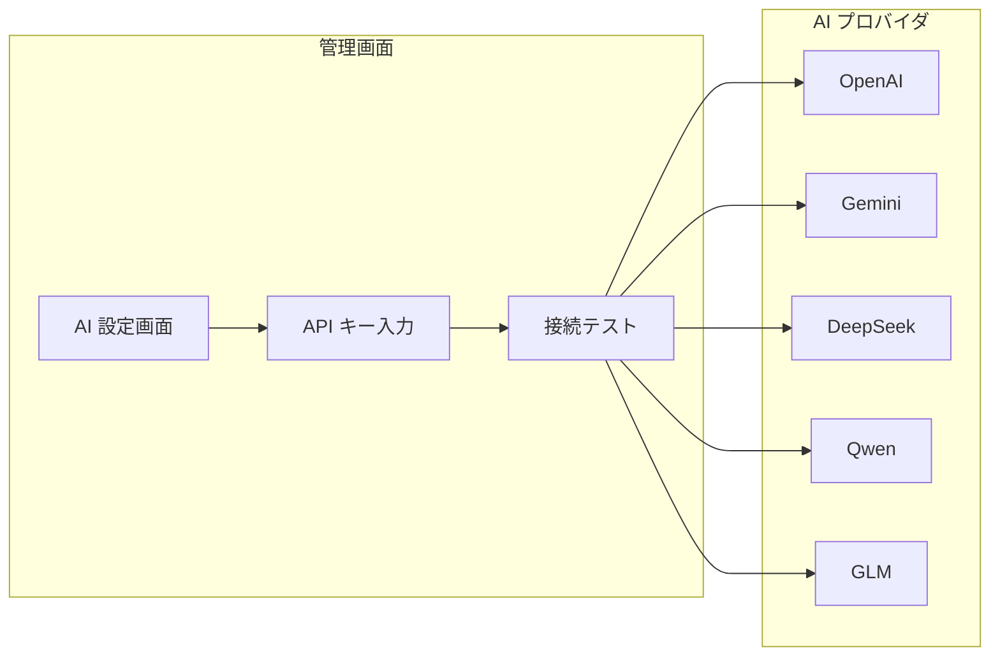

# 管理者ガイド

## 管理画面へのアクセス

```bash
# 管理画面 URL
https://your-domain.com/ghost/

# 初期管理者アカウントでログイン
```

## ユーザー管理

### ロールと権限

| ロール | 権限 | 説明 |
|-------|------|------|
| **オーナー** | 全操作 | システム全体の管理 |
| **管理者** | 管理操作 | ユーザー管理、コンテンツ管理 |
| **編集者** | コンテンツ編集 | 記事の作成・編集・公開 |
| **投稿者** | 記事作成 | 記事の作成（公開には承認が必要） |
| **メンバー** | 閲覧・コメント | 一般ユーザー |

### グループ管理（カスタム SNS）

グループには以下の役割があります：

```
グループ
├── オーナー（作成者、削除権限）
├── 管理者（メンバー管理、設定変更）
└── メンバー（投稿、コメント）
```

## AI 設定

### AI プロバイダ接続



### モデルルーティング設定

タスクごとに使用する AI モデルを設定できます：

| タスク | 推奨モデル | 代替モデル |
|-------|-----------|-----------|
| 一般チャット | GPT-4o / Gemini | DeepSeek |
| 中国語最適化 | Qwen / GLM | GPT-4o |
| コスト重視 | DeepSeek V3 | Qwen |
| 画像生成 | DALL-E | Tongyi Wanxiang |
| 音声対話 | Gemini Realtime | Qwen Voice |

## Page Builder 管理

### テンプレート管理

- 公開テンプレートの作成・編集
- コンポーネントの管理（追加・削除・更新）
- データバインディングの設定

### 公開ページ

- ページの公開・非公開設定
- SEO 設定（タイトル、 description、OGP）
- アクセス制御（認証不要/メンバーのみ）

## 監視とメンテナンス

### 定期メンテナンス項目

| 項目 | 頻度 | 備考 |
|------|------|------|
| ログローテーション | 日次 | Docker ログ |
| DB バックアップ | 日次 | mysqldump |
| メディアのクリーンアップ | 週次 | 未使用アセット |
| セキュリティアップデート | 月次 | Docker イメージ更新 |

### Prometheus 監視

エンドポイント: `/metrics` で以下のメトリクスを取得：

- HTTP リクエスト数・レイテンシ
- DB コネクション数
- AI API 呼び出し数・レイテンシ
- メディアジョブ処理数

---

[運用マニュアルトップへ →](index)
