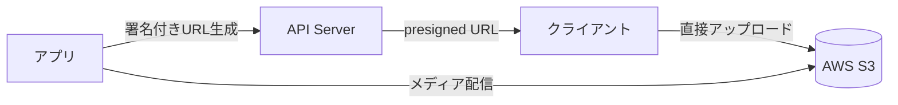

# デプロイメントガイド

## 前提条件

| 要件 | バージョン/仕様 |
|------|---------------|
| Docker | 24.0+ |
| Docker Compose | 2.20+ |
| MySQL | 8.0 (コンテナ内蔵) |
| Node.js | 20.19.0 (本番はコンテナ) |
| 推奨サーバー | 4 vCPU / 8GB RAM 以上 |

## デプロイ手順

### 1. リポジトリのクローン

```bash
# バックエンド
git clone <repo-url> 00-Ghost-5.116.2

# フロントエンド
git clone <repo-url> 01-jibunsee-react
```

### 2. 環境変数の設定

```bash
cd 00-Ghost-5.116.2
cp .env.example .env
# .env を編集して以下の設定を行う
```

**主要な環境変数:**

| 変数 | 説明 | 必須 |
|------|------|------|
| `database__connection__host` | MySQL ホスト | ✅ |
| `database__connection__user` | MySQL ユーザー | ✅ |
| `database__connection__password` | MySQL パスワード | ✅ |
| `database__connection__database` | MySQL データベース名 | ✅ |
| `url` | サイト URL | ✅ |
| `OPENAI_API_KEY` | OpenAI API キー | 🔶 AI 利用時 |
| `GEMINI_API_KEY` | Google Gemini API キー | 🔶 AI 利用時 |
| `DEEPSEEK_API_KEY` | DeepSeek API キー | 🔶 AI 利用時 |
| `QWEN_API_KEY` | Alibaba Qwen API キー | 🔶 AI 利用時 |
| `ZHIPU_API_KEY` | Zhipu GLM API キー | 🔶 AI 利用時 |
| `AWS_ACCESS_KEY_ID` | AWS S3/SNS アクセスキー | 🔶 S3/SNS 利用時 |
| `AWS_SECRET_ACCESS_KEY` | AWS シークレットキー | 🔶 S3/SNS 利用時 |
| `AWS_REGION` | AWS リージョン | 🔶 S3/SNS 利用時 |

### 3. Docker Compose で起動

```bash
# バックエンド
cd 00-Ghost-5.116.2
docker compose up -d

# フロントエンド
cd 01-jibunsee-react
docker compose up -d
```

### 4. 動作確認

```bash
# バックエンド API 確認
curl http://localhost:2368/ghost/api/admin/

# フロントエンド確認
curl http://localhost:3000
```

## AWS 設定ガイド

### S3（メディアストレージ）



1. S3 バケットを作成
2. IAM ユーザーを作成し、S3 アクセスポリシーをアタッチ
3. CORS 設定を構成
4. 環境変数に AWS 認証情報を設定

### SNS（SMS 通知）

1. AWS SNS で SMS 発信元 ID を設定
2. IAM ポリシーで SNS Publish 権限を付与
3. 環境変数に AWS 認証情報を設定

## トラブルシューティング

| 問題 | 原因 | 解決策 |
|------|------|--------|
| コンテナが起動しない | ポート競合 | `docker ps` で競合を確認 |
| DB 接続エラー | MySQL 未起動 | `docker compose logs mysql` で確認 |
| 403 エラー | API キー未設定 | `.env` の設定を確認 |

---

[運用マニュアルトップへ →](index)
