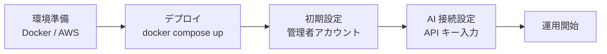
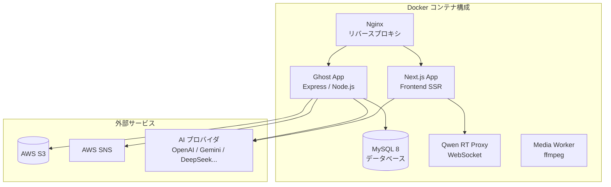

# 運用マニュアル

Think-AI プラットフォームのセットアップ、管理、運用のためのガイドです。

---

## クイックスタート

| ステップ | 所要時間 | 詳細 |
|---------|---------|------|
| 環境準備 | 1-2 時間 | [デプロイメントガイド →](deployment) |
| デプロイ | 10 分 | Docker Compose で起動 |
| 初期設定 | 30 分 | 管理者アカウント、サイト設定 |
| AI 接続 | 15 分 | AI プロバイダの API キー設定 |

---

## 目次

| セクション | 対象読者 | 内容 |
|-----------|---------|------|
| [デプロイメントガイド](deployment) | インフラ担当 | Docker 構成、AWS セットアップ、環境変数 |
| [管理者ガイド](admin-guide) | サイト管理者 | ユーザー管理、コンテンツ管理、AI 設定 |
| [ユーザーガイド](user-guide) | エンドユーザー | 基本操作、AI 機能の使い方 |
| [トラブルシューティング](troubleshooting) | 全員 | よくある問題と解決策 |

## システム構成

