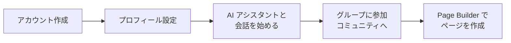

# ユーザーガイド

## はじめに

Think-AI は AI を活用した次世代ソーシャルプラットフォームです。  
チャット、音声対話、画像生成、SNS 機能を一つのプラットフォームで利用できます。

## クイックスタート

## AI アシスタントの使い方

### チャット

1. 画面上の AI アシスタントアイコンをクリック
2. テキストボックスに質問を入力
3. Enter キーで送信（ストリーミング応答）
4. 必要に応じてモデルを切り替え

**できること:**
- 一般的な質問・相談
- 記事の要約・作成
- 翻訳（日本語・英語・中国語）
- サイト内コンテンツの検索

### 音声対話

1. AI アシスタントの音声アイコンをクリック
2. マイクの使用を許可
3. 話しかけると AI が音声で応答
4. 割り込みも可能（話しかけて STOP）

### 画像生成

1. AI アシスタントに「画像を作って」と依頼
2. プロンプトを入力（例：「夕日の中のビーチの画像」）
3. 生成された画像を確認・ダウンロード

## SNS 機能の使い方

### グループ

| 操作 | 方法 |
|------|------|
| グループを作成 | グループ一覧 → 「作成」ボタン |
| グループに参加 | グループページ → 「参加」ボタン |
| グループで投稿 | グループ内の投稿フォームから |
| メンバー管理 | グループ管理者のみ可能 |

### コメント

- 記事や投稿の下部にあるコメントフォームから投稿
- 他のユーザーのコメントに「いいね」や返信が可能
- 不適切なコメントは「レポート」ボタンで報告

### ギャラリー

- 画像ギャラリーに写真をアップロード
- S3 署名付き URL で安全にアップロード
- グループごとにアルバム管理

## Page Builder の使い方

1. メニューから「Page Builder」を選択
2. 新規ページを作成
3. 左側のコンポーネントパレットから要素をドラッグ＆ドロップ
4. 各要素のプロパティを設定
5. データバインディングで動的コンテンツを連携
6. 公開ボタンでページを公開

## リマインダー設定

1. AI アシスタントに「明日の10時にミーティングをリマインドして」と依頼
2. 自動的にリマインダーが設定される
3. SMS またはプッシュ通知で通知

## よくある操作

| 操作 | 手順 |
|------|------|
| パスワード変更 | 設定 → アカウント → パスワード |
| プロフィール編集 | 設定 → プロフィール |
| 言語変更 | 設定 → 言語（日本語/English/中文） |
| 通知設定 | 設定 → 通知 |
| アカウント削除 | 管理者に連絡 |

---

[運用マニュアルトップへ →](index)
