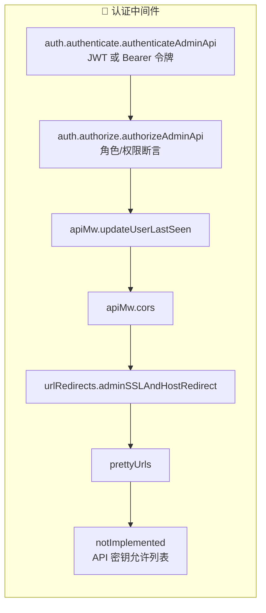

# 服务器架构

## 请求生命周期

```mermaid
flowchart TB
    HTTP[HTTP 请求] --> GhostServer[GhostServer.js<br/>Express 应用]
    GhostServer --> Preprocessing
    subgraph Preprocessing["预处理"]
        Sentry[Sentry 错误跟踪]
        PrettyURL[pretty-urls 重定向]
        Locals[GhostLocals<br/>主题、安全版本]
    end
    Preprocessing --> RouteMatch[路由匹配]
    subgraph RouteMatch["路由匹配"]
        direction TB
        Admin[/ghost/api/admin/*] --> AdminAPI[管理 API 路由器]
        Content[/ghost/api/content/*] --> ContentAPI[内容 API 路由器]
        Members[/members/api/*] --> MembersAPI[会员 API 路由器]
        Other[/ *] --> Theme[前端主题渲染]
    end
    AdminAPI --> Pipeline[API 流水线]
    subgraph Pipeline["每个端点的 API 流水线"]
        direction TB
        MW[中间件链<br/>authAdminApi / authorizeAdminApi]
        Val[验证<br/>选项与输入模式]
        Perm[权限检查]
        Query[查询<br/>模型层]
        Output[输出序列化]
        Response[响应]
    end
    Pipeline --> Error{错误?}
    Error -->|是| ErrHandler[错误处理<br/>404 / 403 / 501]
    Error -->|否| Client[客户端响应]
    ErrHandler --> Client
```

## 中间件链



## 单体仓库结构

```
00-Ghost-5.116.2/
├── ghost/                          ← 核心包
│   ├── core/                       ← 主 CMS 服务器
│   │   ├── core/
│   │   │   ├── server/             ← Express 服务器、API 控制器、模型、服务
│   │   │   │   ├── api/endpoints/  ← 所有 API 控制器（内置 + 30+ 自定义社交）
│   │   │   │   ├── models/         ← Bookshelf ORM 模型
│   │   │   │   ├── services/       ← 业务逻辑层
│   │   │   │   ├── web/            ← Express 路由设置
│   │   │   │   ├── data/           ← 数据库模式 + 迁移
│   │   │   │   ├── adapters/       ← 存储、调度等
│   │   │   │   └── lib/            ← 工具库
│   │   │   ├── frontend/           ← 主题引擎、辅助函数
│   │   │   └── shared/             ← 配置、事件、设置缓存
│   │   └── test/                   ← 端到端、集成、单元测试
│   ├── admin/                      ← Ember.js 管理 SPA
│   ├── api-framework/              ← 可复用 API 流水线框架
│   ├── members-api/                ← 会员/订阅领域
│   ├── email-service/              ← 邮件投递
│   └── ... (30+ 包)
├── apps/                           ← React 前端应用
└── .docker/                        ← Docker 构建配置
```

## 自定义路由隔离

```mermaid
flowchart LR
    subgraph Builtin["内置路由（Ghost 标准）"]
        BR[admin/routes.js]
    end
    subgraph Custom["自定义路由（Think-AI）"]
        CR[admin/custom-routes.js<br/>所有 /social/* 添加]
    end
    subgraph Registry["端点注册表"]
        EI[endpoints/index.js<br/>(custom begin … custom end)]
    end
    subgraph Framework["API 框架"]
        AF[api-framework 流水线]
    end
    BR --> Registry
    CR --> Registry
    EI --> AF
```

## 关键架构决策

### 1. 自定义路由与内置路由隔离
- 内置路由：`admin/routes.js`（Ghost 标准）
- 自定义路由：`admin/custom-routes.js`（所有 `/social/*` 添加）
- 这使得在版本升级时易于与上游 Ghost 对比差异

### 2. API 框架流水线
所有端点（内置和自定义）都使用 `@tryghost/api-framework` 流水线：

```javascript
// 模式：在 endpoints/index.js 中注册端点
get socialFollows() {
    return apiFramework.pipeline(require('./social-follows'), localUtils);
}
```

### 3. 管理端与公开端分离
- **管理端路由** — 完整认证（会话或 API 密钥）、权限检查
- **内容 API（公开）路由** — 轻量级认证（会员令牌或匿名）
- 评论和组件同时拥有管理端和公开端端点

### 4. 自定义 API 密钥允许列表
`notImplemented` 中间件控制 API 密钥可以访问的资源：

```javascript
const allowlisted = {
    social: ['GET', 'POST', 'DELETE', 'PUT']  // 所有方法均允许
};
```
