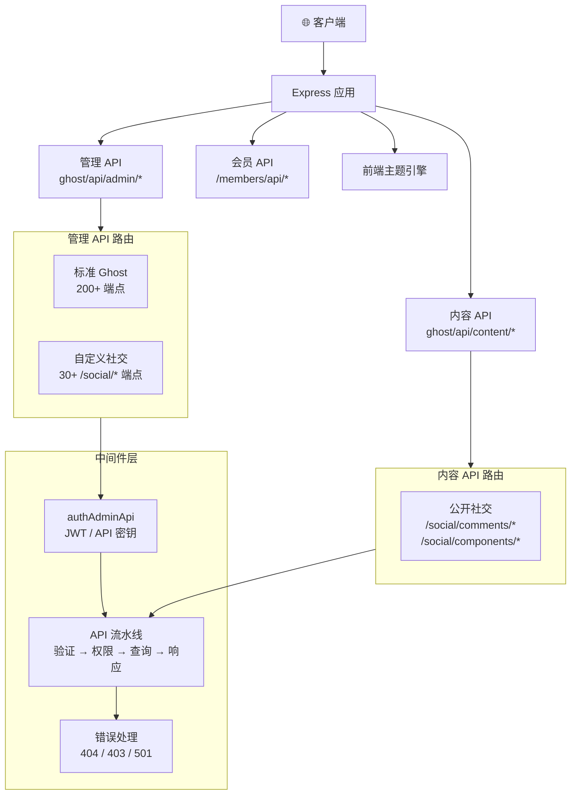

# Think-AI 后端

**Think-AI 后端** 是基于 Ghost CMS v5.116.2 深度定制的服务端基础，为 AI 驱动的社交平台提供动力。

| 方面 | 详情 |
|--------|--------|
| **运行环境** | Node.js v20.19.0 |
| **框架** | Express.js |
| **ORM** | Bookshelf.js (Knex) |
| **数据库** | MySQL 8 |
| **单体仓库** | Nx + Yarn workspaces (30+ 包) |

## 与原生 Ghost 的区别

| 功能 | 原生 Ghost | 本分支 |
|---------|-------------|-----------|
| 社交群组 | — | ✅ 群组及所有者/管理员/成员角色层级 |
| 关注/收藏/点赞 | — | ✅ 完整的社交图谱 API |
| 文章评论 | ✅ 基础 | ✅ 扩展：点赞、回复、举报、审核 |
| 可复用组件 | — | ✅ 用于文章创建的内容组件 |
| 图库 | — | ✅ 用户及群组图片图库（S3 预签名） |
| AI 聊天与提醒 | — | ✅ AI 助手，支持短信/推送通知 |
| AI 语音与实时 | — | ✅ 实时语音聊天（Gemini、Qwen、OpenAI） |
| AI 媒体处理 | — | ✅ 基于 ffmpeg 的后台任务流水线 |
| AI 智能体 | — | ✅ 多智能体系统（图像、搜索、提醒、语音） |
| 可视化页面构建器 | — | ✅ 拖拽编辑器，支持数据绑定 |
| 用户活动日志 | — | ✅ 审计日志 |
| Prometheus 指标 | — | ✅ 系统监控 |
| 网络分析 | — | ✅ 基于 Tinybird 的分析流水线 |
| ActivityPub | — | ✅ 联邦社交功能（开发中） |

## 服务器架构

## 自定义端点分类

| 分类 | 路由 | 用途 |
|----------|--------|---------|
| **社交图谱** | `/social/bookmarks`, `/social/follows`, `/social/favors`, `/social/forwards` | 用户间及用户与内容的关系 |
| **群组** | `/social/groups`, `/social/members` | 社区/群组管理及角色 |
| **评论** | `/social/comments/*` | 完整评论系统（CRUD、点赞、举报、回复、计数） |
| **组件** | `/social/components`, `/social/postcomponents` | 可复用内容构建块 |
| **图库** | `/social/gallery/*` | 图片图库，支持 S3 预签名上传 |
| **AI 功能** | `/social/ai/*` | 聊天、提醒、电话、设备、媒体任务、智能体设置 |
| **日志** | `/social/user-logs` | 活动审计跟踪 |

[服务器架构 →](/zh/backend/architecture)
[API 设计模式 →](/zh/backend/api-design)
[自定义 Social API →](/zh/backend/social-api/)
