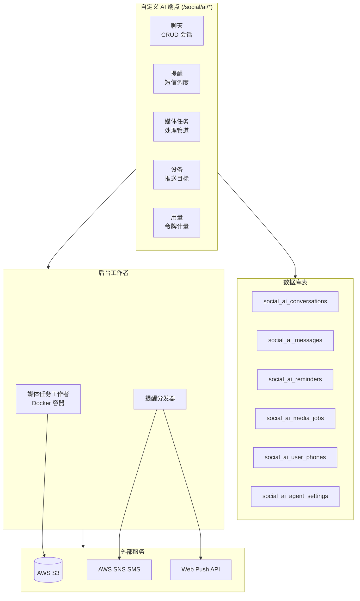
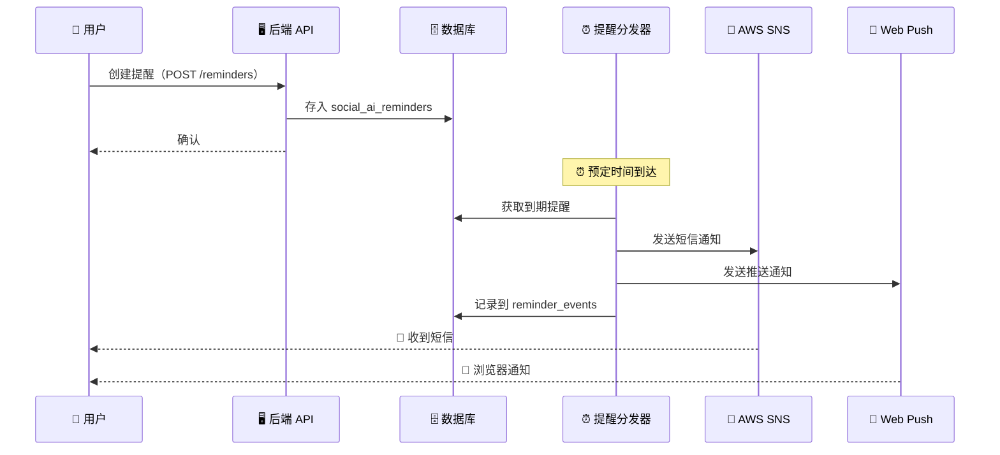
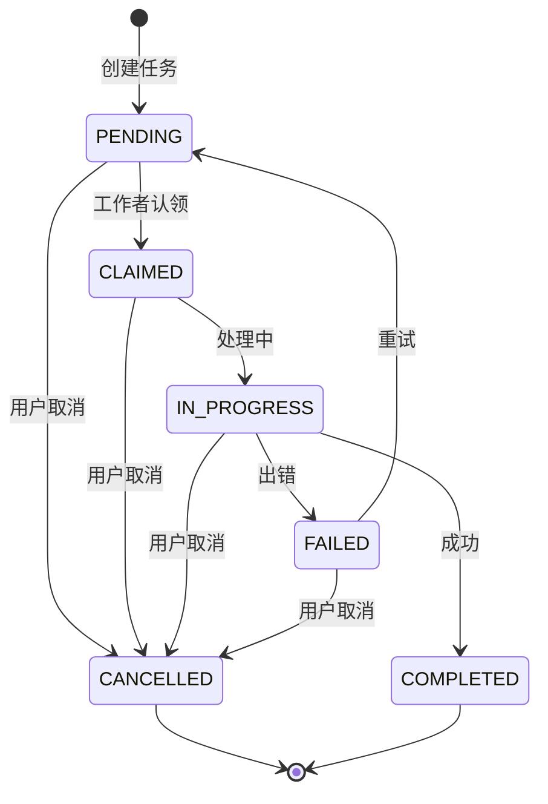
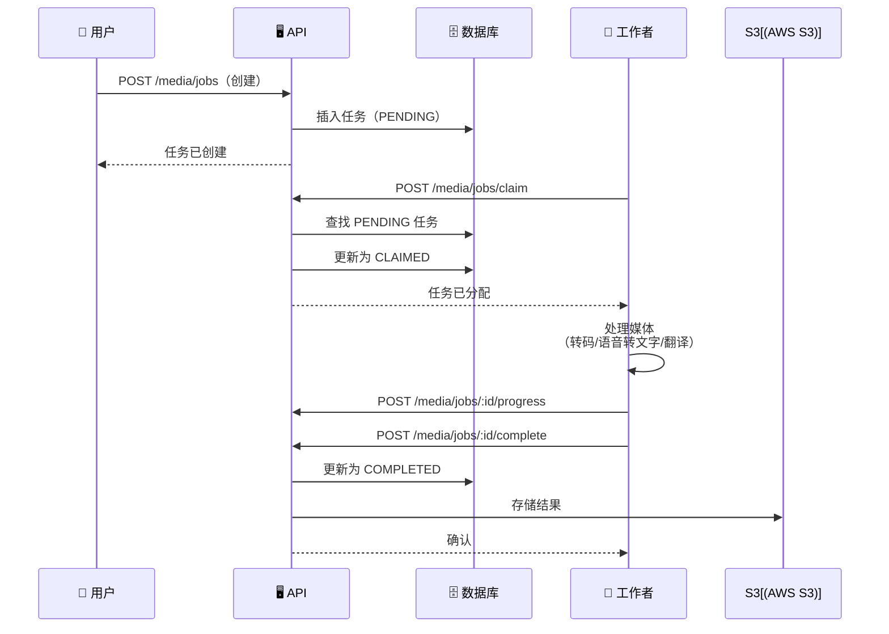

# AI 功能——后端

Think-AI 后端包含全面的 AI 集成，涵盖聊天、提醒、媒体处理、智能体配置和实时语音功能。

## 后端 AI 架构

## AI 聊天

带有持久化的实时对话式 AI：

| 组件 | 端点 | 描述 |
|-----------|----------|-------------|
| **会话** | `/social/ai/chats`（CRUD） | 聊天会话管理 |
| **消息** | `social_ai_messages` 表 | 聊天消息历史 |
| **设备** | `/social/ai/devices`（CRUD） | 推送通知目标注册 |
| **短信日志** | `/social/ai/sms-logs` | 短信投递审计 |

前端通过实时流式 API 连接——文本模型使用直接 HTTP 流式传输，实时语音和多模态交互使用 WebSocket 代理（Qwen RT Proxy）。

### 多提供商架构

后端存储会话和用量数据，而前端负责提供商路由。支持的 AI 提供商包括 **OpenAI**（GPT-4o）、**Google Gemini**（Gemini 2.5）、**DeepSeek**（V3/R1）、**Alibaba Qwen**（通过 DashScope 的 Max/Turbo）和 **Zhipu GLM**（GLM-4）。

## AI 提醒

基于短信的提醒系统，支持推送通知：

| 组件 | 端点 | 描述 |
|-----------|----------|-------------|
| **提醒** | `/social/ai/reminders`（CRUD） | 创建、读取、更新提醒 |
| **提醒事件** | `/social/ai/reminder-events` | 触发历史记录 |
| **分发** | `/social/ai/reminders/dispatch` | 定时分发端点 |
| **用户电话** | `/social/ai/user-phones` | 电话号码验证/管理 |
| **短信日志** | `/social/ai/sms-logs` | 投递跟踪 |

### 提醒流程

## AI 智能体设置

按用户或按群组的智能体配置：

- `/social/ai/agent-settings`——AI 智能体行为的 CRUD

每种智能体类型（图像生成、搜索、提醒、语音、媒体）都有可配置的设置，用于控制行为、模型选择和权限。

## AI 媒体任务

基于工作者架构的后台媒体处理：

### 任务状态机

### 工作者协同

### 任务操作

| 操作 | 端点 |
|-----------|----------|
| 创建 | `POST /social/ai/media/jobs` |
| 认领 | `POST /social/ai/media/jobs/claim` |
| 进度 | `POST /social/ai/media/jobs/:id/progress` |
| 完成 | `POST /social/ai/media/jobs/:id/complete` |
| 失败 | `POST /social/ai/media/jobs/:id/fail` |
| 取消 | `POST /social/ai/media/jobs/:id/cancel` |
| 重试 | `POST /social/ai/media/jobs/:id/retry` |

### 媒体任务管道

任务通过灵活的处理管道支持多种媒体类型：

| 媒体类型 | 处理能力 |
|------------|------------------------|
| **视频** | 转码、缩略图提取、字幕生成、格式转换 |
| **音频** | 语音转文字（STT）、翻译、字幕写入 |
| **图像** | 生成后处理、调整大小、格式转换、优化 |
| **组合** | 多步骤管道（例如：从视频中提取音频 → 语音转文字 → 翻译 → 嵌入字幕） |

管道使用 **FFmpeg** 进行媒体操作，使用 **AWS S3** 进行资源存储。媒体任务运行器（`ghost-media-runner` Docker 镜像）作为后台工作者处理任务。

## AI 用量跟踪

AI API 调用的用量计量：

| 组件 | 端点 | 描述 |
|-----------|----------|-------------|
| **用量记录** | `/social/ai/usages` | 按会话/用户浏览和读取令牌消耗 |

用量跟踪支持：
- 按用户 API 成本监控
- 用量配额和速率限制
- AI 功能采用情况分析

## 数据库模式

所有 AI 功能在 Ghost 数据库中都有专用表：

| 表 | 用途 | 关键列 |
|-------|---------|-------------|
| `social_ai_conversations` | 聊天会话 | id, user_id, title, created_at |
| `social_ai_messages` | 聊天历史 | id, conversation_id, role, content |
| `social_ai_devices` | 推送通知目标 | id, user_id, push_token, platform |
| `social_ai_sms_logs` | 短信投递记录 | id, phone, status, message |
| `social_ai_usages` | API 计量 | id, user_id, tokens, model, cost |
| `social_ai_reminders` | 用户提醒 | id, user_id, text, scheduled_at |
| `social_ai_reminder_events` | 提醒触发日志 | id, reminder_id, triggered_at |
| `social_ai_user_phones` | 已验证的电话号码 | id, user_id, phone, verified |
| `social_ai_agent_settings` | AI 智能体配置 | id, user_id, agent_type, settings |
| `social_ai_media_jobs` | 后台媒体任务 | id, type, status, result_path |
