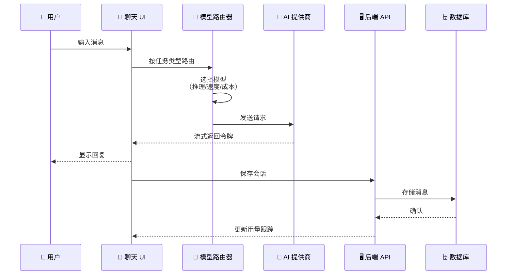
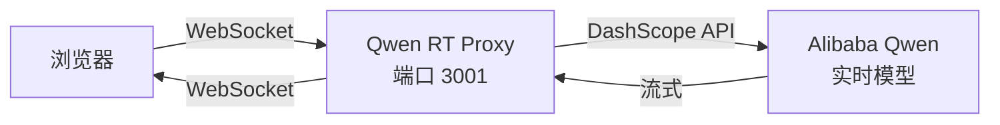
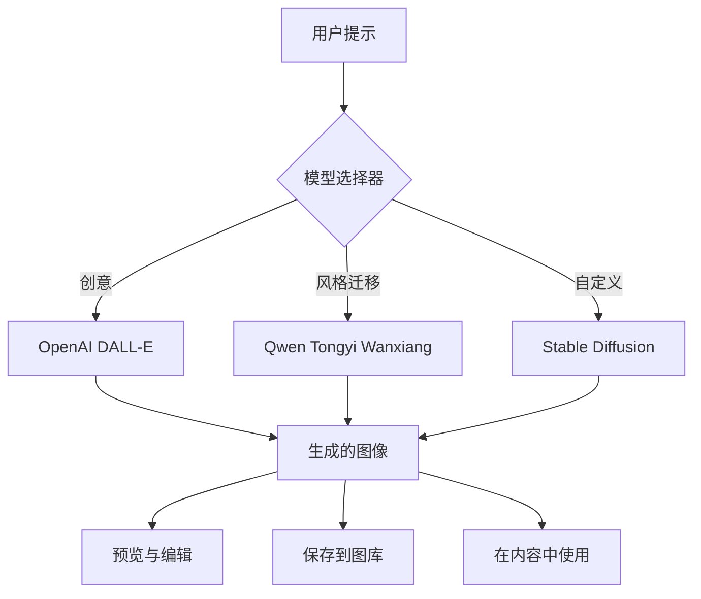
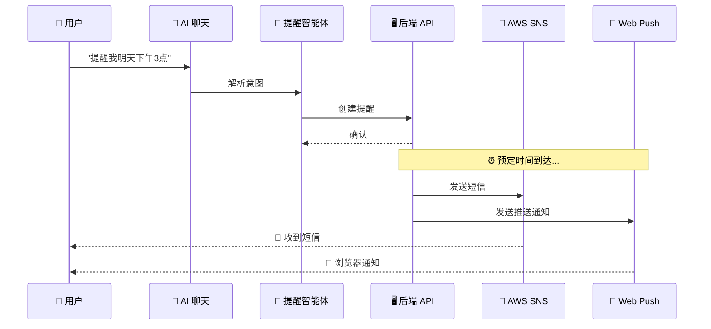
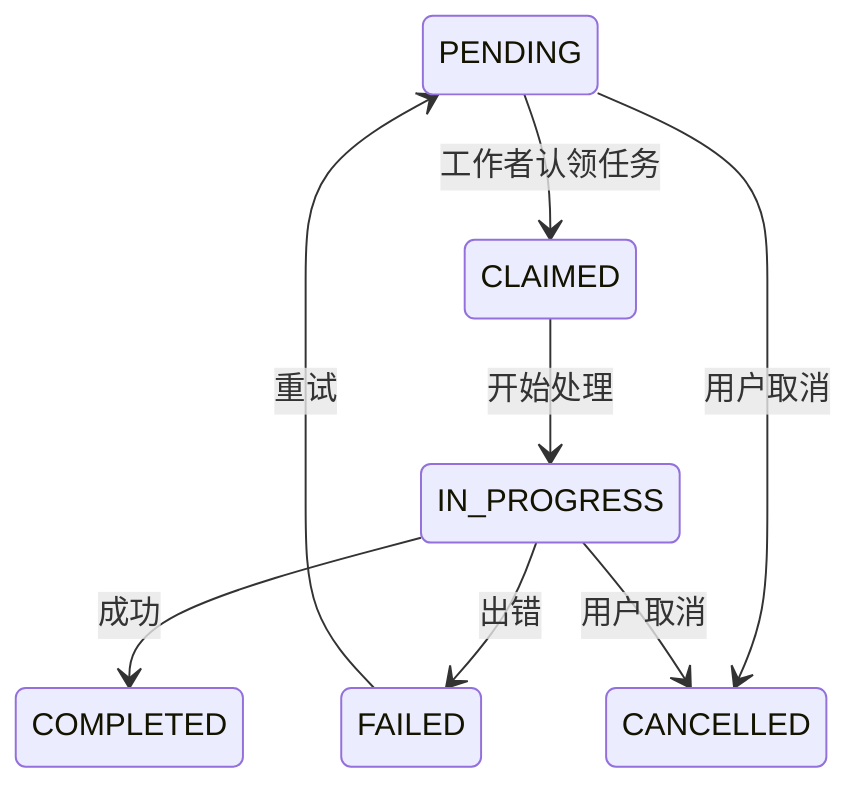
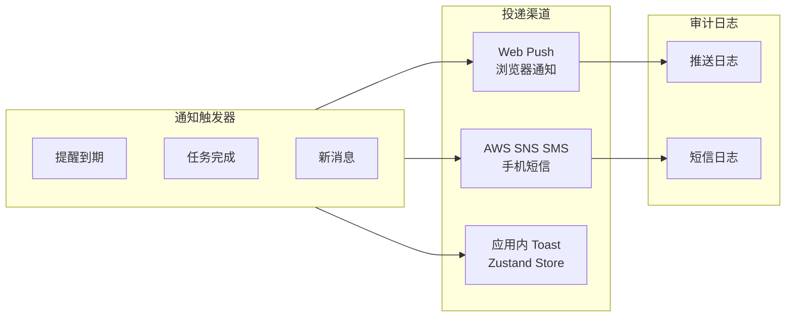

# AI 助手——前端

Think-AI 前端包含一个全面的**多智能体 AI 助手**系统，具有实时聊天、语音交互、图像生成、内容搜索、提醒和媒体处理功能。

## 架构概览

```mermaid
graph TB
    subgraph UI["用户界面"]
        Chat[AI 聊天界面<br/>/ai]
        Panel[网站助手面板<br/>浮动组件]
        Agent[智能体面板<br/>侧边栏工具]
    end
    
    subgraph Agents["AI 智能体"]
        IMG[🖼️ 图像生成<br/>DALL-E / Qwen / SD]
        SRC[🔍 搜索智能体<br/>语义 / 全文]
        REM[🔔 提醒智能体<br/>短信 + 推送]
        VOICE[🎙️ 语音智能体<br/>Gemini / OpenAI / Qwen]
        MEDIA[🎬 媒体智能体<br/>视频 / 音频 / 图像]
    end
    
    subgraph Streaming["实时流式"]
        HTTP[HTTP 流式<br/>文本聊天]
        WS[WebSocket<br/>Qwen RT Proxy]
        VOICE_WS[语音 WebSocket<br/>Gemini Realtime]
    end
    
    subgraph Backend["后端 API"]
        CHAT_API[/social/ai/chats]
        REM_API[/social/ai/reminders]
        MEDIA_API[/social/ai/media/jobs]
        USAGE[/social/ai/usages]
    end
    
    subgraph Providers["AI 提供商"]
        OA[OpenAI GPT-4o]
        GM[Google Gemini 2.5]
        DS[DeepSeek V3/R1]
        QW[Alibaba Qwen]
        ZP[Zhipu GLM-4]
    end
    
    subgraph Notifications["通知"]
        PUSH[Web Push API]
        SMS[AWS SNS SMS]
        IN_APP[应用内通知]
    end
    
    UI --> Agents
    UI --> Streaming
    Agents --> Streaming
    Streaming --> Providers
    Agents --> Backend
    Backend --> Notifications
```

## AI 聊天系统

### 多提供商聊天流程



### 实时 WebSocket 代理

**Qwen RT Proxy**（`apps/qwen-rt-proxy`）提供了一个用于实时 AI 流式的 WebSocket 桥接：



## AI 智能体

系统包含一个**多智能体框架**，具有专门的智能体：

### 图像生成智能体



### 搜索智能体

基于 AI 的语义搜索，覆盖平台内容：

| 搜索范围 | 端点 |
|-------------|----------|
| 文章 | `/api/ai/search-posts` |
| 作者 | `/api/ai/search-authors` |
| 标签 | `/api/ai/search-tags` |
| 图库 | `/api/ai/search-gallery` |
| 群组文章 | `/api/ai/search-group-posts` |
| 媒体任务 | `/api/ai/search-media-jobs` |
| 内部内容 | `/api/ai/search-internal-content` |

### 提醒智能体流程



### 语音智能体

支持多个提供商的实时语音交互：

| 提供商 | 模式 | 功能 |
|----------|------|----------|
| **Gemini Realtime** | 双向流 | 语音到语音，支持打断 |
| **OpenAI Voice** | 实时 API | 自然对话，多种语音 |
| **Qwen Voice** | WebSocket | 语音识别 + TTS |

## AI 任务系统

长时间运行的 AI 任务通过**基于任务的架构**进行管理：



| API 路由 | 功能 |
|-----------|----------|
| `/api/ai/jobs` | 列出、创建 AI 任务 |
| `/api/ai/jobs/[jobId]` | 任务状态、产物 |
| `/api/ai/jobs/[jobId]/artifacts/[artifactId]` | 下载任务产物 |
| `/api/ai/media/jobs/[jobId]` | 媒体任务管理 |
| `/api/ai/media/translate` | 媒体翻译 |

## 通知系统



## 网站助手面板

一个浮动的 **AI 助手面板**（`SiteAssistantPanel`）提供始终可用的 AI 支持：

```
┌─────────────────────────────┐
│  AI 助手                    │
│  ┌───────────────────────┐  │
│  │ 聊天消息               │  │
│  │ • 流式响应             │  │
│  │ • 智能体结果           │  │
│  └───────────────────────┘  │
│  ┌───────────────────────┐  │
│  │ 工具侧边栏             │  │
│  │ • 图像生成             │  │
│  │ • 搜索                │  │
│  │ • 提醒                │  │
│  │ • 语音                │  │
│  └───────────────────────┘  │
│  ┌───────────────────────┐  │
│  │ 输入框（文本/语音）     │  │
│  └───────────────────────┘  │
└─────────────────────────────┘
```

## AI 提供商配置

AI 提供商通过环境变量配置：

```bash
# OpenAI
OPENAI_API_KEY=sk-...

# Google Gemini
GEMINI_API_KEY=AIza...

# DeepSeek
DEEPSEEK_API_KEY=sk-...

# Alibaba Qwen (DashScope)
QWEN_API_KEY=sk-...
DASHSCOPE_API_KEY=sk-...

# Zhipu GLM
GLM_API_KEY=...
```

模型配置定义在：
- `config/aiChatModels.ts` — 聊天模型注册表
- `config/aiImageModels.ts` — 图像生成模型
- `config/aiVoiceModels.ts` — 语音/语音转文字模型
- `config/aiMediaModels.ts` — 媒体处理模型
- `config/aiMediaJobConfig.ts` — 媒体任务配置
- `config/qwenVoiceOptions.ts` — Qwen 语音选项
