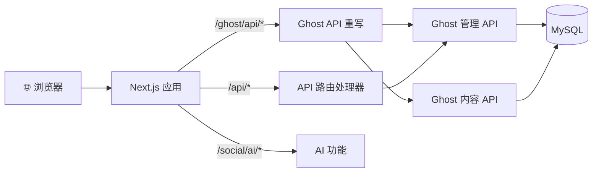

# Think-AI 前端

**Think-AI 前端** 是一个 Next.js 14 应用程序（`@ghost-next/frontend`），提供 AI 驱动的社交体验，包含可视化页面构建器、多智能体 AI 系统和丰富的 SNS 功能。

## 前端概览

```mermaid
graph TB
    subgraph Browser["浏览器"]
        UI[用户界面<br/>React SPA + SSR]
    end
    
    subgraph NextJS["Next.js 14 应用"]
        Pages[页面 (app/*)<br/>SSR/SSG 渲染]
        API[API 路由 (/api/*)<br/>服务端逻辑]
        Rewrites[重写 (/ghost/api/*)<br/>后端代理]
    end
    
    subgraph Services["服务与状态"]
        SWR[SWR 缓存<br/>服务端数据]
        Zustand[Zustand<br/>客户端状态]
        Provider[React Context<br/>认证 / 主题]
    end
    
    subgraph Packages["Monorepo 包"]
        Eastate[Eastate<br/>SNS 组件]
        StackPage[StackPage<br/>页面构建器]
        Comments[Comments-UI<br/>小组件]
        I18n[I18n<br/>国际化]
    end
    
    subgraph Infra["基础设施"]
        Qwen[Qwen RT Proxy<br/>WebSocket]
        Worker[媒体工作者<br/>后台任务]
    end
    
    Browser -->|HTTP/SSR| Pages
    Browser -->|WebSocket| Qwen
    Pages --> API
    Pages --> Packages
    API --> Rewrites
    Rewrites -->|Ghost API| Backend[(Think-AI 后端)]
    Pages --> Services
    Packages --> Services
    Pages --> Worker
```

```
01-jibunsee-react/
├── apps/
│   ├── host/                 ← 主 Next.js 14 应用 (SSR/SSG)
│   └── qwen-rt-proxy/        ← AI 实时流式 WebSocket 代理
├── packages/
│   ├── business/
│   │   ├── eastate/          ← SNS 专用 React 组件与钩子
│   │   └── portal/           ← 会员门户 UI
│   ├── stackpage/            ← 拖放式可视化页面构建器
│   ├── comments-ui/          ← 嵌入式评论组件
│   └── i18n/                 ← 国际化
└── tools/
    └── notify/               ← 通知工具
```

## 前端技术栈

| 类别 | 技术 |
|----------|-------------|
| **框架** | Next.js 14（App Router，standalone 输出） |
| **UI 库** | React 18, TypeScript |
| **样式** | Emotion (CSS-in-JS), Tailwind CSS |
| **组件** | MUI v6 (Material UI), @heroicons/react |
| **状态** | Zustand, SWR |
| **编辑器** | Tiptap（评论）, Koenig Lexical（文章）, react-slick（轮播） |
| **页面构建器** | StackPage（基于 gridstack 的拖放，支持数据/事件绑定） |
| **媒体** | Video.js, react-dropzone |
| **表单** | react-hook-form, @rjsf/core（JSON Schema 表单） |
| **AI** | AI SDK (@ai-sdk/openai, @ai-sdk/google, @ai-sdk/deepseek, @ai-sdk/react) |
| **AI 语音** | Gemini Realtime, OpenAI Voice, Qwen Voice/STT |
| **后端** | Axios, Zod, dayjs |
| **云服务** | @aws-sdk/client-s3, @aws-sdk/client-sns |
| **推送** | web-push |
| **构建** | Vite（包）, Webpack/SWC（Next.js） |

## 与后端通信



## 关键架构决策

| 决策 | 理由 |
|----------|-----------|
| **Next.js standalone 输出** | 自包含 Node.js 服务器，适合 Docker 部署 |
| **通过重写代理 Ghost API** | `/ghost/api/*` → Ghost 后端——避免 CORS 问题 |
| **Yarn workspaces monorepo** | 共享包（eastate, stackpage, i18n） |
| **StackPage 库** | 独立的 Vite 构建 React 库，用于拖放页面构建 |
| **SWR + Zustand** | SWR 用于服务端状态缓存，Zustand 用于客户端状态 |

[组件架构 →](/frontend/architecture)
[页面路由 →](/frontend/routing)
[页面构建器 →](/frontend/page-builder)
[AI 助手 →](/frontend/ai-assistant)
[状态管理 →](/frontend/state-management)
