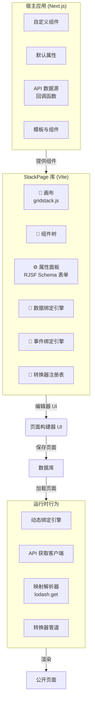
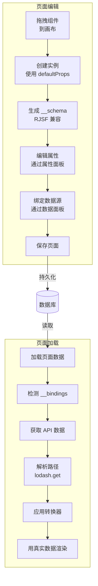
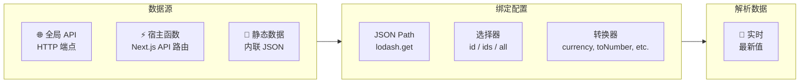
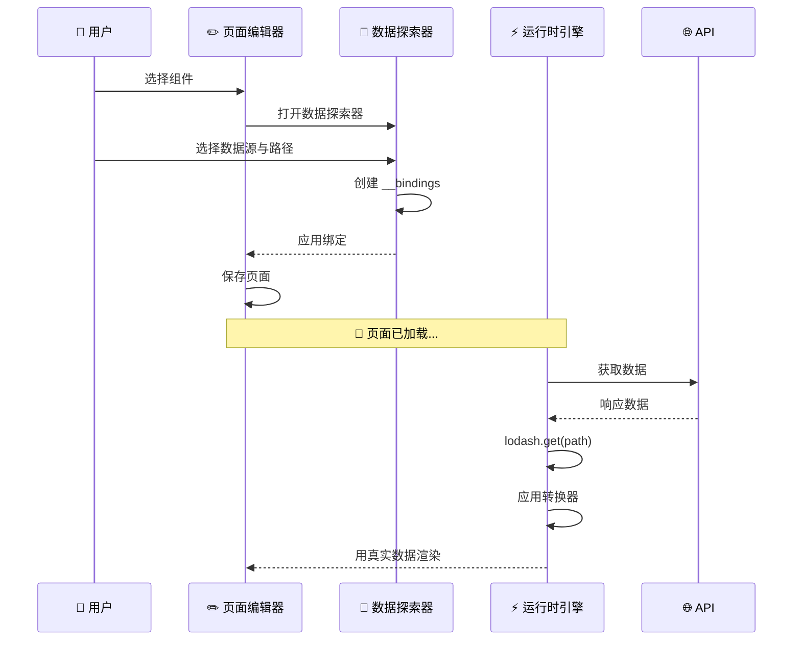

# 可视化页面构建器（StackPage）

Think-AI 前端包含一个名为 **StackPage** 的**拖放式可视化页面构建器**—— 一个独立的 React 库（Vite 构建），使用户无需编写代码即可组合动态页面。

## 架构

StackPage 采用**宿主/库（Host/Lib）**架构：



### 核心概念

- **宿主项目（Next.js）：** 提供自定义组件、默认属性、API 数据源（通过回调）和模板。
- **StackPage 库：** 提供编辑器 UI，包括画布（基于 `grid-stack.js`）、组件树、属性面板以及数据/事件绑定引擎。

## 核心工作流



### 1. 拖放组合

用户从**组件面板**将组件拖拽到画布。这会创建一个带有 `defaultProps` 的组件实例。

### 2. 模式生成

系统立即根据 `defaultProps` 使用 `PropertyTypeUtils` 生成一个 RJSF（React JSON Schema Form）兼容的模式。该模式存储在 `props.__schema` 中。

### 3. 属性编辑

用户通过**属性面板**修改组件属性，该面板基于 `props.__schema` 渲染表单。属性类型推断方式如下：
- **对象数组** → 数组类型模式
- **原始类型数组** → 选择类型模式
- **媒体类型** → 图片/视频/音频专用处理器

### 4. 数据绑定引擎

组件可以绑定到动态数据源：



| 绑定类型 | 描述 |
|-------------|-------------|
| **全局 API** | HTTP/HTTPS 端点（直接 fetch） |
| **宿主函数** | Next.js API 路由 / 服务端函数 |
| **静态数据** | 硬编码 JSON 数据 |

绑定系统支持：
- **JSON Path 解析**（通过 lodash.get）——例如 `response.users[0].name`
- **转换器管道**——注入前的数据修改（例如 `toNumber`、`currency`、`formatDate`）
- **选择器类型：** `id`（单条记录）、`ids`（多条记录）、`all`（所有记录）
- **递归数组元素绑定**——嵌套数组结构一层深度
- **忽略映射**（`__ignoredMappings`）——明确排除的字段

### 5. 保存与重新加载

- **页面保存：** 组件实例属性（包括 `__schema`、`__bindings` 和 `__ignoredMappings`）被持久化。
- **页面加载：** **动态绑定引擎**读取保存的绑定信息，触发 API 调用，应用 JSON Path 解析，运行转换器，并将最终值注入组件属性。

## 运行时行为

当构建的页面被渲染时：

```
页面加载
    │
    ▼
检测具有活跃 API 绑定的组件
    │
    ▼
触发 API 调用（通过宿主回调或直接 fetch）
    │
    ▼
应用保存的 JSON Path（lodash.get）
    │
    ▼
运行保存的转换器函数
    │
    ▼
将最终值注入组件属性
    │
    ▼
用真实数据渲染页面
```

## 数据绑定示例



## 组件类型

宿主应用提供各种可组合的组件：

| 类别 | 组件 |
|----------|-----------|
| **内容** | PostView, ArticleView, RichTextEditor |
| **媒体** | ImageCard, VideoCard, MediaCard, MediaMobileCard |
| **社交** | AvatarStack, PersonCard, RecommendationCard |
| **布局** | FeaturedPostCard, StoryCard, EmailSubscriptionForm |
| **导航** | ImageCircle, PostView |

## 模板

可复用的页面布局在模板系统中定义：

- **`templates/common/`** — 共享布局（页头、页脚、侧边栏）
- **`templates/home/`** — 首页动态布局，不同的内容排列方式
- **`templates/stories/`** — 故事风格布局

## 页面管理

| 功能 | 路由 | 描述 |
|---------|-------|-------------|
| **页面编辑器** | `/pages/edit/[pageid]` | 完整的拖放编辑器界面 |
| **页面列表** | `/pages/list` | 浏览所有已构建的页面 |
| **公开视图** | `/pages-public/view/[pageid]` | 渲染后的公开页面输出 |
| **API** | `/api/pages/*`, `/api/pages-public/*` | 页面 CRUD 与公开服务 |

## 使用场景

1. **着陆页**——无需开发人员参与即可创建营销或活动页面
2. **仪表盘**——使用 API 绑定的组件组合数据驱动型仪表盘
3. **内容中心**——以自定义布局策展文章/帖子集合
4. **会员门户**——带有会员特定数据绑定的个性化页面
5. **动态图库**——支持 S3 媒体绑定的图库页面
