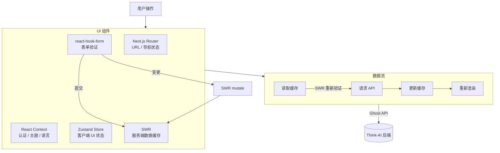

# 状态管理

前端采用分层状态管理方法：

| 层 | 技术 | 用途 |
|-------|-----------|---------|
| **服务端状态** | SWR | Ghost API 数据的缓存与重新验证 |
| **客户端状态** | Zustand | UI 状态、模态框、用户偏好 |
| **URL 状态** | Next.js Router | 页面导航、动态路由 |
| **表单状态** | react-hook-form | 表单输入验证与提交 |
| **上下文** | React Context | 主题、认证、语言环境提供者 |

## SWR（服务端状态）

用于从 Ghost 后端获取数据：

```typescript
// 模式：用于 API 数据的 swr 钩子
import useSWR from 'swr'

function usePosts(filter) {
    return useSWR(`/ghost/api/admin/posts/?filter=${filter}`, fetcher)
}
```

- 焦点恢复时自动重新验证
- 并发请求去重
- 乐观 UI 更新
- 变更时缓存失效

## Zustand（客户端状态）

用于轻量级客户端状态管理：

```typescript
// 模式：用于 UI 状态的 Zustand store
import { create } from 'zustand'

const useEditorStore = create((set) => ({
    isDirty: false,
    selectedBlock: null,
    setDirty: (dirty) => set({ isDirty: dirty }),
    selectBlock: (block) => set({ selectedBlock: block }),
}))
```

无样板代码，无提供者——比 Redux 更轻量，足以满足此应用的需求。

## React Context

用于全局提供者：

- **认证上下文** — 用户会话、权限
- **主题上下文** — 深色/浅色模式、MUI 主题
- **布局上下文** — 响应式布局状态
- **语言环境上下文** — 当前语言（通过 i18n）

## 表单状态

react-hook-form 在以下场景处理复杂表单状态：

- 编辑器界面（文章创建）
- 个人资料设置
- 仪表盘表单
- 图库上传表单
- 任何需要验证的输入表单

## 状态流



```
用户操作
    │
    ▼
组件 ←→ Zustand Store（客户端 UI 状态）
    │
    ├──→ SWR（服务端数据）←→ Ghost API
    │
    ├──→ react-hook-form（表单状态）→ 提交 → SWR mutate
    │
    ├──→ React Context（全局提供者）
    │
    └──→ Next.js Router（URL 状态、导航）
```
