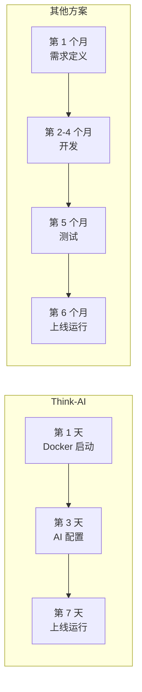
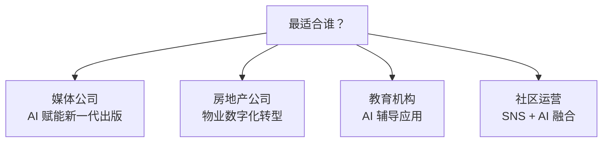

# 竞品对比

## 平台对比

| 功能 | **Think-AI** | Ghost CMS | WordPress + AI | Strapi + AI |
|------|------------|-----------|---------------|-------------|
| **AI 助手** | ✅ 内置（5 提供商） | ❌ | 🔶 插件依赖 | 🔶 自定义开发 |
| **AI 语音** | ✅ 内置 | ❌ | ❌ | ❌ |
| **AI 图像生成** | ✅ 内置 | ❌ | ❌ | ❌ |
| **AI 媒体处理** | ✅ 内置 | ❌ | 🔶 插件 | ❌ |
| **智能通知** | ✅ 内置 | ❌ | 🔶 插件 | ❌ |
| **SNS 功能** | ✅ 完全集成 | ❌ | 🔶 插件 | ❌ |
| **Page Builder** | ✅ 数据绑定 | ❌ | 🔶 SEO 问题 | 🔶 基础功能 |
| **自托管** | ✅ Docker 一键 | ✅ | 🔶 较复杂 | ✅ Docker |
| **数据主权** | ✅ 完全控制 | ✅ | 🔶 第三方依赖 | ✅ |
| **API 扩展性** | ✅ 200+标准+30+自定义 | ✅ 200+标准 | ❌ REST 限制 | ✅ 灵活 |
| **多语言** | ✅ 日/英/中 | ✅ 社区支持 | 🔶 插件 | ✅ 插件 |

## 时间成本对比

## 适用客户

---

[返回营销首页 →](index)
