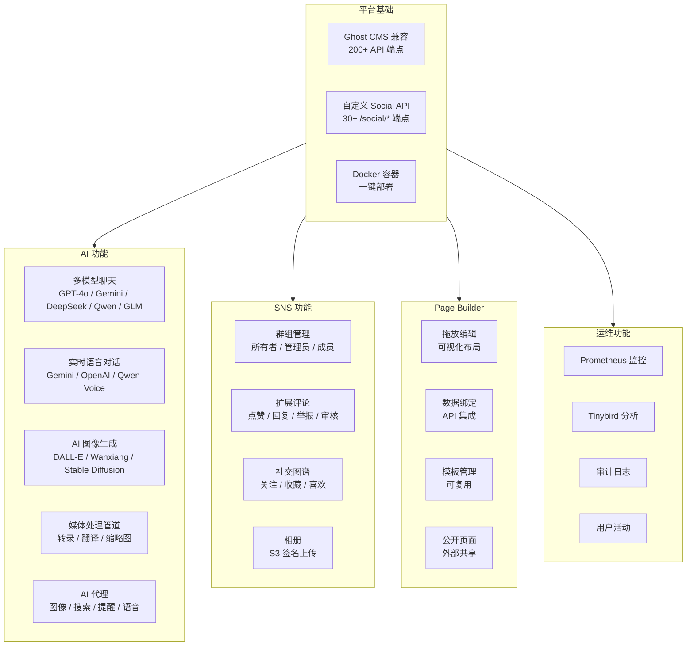

# Think-AI 功能列表

## 功能类别

## 功能详情

### AI 助手

| 功能 | 提供商 | 状态 |
|------|--------|------|
| 文本聊天（流式） | OpenAI, Gemini, DeepSeek, Qwen, Zhipu GLM | ✅ 已完成 |
| 对话历史管理 | 所有提供商 | ✅ 已完成 |
| 上下文感知搜索 | RAG 管道 | ✅ 已完成 |
| 模型自动路由 | 按任务选择最佳模型 | ✅ 已完成 |

### 社交功能

| 功能 | 描述 | 状态 |
|------|------|------|
| 群组 | 创建、加入、角色管理 | ✅ 已完成 |
| 评论 | CRUD、点赞、回复、举报、审核 | ✅ 已完成 |
| 关注 | 关注/取消关注、粉丝列表 | ✅ 已完成 |
| 收藏 | 文章/帖子收藏管理 | ✅ 已完成 |
| 相册 | 用户/群组相册、S3 上传 | ✅ 已完成 |
| 活动日志 | 用户审计跟踪 | ✅ 已完成 |

### Page Builder

| 功能 | 描述 | 状态 |
|------|------|------|
| 拖放编辑 | gridstack 直观布局 | ✅ 已完成 |
| 数据绑定 | 动态 API 数据集成 | ✅ 已完成 |
| 属性编辑器 | JSON Schema 驱动编辑 | ✅ 已完成 |
| 转换器管道 | 日期、货币、数字格式化 | ✅ 已完成 |
| 公开页面 | 外部用户页面发布 | ✅ 已完成 |

---

[返回营销首页 →](index)
