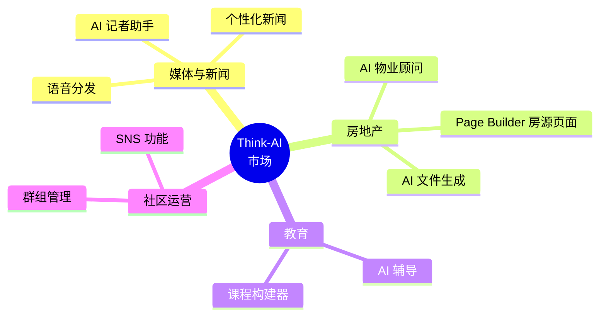
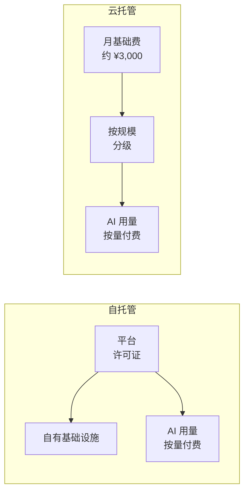
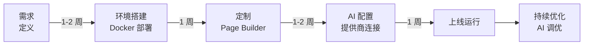
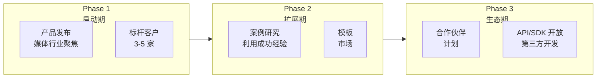

# Think-AI Marketing

**AI 驱动的下一代社交平台**

用于推广、销售和方案提案的资料。

---

## 目标市场

## 产品亮点

| 功能 | 价值主张 | 差异化优势 |
|------|---------|-----------|
| **多模型 AI 助手** | 5 个 AI 提供商按任务优化 | 无供应商锁定，成本优化 |
| **实时语音对话** | 自然语音对话，支持打断 | 多语音提供商 |
| **可视化 Page Builder** | 无代码动态页面创建 | 数据绑定，转换器管道 |
| **完整 SNS 套件** | 群组、评论、相册、关注 | CMS + SNS 集成 |
| **AI 媒体处理** | 自动视频/音频/图像处理 | 后台任务管道，ffmpeg |

## 定价模式

## 实施步骤

---

## 顾问笔记 — 战略思考

### 🎯 定位策略

Think-AI 最大的优势在于 **"CMS + SNS + AI 三位一体集成"**。市场上充斥着 CMS 专精型（WordPress, Ghost）、SNS 专精型（Discourse, Circle）和 AI 聊天专精型解决方案，但很少有产品能在单一平台上提供所有这些功能。

**推荐定位：**
> 不应将 Think-AI 定位为"内置 AI 的 CMS"，而应定位为"具备 CMS 功能的 AI 平台"。AI 是基础，CMS/SNS 是构建在 AI 之上的"功能"。这种信息传递能够明确区隔那些将 AI 作为事后补充的竞争对手。

### 📊 细分市场优先级

资源有限时，建议按以下顺序覆盖细分市场：

| 优先级 | 细分市场 | 理由 |
|-------|---------|------|
| 🥇 最高 | 媒体与新闻业 | AI 写作助手价值最明确，且有数字化预算 |
| 🥈 次高 | 房地产 | AI 顾问 + Page Builder 组合具有独特价值，效果可衡量 |
| 🥉 未来 | 教育 / 社区 | 市场规模大但专业竞品多（LMS） |

### 💰 定价策略建议

- **入门版应设定低价而非免费**。免费计划会降低质量期望，且零迁移成本导致高流失率。建议入门版约 ¥5,000/月。
- **强调 AI 成本透明度**。"AI 使用按实际费用收取"的信息有助于建立企业客户的信任。
- **引入年度折扣**（15-20% 优惠）以提高续约率。

### 🚀 增长策略

**关键洞察：** 在 Phase 1，重点不是"更多功能"而是"一个压倒性的成功案例"。深度服务一家媒体公司，用可衡量的 KPI（文章创作时间缩短 60%、参与度翻倍等）来证明价值，这将为后续的规模化销售奠定基础。

---

## 相关文档

- [功能列表 →](features)
- [竞品对比 →](comparison)
- [使用场景 →](use-cases)
- [定价模式 →](pricing)
