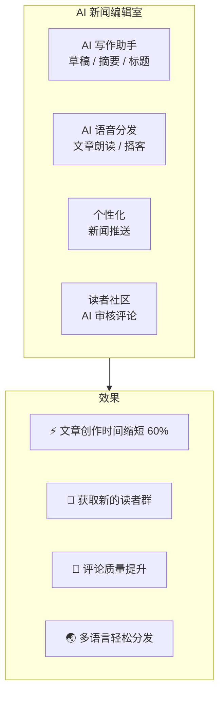

# 使用场景

## 媒体与新闻业

### 解决方案

## 房地产业

| 功能 | 应用 |
|------|------|
| **AI 物业顾问** | 24/7 自动回复，多语言 |
| **混合搜索** | 自然语言 + 结构化过滤 |
| **Page Builder 模板** | 房源页面模板创建 |
| **AI 翻译** | 中日英自动翻译 |
| **AI 文件生成** | 自动生成物业资料 |
| **智能通知** | 看房提醒、降价通知 |

## 教育

| 功能 | 应用 |
|------|------|
| **AI 辅导** | 24/7 学生支持，个性化学习 |
| **课程页面构建器** | 无代码课程页面创建 |
| **社区功能** | 班级群组、讨论管理 |
| **媒体处理** | 讲座转录、翻译 |

---

[返回营销首页 →](index)
