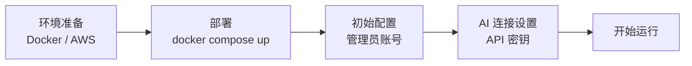
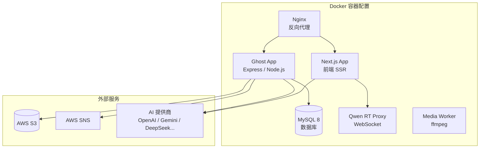

# 运维手册

Think-AI 平台的设置、管理和操作指南。

---

## 快速开始

| 步骤 | 耗时 | 详情 |
|------|------|------|
| 环境准备 | 1-2 小时 | [部署指南 →](deployment) |
| 部署 | 10 分钟 | Docker Compose 启动 |
| 初始配置 | 30 分钟 | 管理员账号、站点设置 |
| AI 连接 | 15 分钟 | AI 提供商 API 密钥设置 |

---

## 章节导航

| 章节 | 读者 | 内容 |
|------|------|------|
| [部署指南](deployment) | 基础设施人员 | Docker 配置、AWS 设置、环境变量 |
| [管理员指南](admin-guide) | 站点管理员 | 用户管理、内容管理、AI 设置 |
| [用户指南](user-guide) | 终端用户 | 基本操作、AI 功能使用 |
| [故障排除](troubleshooting) | 所有人 | 常见问题与解决方案 |

## 系统架构

