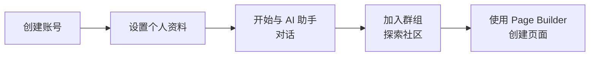

# 用户指南

## 快速开始

## 使用 AI 助手

### 聊天

1. 点击屏幕上的 AI 助手图标
2. 在文本框中输入问题
3. 按 Enter 发送（流式响应）
4. 根据需要切换模型

### 语音对话

1. 点击 AI 助手中的语音图标
2. 允许麦克风访问
3. 说话 — AI 会语音回复
4. 支持打断

### 图像生成

1. 告诉 AI 助手"创建一张图片"
2. 输入提示词
3. 查看并下载生成的图像

## SNS 功能

| 操作 | 方法 |
|------|------|
| 创建群组 | 群组页面 → "创建"按钮 |
| 加入群组 | 群组页面 → "加入"按钮 |
| 评论 | 文章下方的评论框 |
| 上传图片 | 相册上传，S3 安全上传 |

## Page Builder

1. 从菜单中选择 "Page Builder"
2. 创建新页面
3. 从组件面板拖放元素
4. 配置元素属性
5. 使用数据绑定连接动态内容
6. 点击发布

---

[返回运维首页 →](index)
