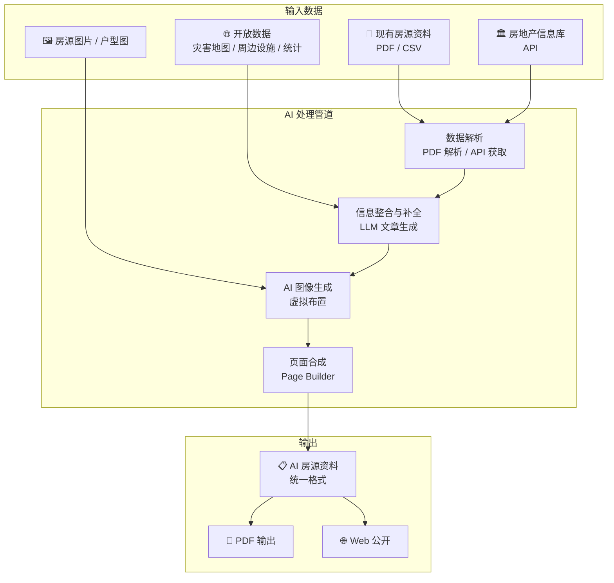
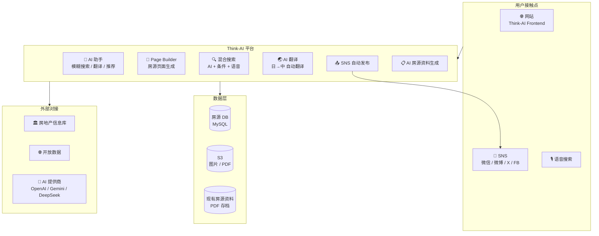
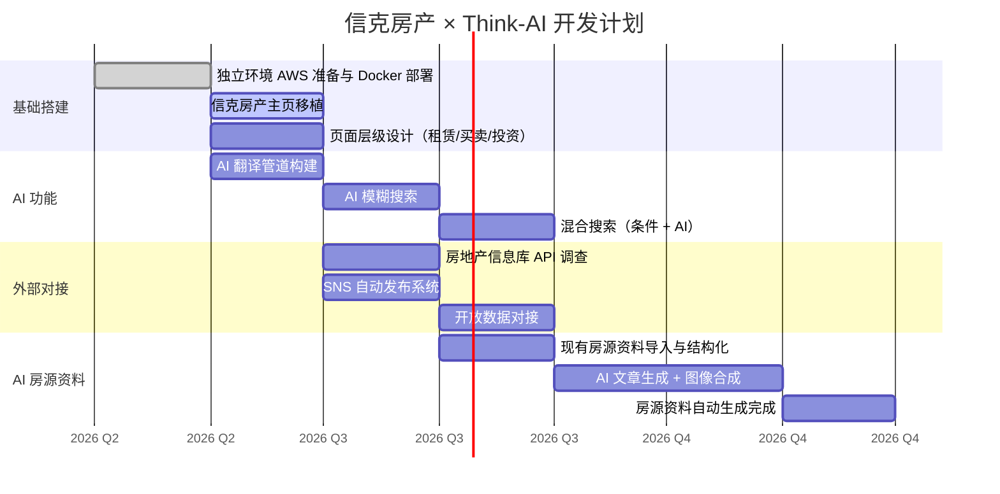

# 信克房产 — Think-AI 房地产系统需求规格书

**创建日期：** 2026-04-29
**提交人：** 神矢浩治（信克系统株式会社）
**项目：** 信克房产 × Think-AI

---

## 按优先级排序的需求列表

### ① 独立环境准备与主页移植

**需求：** 准备与 60-think.com 不同的独立环境，完整移植信克房产的主页。
※「面向海外·中国客户」页面保持施工中状态移植。

**Q&A:**
| # | 问题 | 回答 |
|---|------|------|
| 01 | 是否只需启动另一个 Docker 容器？ | 需要另签 AWS 合同，否则规格不足 |
| 02 | 能否对任意容器配置的整个页面应用统一设计？ | 可以 |

**应对方案：**
- 准备新的 AWS 账户 / 独立环境
- 将 Think-AI 的 Docker 容器部署到新环境
- 使用 Page Builder 重现现有网站的静态页面 + 统一设计

---

### ② 全文章中文化

**需求：** 所有文章准备中文版。

**Q&A:**
| # | 问题 | 回答 |
|---|------|------|
| 03 | 移植时（静态信息）是否可以不使用 AI 翻译？ | 用 AI 做 |
| 04 | 新增房源信息时的翻译如何处理？ | 自动翻译后自动分发。URL 在多语言页面中共用 |

**应对方案：**
- 现有内容 → AI 批量翻译（OpenAI GPT-4o / DeepSeek 等）
- 新增时 → 注册时自动翻译管道运行，生成中文版
- 通过 i18n 路由实现语言别 URL 管理（/ja/、/zh/ 等）

---

### ③ 多 SNS 自动发布

**需求：** 部分文章（房源信息等）自动发布到多个 SNS。

**Q&A:**
| # | 问题 | 回答 |
|---|------|------|
| 05 | 具体发布到哪些平台（中国系）？ | 通过 OpenClaw 实现 SNS 群发（中国系、日本系均可） |
| 06 | 信克房产是否需要准备账号？ | 需要 |

**应对方案：**
- 准备各 SNS 账号（微信、微博、小红书、Twitter/X、Facebook 等）
- 利用 OpenClaw / wacli / xurl 等构建自动发布系统
- 构建房源信息注册 → AI 摘要生成 → 多语言翻译 → SNS 群发的自动管道

---

### ④ 房源列表页面的层级划分

**需求：** 将「房源列表」分为租赁 / 买卖。买卖再分为普通买卖 / 投资房源。
※精选房源和房源信息保留在主页上。

**Q&A:**
| # | 问题 | 回答 |
|---|------|------|
| 07 | 页面层级结构在 Think-AI 上如何实现？ | 可以实现。实现方法取决于需求内容 |

**应对方案：**
```
房源列表
├── 租赁房源
│   ├── 条件搜索（租金 / 押金 / 礼金 等）
│   └── 房源列表
├── 买卖房源
│   ├── 普通买卖
│   │   ├── 条件搜索（价格 / 面积 / 房龄 等）
│   │   └── 房源列表
│   └── 投资房源
│       ├── 条件搜索（实际收益率 / 预期收益率 等）
│       └── 房源列表
└── 精选房源（主页显示）
```

- 使用 Page Builder 为每个分类创建模板页面
- 通过自定义路由实现层级结构
- 在数据模型中添加 property_type / category 字段

---

### ⑤ AI 模糊搜索 + 条件搜索混合

**需求：** 实现 AI 模糊搜索与条件搜索的混合模式。条件搜索项目可根据租赁/买卖/投资单独配置。

**Q&A:**
| # | 问题 | 回答 |
|---|------|------|
| 08 | 条件搜索的输入类型是否可支持值范围或候选项选择等多种形式？ | 可以将从项目中选择的内容转化为文字，与（语音输入）合成后搜索。当用户对 AI 搜索结果不满意时，也可以仅通过条件项目搜索 |

**应对方案：**
```
用户输入
    │
    ├── 自然语言搜索（AI）
    │   "找靠近车站、可养宠物、3LDK 的租房"
    │       → Embedding 相似度搜索 + LLM 推荐
    │
    ├── 条件搜索（筛选）
    │   租赁： 租金范围 / 押金 / 礼金 / 户型 / 步行距离 / 房龄
    │   买卖： 价格范围 / 面积 / 房龄 / 步行距离
    │   投资： 实际收益率 / 预期收益率 / 价格 / 面积
    │
    └── 混合（AI + 条件）
        条件筛选 → AI 模糊搜索补充
        或
        AI 搜索 → 条件筛选缩小结果

```

---

### ⑥ 与房地产信息库（相当于 REINS）的对接

**需求：** 除自有房源外，同时一列表展示房地产信息库的搜索结果。

**Q&A:**
| # | 问题 | 回答 |
|---|------|------|
| 09 | 能否从房地产信息库提取搜索结果？API 认证情况如何？ | 尚未着手 |

**应对方案：**
- 调查房地产信息库 / REINS API 的规格
- 确认 API 认证及使用合同
- 开发自定义数据对接模块
- 展示自有房源 + 外部房源的综合搜索结果

---

### ⑦ 列表中选择他公司房源时的显示

**需求：** 从列表中选择他公司房源时的显示内容和格式需另行研究。
※在确认是否可代理前，若自动生成并展示房源资料，可能导致用户误解为已可签约。

**Q&A:**
| # | 问题 | 回答 |
|---|------|------|
| 10 | 是否能够创建列表页面？ | 可以创建 |

**应对方案：**
- 明确标注注意事项（如「非本公司代理房源」等）
- 区分他公司房源与自有房源的显示样式
- 咨询路径限为公司代理（转交处理）
- 房源资料自动生成仅限于自有房源

---

### ⑧ AI 房源资料自动生成

**需求：** 利用房地产信息库、现有房源资料、开放数据（周边设施、灾害地图等）自动生成 AI 房源资料。

**Q&A:**
| # | 问题 | 回答 |
|---|------|------|
| 11 | 能否导入现有房源资料信息？ | 可以读取 |
| 12 | 能否从房地产信息库获取除文字外的其他信息？ | 尚未着手 |
| 13 | 能否整合现有房源资料、开放数据和房地产信息库的信息生成房源资料？ | 尚未着手。图像合成可以 |

**应对方案：**


**阶段划分：**

| Phase | 内容 | 时间 |
|-------|------|------|
| Phase 1 | 现有房源资料导入 + 文本信息结构化 | 2026 Q3 |
| Phase 2 | 房地产信息库对接 + 开放数据整合 | 2026 Q4 |
| Phase 3 | AI 自动文章生成 + 图像合成 | 2026 Q4 |
| Phase 4 | 全自动 AI 房源资料生成管道完成 | 2027 Q1 |

---

## 系统架构图（房地产版）



---

## 开发路线图



---

## 所需资源

| 类别 | 项目 | 备注 |
|---------|------|------|
| **基础设施** | AWS 新账户 | 当前规格不足，需另签合同 |
| **SNS 账号** | 微信公众账号 | 面向中国 |
| | 微博官方账号 | 面向中国 |
| | 小红书 (RED) 账号 | 面向中国 |
| | Twitter/X 账号 | 面向日本 |
| | Facebook 页面 | 面向日本 |
| **外部 API** | 房地产信息库 API 合同 | 需调查 |
| | 灾害地图 API | 开放数据 |
| | 周边设施 API | Google Maps / 其他 |
| **翻译** | AI 翻译模型 | OpenAI / DeepSeek 等（已有） |

---

*本需求规格书基于 2026 年 4 月 29 日的会议内容。*
*Think-AI Real Estate · 信克房产 · 信克系统株式会社*
