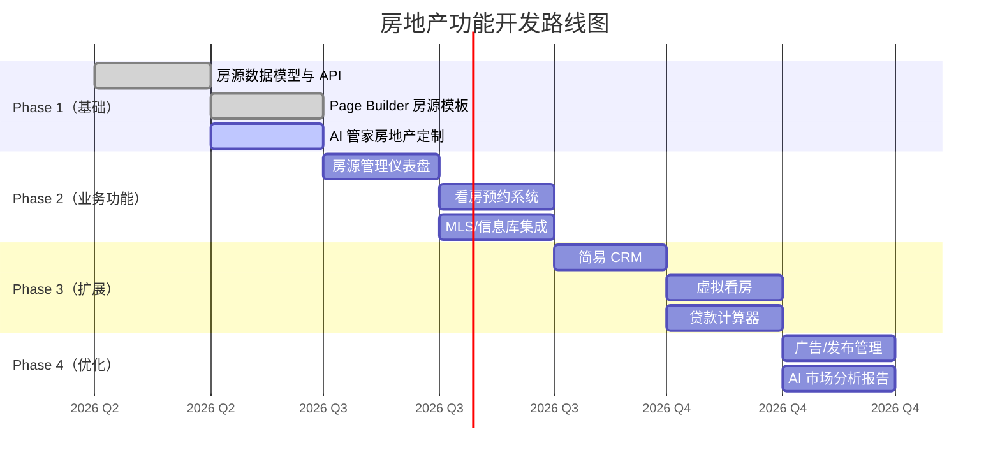
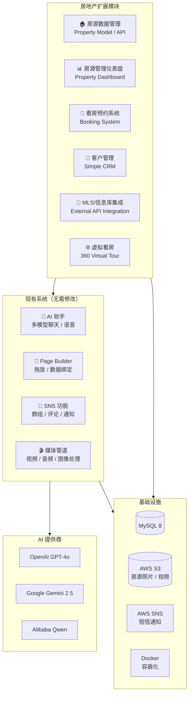

# Think-AI 房地产愿景

**AI 驱动的房地产业数字化转型**

---

## 1. 执行摘要

Think-AI 是一个实现房地产业务 **AI 全面数字化转型** 的平台。以现有的 SNS/CMS 基础、AI 助手和可视化页面构建器为核心，通过增加覆盖房地产特有业务流程的模块，演变为行业级整体解决方案。

**已具备的能力：** AI 聊天、语音对话、图像生成、提醒通知、媒体处理、Page Builder
**可扩展的能力：** 房源页面、客户管理、看房预约、AI 管家、虚拟看房

---

## 2. 为什么选择 Think-AI 进军房地产

### 房地产业的挑战

| 挑战 | 当前问题 |
|------|------------|
| **客户响应效率低** | 大量工时用于回复咨询，无法在营业时间外提供服务 |
| **房源信息管理繁琐** | 需要在多个系统间切换，手动更新容易出错 |
| **数字化呈现不足** | 许多房地产公司缺乏有吸引力的网站 |
| **客户跟进困难** | 看房后或签约过程中的跟进依赖个人经验 |
| **内容制作耗时** | 房源介绍页、宣传单、SNS 发布需要大量时间 |
| **数据分析不足** | 无法分析客户行为和市场趋势 |

### Think-AI 带来的变革

| 解决方案 | 影响 |
|--------------|-----------|
| **AI 管家 24/7** | 即时响应客户咨询、预约看房、推荐房源 |
| **可视化 Page Builder** | 房地产公司自行创建有吸引力的房源页面，无需 CMS |
| **智能提醒** | 看房前提醒、合同到期自动通知 |
| **AI 图像生成/处理** | 自动校正房源照片、虚拟布置、生成户型图 |
| **媒体处理管道** | 自动生成房源视频、创建虚拟看房 |
| **AI 搜索与推荐** | 根据客户需求推荐最合适的房源 |
| **群组管理** | 销售团队、客户群组、房源分类管理 |

---

## 3. 现有系统已具备的能力

### ✅ AI 助手（多模型）

支持 ChatGPT / Gemini / DeepSeek / Qwen 等多种 AI 模型，根据用途切换。

**房地产应用示例：**
- 24/7 全天候回答客户关于房源的咨询
- 多语言自动回复（日语、英语、中文等）
- 贷款计算、费用估算建议
- 提供周边设施信息（超市、学校、医院等）

### ✅ 实时语音对话

支持通过语音搜索房源、口述看房记录、语音客户服务。

**房地产应用示例：**
- "帮我找 3LDK、步行5分钟以内、可养宠物的房子"——语音搜索
- 看房时语音记录自动转为文本
- 对外国客户的实时翻译通话

### ✅ 智能提醒与通知

支持短信和推送通知的提醒系统。

**房地产应用示例：**
- 看房前一天自动提醒（短信 + 推送）
- 合同提交期限通知
- 贷款预审结果自动通知
- 降价房源的推送通知

### ✅ Page Builder (StackPage)

通过拖放创建页面的可视化构建器。支持 API 数据绑定。

**房地产应用示例：**
- 创建房源详情页模板（照片库、户型图、周边地图）
- 无代码创建活动页面
- 通过数据绑定自动更新的推荐房源列表

### ✅ AI 媒体处理管道

自动处理视频、音频、图像的后台任务系统。

**房地产应用示例：**
- 自动生成看房视频（图片幻灯片 + 背景音乐 + 字幕）
- 自动校正房源照片（亮度调整、色彩校正、杂物去除）
- 虚拟布置（AI 将家具和装饰合成到空房中）

### ✅ SNS 社交功能

群组管理、评论、点赞、关注等 SNS 基础平台。

**房地产应用示例：**
- 每个房源的客户咨询线程
- 销售团队内部群组
- 购房者之间的社区形成
- 收藏喜欢的房源

---

## 4. 现有系统可扩展的能力

### 🔧 AI 智能体功能扩展

将现有智能体系统（图像生成、搜索、提醒、语音、媒体）定制为房地产专用。

**房地产 AI 智能体：**

| 智能体 | 功能 | 现有资产 |
|------------|------|-----------|
| **房源导览智能体** | 推荐符合条件的房源、看房引导 | 现有 AI 聊天 + 搜索智能体 |
| **估价智能体** | 分析周边行情、生成估价报告 | 现有 AI 搜索 + 媒体任务 |
| **文档智能体** | 生成合同模板、起草重要事项说明 | 现有 AI 聊天 + 内容生成 |
| **跟进智能体** | 看房后、签约后的自动跟进 | 现有提醒 + 通知系统 |

### 🔧 Page Builder 模板

| 模板 | 描述 | 技术实现方式 |
|------------|------|--------------|
| 房源详情页 | 照片、户型、价格、周边信息、咨询表单 | 现有 Page Builder + 数据绑定 |
| 房源列表页 | 带搜索功能的房源列表、筛选条件 | 现有组件 + API 数据绑定 |
| 公司介绍页 | 公司信息、员工介绍、业绩 | 现有 Page Builder |
| 联系我们页 | 表单 + AI 自动回复 | 现有 AI 聊天嵌入 |

### 🔧 数据集成

利用现有 API 路由系统与外部系统集成。

| 集成目标 | 方式 | 现有机制 |
|--------|------|-------------|
| MLS / 不动产信息库 | 自定义 API 端点 + 数据绑定 | 30+ 自定义端点基础 |
| Google Maps | 嵌入 + 数据集成 | 现有前端 |
| 计费/支付 | API 路由 + Webhook | 现有 API 路由处理器 |
| CRM | API 集成 | 现有 API 通信基础 |

---

## 5. 需要新增开发的模块

### 🏗️ 新模块列表

| 模块 | 优先级 | 开发规模 | 描述 |
|-----------|--------|---------|------|
| **房源数据模型** | ★★★ 高 | 中 | 管理房源信息的数据库模型与 API |
| **房源管理仪表盘** | ★★★ 高 | 大 | 公司房源统一管理界面（注册、编辑、发布管理） |
| **MLS/不动产信息库对接 API** | ★★★ 高 | 中 | 与外部房源数据库自动对接 |
| **看房预约系统** | ★★☆ 中 | 中 | 在线看房预约、日程安排、通知 |
| **客户管理（简易 CRM）** | ★★☆ 中 | 大 | 客户信息、咨询历史、感兴趣的房源管理 |
| **虚拟看房构建器** | ★★☆ 中 | 中 | 使用 360° 照片创建虚拟看房页面 |
| **贷款计算器** | ★☆☆ 低 | 小 | 根据贷款金额和利率计算月供 |
| **广告/发布管理** | ★☆☆ 低 | 中 | 门户网站对接、广告投放管理 |

### 🏗️ 优先级路线图



---

## 6. 使用场景

### 场景 1：购房者的体验

```
用户（手机操作）
    │
    ├── 1. "帮我找 3LDK、世田谷区、步行10分钟以内的房源"
    │       → AI 管家推荐 5 个符合条件的房源
    │
    ├── 2. 使用 Page Builder 创建感兴趣的房源页面
    │       → 照片库、360° 全景、户型图、周边信息
    │       → 通过数据绑定自动显示最新信息
    │
    ├── 3. "我想预约看房"
    │       → 从日历选择希望日期和时间
    │       → 通知房地产公司，向用户发送确认邮件
    │
    ├── 4. 看房前一天自动提醒
    │       → 短信 + 推送通知"明天下午2点看房"
    │
    ├── 5. 看房后，AI 自动跟进
    │       → "今天的看房感觉如何？还有其他感兴趣的房源吗？"
    │
    └── 6. 开始购买流程
            → "需要进行贷款计算吗？"
            → "为您发送所需文件清单"
```

### 场景 2：房地产公司的运营

```
销售代表
    │
    ├── 早上: 通过 AI 仪表盘确认今天的看房安排
    │       → 自动提醒使客户回复率提升 40%
    │
    ├── 上午: 使用 Page Builder 创建新房源页面
    │       → 只需上传照片即可自动布局
    │       → 通过数据绑定自动更新价格和状态
    │
    ├── 下午: 确认 AI 生成的看房报告
    │       → 看房中的语音记录自动转为文本
    │       → "这位客户希望 3LDK，重视靠近车站"
    │
    └── 下班: AI 总结明日任务
            → "明天有 3 次看房、1 次签约、2 次跟进需要处理"
```

---

## 7. 系统架构（房地产版）



---

## 8. 竞品对比

| 功能 | Think-AI | 房地产专用 CMS | 通用 CMS | 门户网站 |
|------|----------|-------------|---------|--------------|
| **AI 管家** | ✅ 内置 | — | — | — |
| **可视化 Page Builder** | ✅ 内置 | — | ✅ (有限) | — |
| **语音对话** | ✅ 内置 | — | — | — |
| **AI 图像生成/处理** | ✅ 内置 | — | — | — |
| **短信/推送通知** | ✅ 内置 | — | — (插件) | — |
| **SNS 社区** | ✅ 内置 | — | ✅ (插件) | ✅ (有限) |
| **房源数据管理** | 🔧 开发中 | ✅ | — | — |
| **MLS/信息库对接** | 🔧 开发中 | ✅ (有限) | — | ✅ |
| **自托管** | ✅ 完全支持 | — (SaaS) | ✅ | — (SaaS) |
| **数据主权** | ✅ 完全保障 | — | ✅ | — |

---

## 9. 未来愿景

### 🎯 2027 年：确立房地产行业 AI 平台地位

**中期愿景：**
- 面向中小型房地产公司提供「AI 房地产 DX 套件」
- 月费订阅模式（可选择自托管 / 云托管）
- 开设 Page Builder 模板市场
- 房地产 AI 智能体高级化（市场预测、自动估价、交易匹配）

**长期愿景：**
- 房地产交易全流程数字化
- AI 驱动的自动估价、匹配、合同协助
- 利用元宇宙/AR 的沉浸式看房体验
- 成为房地产科技生态系统的核心平台

### 💡 核心差异化

Think-AI 房地产解决方案的最大差异化在于其 **「天生 AI 原生」** 的基因。

传统房地产系统采用「在管理系统上后加 AI」的方式，而 Think-AI 则是「以 AI 为核心的系统上增加房地产功能」。这意味着：

- AI 功能作为一等公民集成到所有功能中
- 从客户响应到内部业务，AI 无缝支持
- 新功能的添加可通过 Page Builder 快速完成
- 在保持数据主权的同时最大化 AI 能力

---

**Think-AI × Real Estate — AI-Powered Digital Transformation**

---

*本文档用于说明 Think-AI 房地产愿景。所述功能和路线图可能在不另行通知的情况下变更。*
